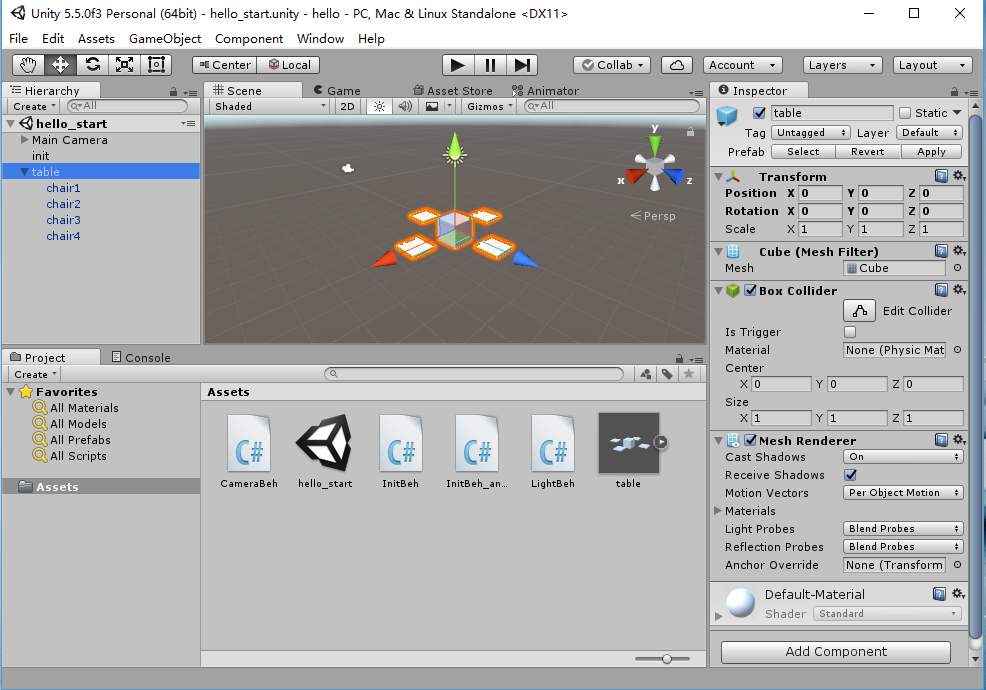

# 二、离散仿真引擎基础
{:.no_toc}

## 作业与练习

**Unity 常用资源**

* Manual  https://docs.unity3d.com/Manual/index.html
* 中文参考 http://docs.manew.com/  、  http://wiki.ceeger.com/ceeger.php
* 官方案例 https://unity3d.com/cn/learn/tutorials
* UML 绘图工具 http://www.umlet.com/changes.htm

**作业内容**

1、简答题

* 解释 游戏对象（GameObjects） 和 资源（Assets）的区别与联系。
* 下载几个游戏案例，分别总结资源、对象组织的结构
* 编写一个代码，使用 debug 语句来验证 [MonoBehaviour](https://docs.unity3d.com/ScriptReference/MonoBehaviour.html) 基本行为或事件触发的条件
    - 基本行为包括 Awake() Start() Update() FixedUpdate() LateUpdate()
    - 常用事件包括 OnGUI() OnDisable() OnEnable()
* 查找脚本手册，了解 [GameObject](https://docs.unity3d.com/ScriptReference/GameObject.html)，Transform，Component 对象
    - 分别翻译官方对三个对象的描述（Description）
    - 描述下图中 table 对象（实体）的属性、table 的 Transform 的属性、 table 的 部件
    - 用 UML 图描述 三者的关系（请使用 UMLet 14.1.1 stand-alone版本出图）

* 整理相关学习资料，编写简单代码验证以下技术的实现：
    - 查找对象
    - 添加子对象
    - 遍历对象树
    - 清除所有子对象
* 预设（Prefabs）有什么好处？与对象克隆 (clone or copy or Instantiate of Unity Object) 关系？
* 尝试解释组合模式（Composite Pattern / 一种设计模式）。使用 BroadcastMessage() 方法
    - 向子对象发送消息

2、 编程实践，小游戏

* 游戏内容： 井字棋 或 贷款计算器 或 简单计算器 等等
* 技术限制： 仅允许使用 **[IMGUI](https://docs.unity3d.com/Manual/GUIScriptingGuide.html)** 构建 UI
* 作业目的： 
    - 提升 debug 能力
    - 提升阅读 API 文档能力 

**作业提交要求**

* 仅能用博客或在线文档提交作业，建议使用 Github 提交代码和作业。**不能使用docx、pdf等需要下载阅读的格式**
* deadline 下周二 24 点前

&nbsp;

[返回目录](./)  

