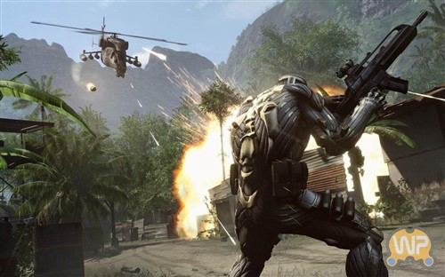
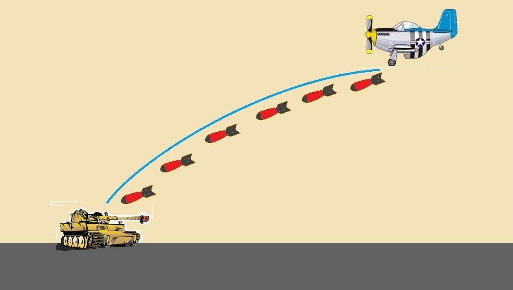
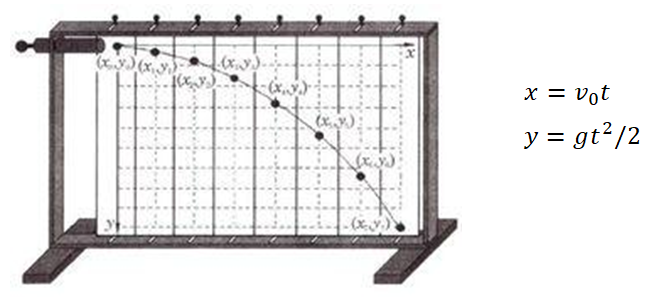
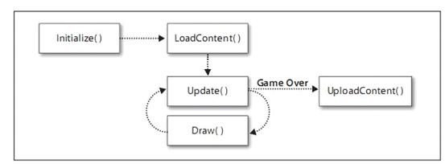
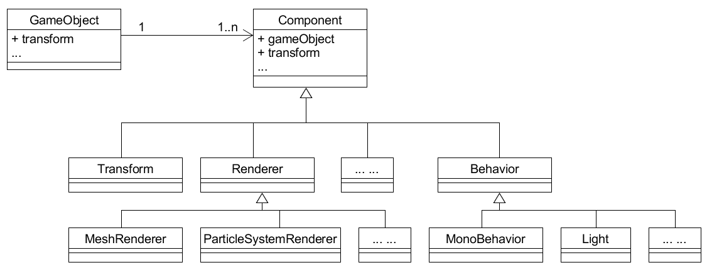
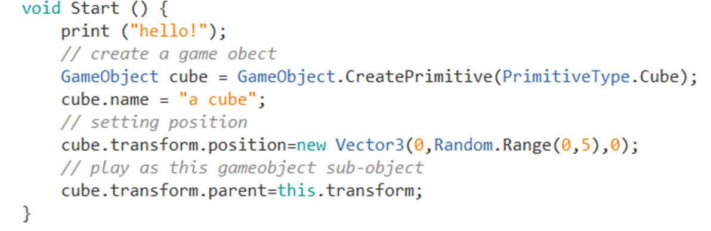
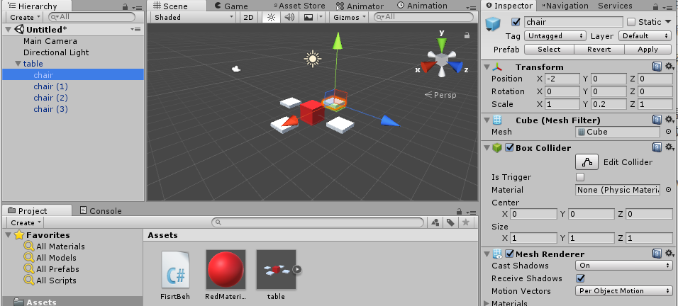
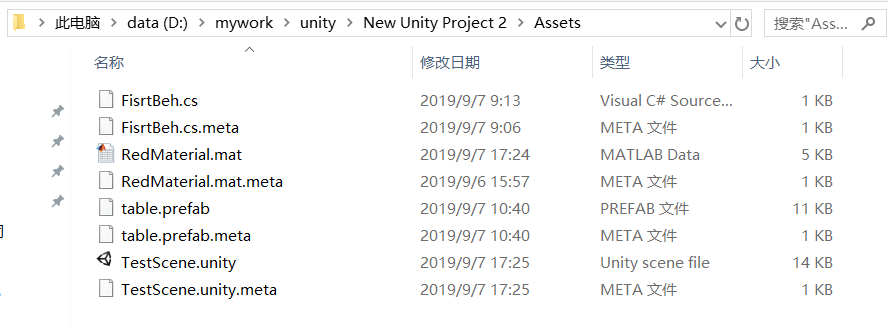

# 二、离散仿真引擎基础
{:.no_toc}

>   
> **_You can't connect the dots looking forward; you can only connect them looking backwards_**  
>   
> --- Steve Jobs, Stanford Report, June 14, 2005
>  

* 目录
{:toc}

_预计时间：3-4 * 45 min_

## 1、游戏引擎

### 1.1 游戏引擎概念与结构

> A _game engine_ is a software-development environment designed for people to build video games.  

根据这个定义，从 [Construct2](https://www.scirra.com/construct2) 到 [Unreal Engine](https://www.unrealengine.com/) 都是游戏引擎。之所以 Unreal Engine 才是你眼中引擎是因为 EPIC Game 能够提供电影艺术级别效果，一下就吸引了你的眼球。与指相比而 Construct2 等引擎尽管默默无闻，但也是无数游戏设计师、开发者的最爱。



【注】游戏引擎产生了如此难以置信的精美而“真实”的场景画面，几乎每个人都梦想能开发这样的引擎！

简而言之，**游戏引擎** 是一组游戏运行部件以及软件工具的集合。随着技术进步，多数现代游戏引擎都包含以下部件，游戏引擎架构如图所示：


如上图所示，游戏引擎分为两个层次：

游戏内容层：一组工具管理游戏需要的数据  
游戏引擎层：一组游戏运行部件，支撑游戏的运行与人机交互

尽管不同厂家的引擎性能差别巨大，每个部件功能也不同，其基本原理和使用方法基本一致。特别的，现代游戏都是数据驱动的架构，即游戏代码工作量一般不太大，游戏的行为、规则主要由数据决定。

### 1.2 游戏引擎产生与分类

早期游戏引擎是在游戏开发过程产生的。例如：id TECH 制作了游戏 《德军总部3D》、《Doom 3》（毁灭战士）、《Quake》（雷神之锤）等大卖的 3D 游戏，同时也把 3D 游戏的核心部件以及相关工具卖给其他游戏公司或电影制作企业。比较著名的就是 [Quake engine](https://www.moddb.com/engines/quake-engine/downloads)，它的作者约翰·卡马克\* 是开源运动的支持者，你可以下载源代码与各种资源。

 早期游戏引擎都是以动画与渲染为核心，并没有使用现代显卡技术。

【注】 约翰·卡马克，id TECH 联合创始人(John Carmack)。现在已经加入Oculus Rift 团队，并且担任首席技术官一职。

**PC与游戏机专业游戏引擎**

以下是一些商业引擎与代表作：

|引擎|代表作|
|---|---|
|虚幻/Unreal|《战争机器》|
|Cry Engine\*|《Crysis》|
|寒霜/Frostbite|《战地》|
|Infinity Ward|《使命召唤》|
|EGO|《尘埃2》|
|id TECH|《DOOM3》|
|Source|《半条命2》|
|X-Ray\*|《潜行者》|
|Havok Vision|《哥特王朝》|
|Quake/idTECH|《雷神之锤》|
|Chrome4\*|《狂野西部2》|
|MT framework|《生化危机5》|
|Gamebryo|《上古卷轴IV》|
|Jupiter EX|《 F.E.A.R》|

\* 顶级特效引擎，需要强大的 CPU 和 GPU（甚至超级计算）支持。

因为游戏引擎开源，具有实力的游戏公司一般都对外宣称拥有自己的游戏引擎。因此，要学好游戏开发，要点是强化游戏引擎知识，而不是简单的追随大厂如EPIC（Unreal）、EA（Frostbite）这些产品。

 游戏引擎核心部件几乎 100% 由 c 和 c++ 实现。因此要进入游戏引擎开发的核心，c语言、数学、算法、计算机图形学等是基础。 如果要深入 AR/VR，SLAM 、计算机视觉与理解等技术是重要内容。因此游戏编程技术仅是游戏开发的一个方面，学好相关课程很重要。

**移动端游戏引擎**

手机端3D游戏引擎几乎是 Unity3D 一家独大。Unity Technologies 在PC、游戏机平台的游戏大厂比，难以竞争。就借助一款 [mono](https://github.com/mono/mono) 跨平台 .net 实现框架软件（类似java虚拟机），把它的游戏引擎部署到几乎任意的操作系统上，特别在手机平台上获得成功！

众多的开发者倒逼 Unity 成为一家专业提供游戏引擎与资源服务的公司。与传统游戏引擎比 Unity 3D 有着强大的开发工具和比较完善的服务社区，不仅是游戏入门学习的首选，也是 3D 手游开发的最佳工具之一。

Unity 的成功吸引了其他企业进入手游市场，其他包括：

* cocos 3d （cocos 2d 的扩展）
* Unreal

**面向游戏设计师的游戏引擎**

简单一些，就是几乎不用写代码（交互编程，可视化编程）的游戏引擎。常用于非计算机专业人员游戏入门、做游戏 demo 和 testing、编写 html5 小游戏等

* Construct2
* GameMaker: Studio
* GameMei


**网页平台（HTML5）游戏引擎**

具体说应该是 [WebGL](https://developer.mozilla.org/zh-CN/docs/Web/API/WebGL_API/Tutorial/Getting_started_with_WebGL) 开发的副产物，为展示新一代互联网图形基础设施而开发，并逐步走向流行。

* three.js  WebGL 官方效果展示项目
* babylon.js 目前发展较好的项目

**开源游戏引擎**

很多公司游戏引擎都是基于开源引擎而建，因此有必要了解它们

* Quake engine 系列
* OGRE
* Panda 3D
* Yake

一些公司，开源了部分基础代码以获得同行信任，如：

* Unity 3D
* Torque

## 2、游戏引擎核心-离散仿真

游戏就是模拟世界或构建虚拟世界。用计算机技术呈现现实或虚拟世界的动态场景，统称“离散仿真系统”

### 2.1 离散仿真的程序直观

这是一个简单的游戏世界，飞机打坦克的场景，如图所示：



为了呈现炮弹打击坦克的过程，



需要不断计算炮弹的位置，并在屏幕上画出炮弹。当游戏的引擎每 1/60 秒计算出所有游戏对象的位置、形态，并在屏幕上画出来，我们就看到了如电影一般飞机打坦克的动态场景。

**游戏循环**

先看仿真系统底层运作的伪代码，在游戏引擎中称为游戏循环（Game Loop）：

```
Initialize()
LoadContent()
WHILE not end of game DO {
    UpdateGameObjects(t) //创建、删除、修改游戏对象
    DrawGameObjects(t)   //绘制游戏对象
}
UnloadContent()
```

这么简单（难以置信）。微软 XNA 游戏引擎的基本框架就是这样，如图所示：



所有，XNA 游戏编程的模板如下：

```c
public class Game1 : Microsoft.Xna.Framework.Game {

        GraphicsDeviceManager graphics;
        SpriteBatch spriteBatch;

        public Game1() {
            graphics = new GraphicsDeviceManager(this);
            Content.RootDirectory = "Content";
        }

        protected override void Initialize() {        
            base.Initialize();
        }

        protected override void LoadContent() {  
            spriteBatch = new SpriteBatch(GraphicsDevice); 
        }

        protected override void UnloadContent(){           
        }

        protected override void Update(GameTime gameTime)
        {           
            if (GamePad.GetState(PlayerIndex.One).Buttons.Back == ButtonState.Pressed)
                this.Exit();

            base.Update(gameTime);
        }

        protected override void Draw(GameTime gameTime) {
            GraphicsDevice.Clear(Color.CornflowerBlue);

            base.Draw(gameTime);
        }
    }
```

* GraphicsDeviceManager 图形设备管理器，用于访问图形设备的通道。
* GraphicsDevice 图形设备。
* Sprite 精灵，绘制在屏幕上的的2D或3D图像，比如游戏场景中的一个怪兽就是一个Sprite。
* SpriteBatch 它使用同样的方法来渲染一组Sprite对象。

既然游戏执行过程是固定的，但每步骤的具体内容是用户定义的，这就是“设计模式”教材上典型的模板方法模式设计！

尽管现代游戏引擎的游戏循环非常复杂，但作为开发者必须明白，所有复杂的代码均建立在这样简单的基础代码之上。

 无论引擎怎么强大，其游戏循环一定是单线程的。即有仅有一个线程渲染画面，由于渲染过程中计算线程不能修改游戏对象状态，所以过多 CPU 很难被利用。 

### 2.2 离散仿真与离散事件仿真

“Discrete”是离散，为了研究一个系统的动态，计算机必须通过一个时间点来就系统状态，比如研究对象进入系统和离开系统的时间点，进入队列和离开队列的时间点，开始加工和完成加工的时间点等等。这些时间点在时间轴上是离散而非连续的序列，而系统状态仅在离散的时间点上发生变化。

**离散仿真**

为了研究系统动态，时间被分成为若干小的时间片，系统状态被这段时间内发生的系列活动而改变。称为基于活动的仿真（activity-based simulation）

* **时间轴（线）** 为了解释或预测系统变化的规律，必须选择合适的时间轴并在上选择一组点观察或记录系统状态。不同系统时间轴选择不一样，如模拟古代气候变化，可能以千年为单位，研究微观世界，如化学反应则可能以纳秒为单位。对于游戏，可能有两个以上时间轴
    - 游戏时间，如：石器时代、铁器时代、火器时代、太空时代
    - 渲染时间，游戏引擎根据系统状态，绘制游戏画面的时间
* **FPS（Frames PerSecond）** 是视频游戏最重要的概念，它是每秒钟游戏循环执行 DrawGameObjects 的次数。如果低于 30次/秒，玩家则会看到明显的动作不流畅。在特定性能机器上，它是评价游戏优化的指标；在不同机器上，它是机器游戏性能的综合指标。
* **系统状态**：某一时刻，系统中所有对象、及其属性与关联。

离散仿真存在一些显而易见的问题：

* 跳帧。无论 UpdateGameObjects 或 DrawGameObjects 花费的时间过多，就会产生帧间隔超出给定时间问题。
* 穿越。可能失去两次计算之间存在重要的状态，例如：当炸弹速度很快时，在上一个时刻，计算到炸弹在坦克上面，接下来一个时刻炸弹已坦克下面，问题是坦克打中了吗？这时，不仅需要计算两个时刻对象状态（位置），而且要判断炸弹轨迹与坦克轨迹是否相交？然而，轨迹用直线表示，还是进一步内插补计算？

这里仅给出游戏离散仿真中两个典型问题。你必须明白，无论游戏编程或引擎开发都需要认真学习相关知识，避免 “too young too naive”

**离散事件仿真**

早期游戏引擎最大的问题是硬件性能不足，游戏优化能力决定了游戏的成功。在硬件性能冗余、面向对象的时代，用 XNA 这样的引擎从头开始编写管理成百上千游戏对象的游戏是什么感觉？

* 需要用代码和合适的数据结构组织游戏对象，包括创建、删除等
* 需要用代码计算每个时刻游戏对象属性
* 需要用代码确定绘制游戏对象的顺序

程序员做2D小游戏时 “一切控制在手中” 的好感觉将荡然无存。因此，需要对游戏离散引擎进行改造，既要合适面向对象的编程，也要将游戏设计与优化工作自动化与工具化，在游戏执行性能可接受的条件下，使得游戏开发难度减低到普通程序员可以接受的程度。Unity 3d 在这方面工作使得游戏开发得到普及，EPIC（Unreal） 等大厂也积极跟进，谁也不乐意被开发者抛弃！

**离散事件仿真**（Discrete Event Simulation，缩写为DES）：为了研究系统动态，系统中对象处理在内部（如对象状态改变产生事件）、外部事件，并在事件处理过程中进一步引发系统状态改变产生系列事件。称为基于事件的仿真（Events-based simulation）。与离散仿真不同，我们是在特定事件（条件）中观察并改变系统状态。

现代游戏引擎一般都是离散仿真与离散事件仿真混合模型。先给出一个更接近现代游戏引擎的伪代码：

```
initialize()
loadContent()
WHILE not end of game DO {
    FOREACH GameObject o In game DO {
        IF (o.fristUpdated) o.Start();
    }
    FOREACH GameObject o In game DO {
        o.Update();
    }
    FOREACH GameObject o In game DO {
        o.LastUpdate();
    }
    drawGameObjects(t)   
}
unloadContent()
```

尽管这个代码与实际代码差别很大，它体现了以下一些事实：

* 注意方法的首字母大小写，小写表示内部方法，大写表示公有方法。显然，这时编程模板从游戏循环级别改为对象级别，即游戏对象有 Start 等方法
* 游戏对象的数据结构是引擎管理的，用户可以用工具或代码（通过API）管理游戏对象。例如，用户通常不能直接析构游戏对象，因为你在某个对象的 Update 中析构一个游戏对象，导致其他对象的 Update 中引用该对象出现 Null 错误！
* 游戏渲染自动化了，程序员并不需要干预渲染过程
* 你可能会看到游戏对象模板中有 OnXXX(...) 这样的事件处理句柄。例如： OnCollision(...) 表示这个对象与其他对象碰撞时，该句柄被调用。因为当你使用与引擎集成的物理模块时，物理模块一旦发现游戏对象碰撞，就会自动触发它。类似的事件句柄很多，至于不同事件在什么时机执行，这是复杂的话题。

现代游戏引擎由于要管理许多游戏对象，空间管理与性能优化无疑是巨大的挑战。所幸的是程序员编写游戏正在一步步变得更简单！

## 3、Unity 离散仿真引擎实现与应用

 Unity 的使用与操作细节请移步 Unity 用户手册，这里仅关注相关内容

* 官方用户手册 [Manual](https://docs.unity3d.com/Manual/)
* [中文手册](http://docs.manew.com/Manual/)。【善意提示：翻译总是落后技术发展的】 

### 3.1 Unity 3D 操作快速入门

**1、了解 Unity 3D 基本界面**

如果你是新手，先阅读 [Getting Started](https://docs.unity3d.com/Manual/UnityBasics.html)

安装完成后，创建一个 3D 项目。[Unity 主界面](https://docs.unity3d.com/Manual/LearningtheInterface.html)如图所示：


* 项目视图（Project Window）：管理游戏项目资源的地方。
    - 创建游戏需要的材料
    - 参见 菜单 -\> Assets -\> Create
* 场景视图（Scene View）：编辑游戏对象的视口
* 层次视图（Hierarchy Window）：组织游戏对象的地方。
    - 游戏运行时需要的游戏对象
    - 参见 菜单 -\>  GameObject
* 属性视图（Inspector Window）：观察游戏对象和资源属性的地方
    - 游戏运行时，可实时修改属性改变游戏对象行为，但不会影响设计内容
    - 参见 菜单 -\>  Component
* 工具栏（Tools Bar）：工具。新手会用运行、停止即可

**2、初识游戏对象与资源**

任务是在游戏场景中放置一个物体（如 Cube）并赋予红色，运行游戏。

 操作 02-01 ，GameObject 练习：

* 使用 菜单 -\> GameObject -\> 3D Object -\> Cube  或 在层次视图点右键（上下文菜单 -\> 3D Object -\> Cube）
    - 层次视图增加了 Cube 游戏对象， 同时我们在场景视图中看到了一个白色的正方型
* 选择 层次视图 中主摄像机对象（Main Camera）, 场景视图右下方就是摄像机拍摄的画面
* 使用 菜单 -\> Assets -\> Create -\> Material 或 项目视图（Assets）的上下文菜单 -\> Create -\> Material
    - 项目视图（Assets）下新增了一个白色的材料，点击它观察属性视图
    - 在属性视图找到 Albedo 并双击颜色板，出现一个 Color 窗口
    - 选择一个你喜欢的颜色，如红色
    - 项目视图（Assets）中该材料色彩变化
    - 重命名为 RedMaterial
* 拖动（Drag） RedMaterial 放落（Drop）Cube（层次视图或场景视图）上，Cube变成红色。
* 点击工具栏 Play 按钮运行游戏，游戏视图出现（正是摄像机拍摄到的内容）
* 再点 Play 按钮 终止游戏

### 3.2 Unity 离散仿真引擎快速入门

**1、游戏对象的表示**

Unity 游戏对象主要涉及三种类:

* [GameObject](https://docs.unity3d.com/ScriptReference/GameObject.html): Unity 场景中所有实体的基类
* [Component](https://docs.unity3d.com/ScriptReference/Component.html): 能附加到游戏对象的部件的基类
* Component 的各种子类。包括空间与变换部件 [Transform](https://docs.unity3d.com/ScriptReference/Transform.html)、各种 渲染部件[Reander](https://docs.unity3d.com/ScriptReference/Renderer.html) ，脚本部件 [MonoBehaviour](https://docs.unity3d.com/ScriptReference/MonoBehaviour.html) 的子类等等。

它们之间的关系如图所示：



直观上，游戏对象继承非常直观，例如：96A主站坦克继承抽象坦克，抽象坦克继承游戏对象基类，似乎是天经地义的设计。然而，游戏引擎能仅能与游戏对象基类打交道。游戏引擎做的事越多，游戏对象基类必然要承担许多职责，导致基类过于庞大。

这里，游戏对象用一组部件来表达不同的方面的要求，能更好满足游戏世界的复杂性，提升游戏对象的灵活性，便于与引擎协作。例如：游戏对象位置等由 Transform 管理，形态网格由  Mesh 管理， 绘制由 Render 等部件协作完成，行为则由 MonoBehaviour 的子类管理。这些部件，仅需要时才加入游戏对象的定义。

**组合优于继承** 

为什么要这样设计？在设计模式的装饰模式器描述了这样的设计场景：“装饰器模式（Decorator Pattern）允许向一个现有的对象添加新的功能，同时又不改变其结构。” 动态地给一个对象添加一些额外的职责。就增加功能来说，装饰器模式相比生成子类更为灵活。

这个设计充分体现了这条软件设计原则“组合优于继承”。然而，众多的部件对象也带来管理复杂性与性能优化问题。

【注】装饰器模式的案例多数是该设计场景的特例，“Wrapper”模式。

现在，做一些任务验证上图设计:

 操作 02-02 ，GameObject 与 Component 关系练习：

* 在层次视图选择 Cube 游戏对象
* 在属性视图观察它有哪些部件？
* 修改 Tranform 部件中 Postion 的 x，y，z。观察游戏对象在场景视图中的变化
* 在属性视图点击 “添加部件（Add Component）” 按钮，... 有哪几大类部件？
* 在层次视图选择 Cube 游戏对象，在属性视图观察它有哪些部件？

**2、赋予游戏对象行为**

游戏对象行为是游戏对象的一个部件，都是脚本部件 [MonoBehaviour](https://docs.unity3d.com/ScriptReference/MonoBehaviour.html) 的子类。

下面的任务就是创建一个简单的脚本，并挂载到 Cube 对象。

 操作 02-03 ，c# Script 编写练习：

* 在资源视图创建一个脚本。上下文菜单 -\> Create -\> c# script
* 修改脚本名称 FisrtBeh。然后双击它，编辑它。
* 修改代码如下：

```csharp
using System.Collections;
using System.Collections.Generic;
using UnityEngine;

public class FisrtBeh : MonoBehaviour {

	// Use this for initialization
	void Start () {
		Debug.Log("This Start!");
	}
	
	// Update is called once per frame
	void Update () {
		// Debug.Log("This Update!");	
	}

	void OnEnable () {
		Debug.Log("This Enabled!");	
	}

	void OnDisable () {
		Debug.Log("This Disabled!");	
	}
}
```

你可能注意到 FisrtBeh 是 MonoBehaviour 的子类。我们怎么知道引擎调用了哪些方法和事件呢？ MonoBehaviour 基类就是一个编程模板，Unity API 的 Messages 一节给出了它可以处理的引擎回调（callback）与事件句柄（OnXXX）。

由于 Update 在每个游戏循环都会被调用，为了避免大量输出，所以暂时注释了。

* 如果这个代码没有编译错误，现在可拖动（Drag）它到任何游戏对象（如 Cube）上，属性面板自动添加该部件。
* 运行游戏
* Console 面板（control + shift + c）中，你看到消息顺序是 Enabled，Start。
* 点击 Cube 属性面板最上面 checkbox，你得到消息 Disabled 
* 点击 Cube 属性面板最上面 checkbox，你得到消息 Enabled
* 点击 FisrtBeh 部件前面 checkbox，你得到消息 Disabled
* 点击 FisrtBeh 部件前面 checkbox，你到消息 Disabled
* 结束游戏，你得到消息 Disabled

修改代码，让 update 中语句执行， 重复上述过程。

 脚本文件名称必须与类名一致，否则 ...


**3、游戏脚本对象方法与事件执行顺序**

你可能想知道这些消息在游戏循环的什么时候发生，它们之间的顺序，Unity 官方手册这样描述了游戏循环、事件、引擎部件之间的关系：

* [Order of Execution for Event Functions](https://docs.unity3d.com/Manual/ExecutionOrder.html)

这是一张可怕的大图，对入门者极其不友好。知道以下事件就够用了：

| 事件名称 | 执行条件或时机 |
| --- | --- |
| Awake | 当一个脚本实例被载入时Awake被调用。或者脚本构造时调用 |
| Start | 第一次进入游戏循环时调用 |
| FixUpdate | 每个游戏循环，由物理引擎调用 |
| Update | 所有 Start 调用完后，被游戏循环调用 |
| LastUpdate | 所有 Update 调用完后，被游戏循环调用 |
| OnGUI | 游戏循环在渲染过程中，场景渲染之后调用 |

 由于游戏对象与部件之间是组合关系，Compnonent 对象子类的构建、释放必须由对应 GameObject 完成。程序员不能创建它们

 为什么不能让程序员用 new 创建部件？

### 3.3 游戏对象的组织、预制与场景

**1、用脚本创建 Primitive 游戏对象**

 操作 02-04 ，创建 Primitive 游戏对象练习：

* 修改 FisrtBeh 类的 Start 方法，如图所示



* 运行游戏
* 展开层次视图，找到创建的游戏对象
* 终止游戏
* 在层次视图中观察，运行期的变化都消失了！

 菜单能作的工作，利用 API 编程也能做到！

**2、游戏对象组合与预制**

如果我们每次都从基础游戏对象构建游戏，这需要多少代码，而且不易于修改。我们可以把基本的游戏对象组合起来，制作成 **预制**，以后把预制当作一个游戏对象使用。

 如果说基本游戏对象是原材料，预制就是半成品。因此，预制的概念在 Unity 中及其重要，也是游戏制作最基础的知识！

下图就是本节的任务，制作一个座椅的预制




 操作 02-05 ，创建 Prefabs 练习：

* 将 Cube 命名为 table
* 从菜单创建新的 Cube 游戏对象，并命名为 chair
* 将 chair 拖动并放置在 table 之上，我们发现 chair 变为子对象
* 改变 chair 位置（如 position.x = -2）；大小（如 scale.y = 0.2)
* 采用复制粘贴，生成其他三个 chair 并修改位置
* 【重要】将 table 拖动并放置 在 Assets 面板之上，就生成了一个 table 预制
* 将 table 预制 拖动并放置 到层次视图，我们观察到座椅游戏对象同时生成了
* 修改 table 的位置，chair 如何变化？

 在层次视图中，预制的颜色与普通游戏对象不同！！！

 父对象坐标与子对象坐标的关系（世界坐标、相对坐标）？

事实上，游戏都是一些预制好的对象进一步组合而成，我们的代码不过是胶水，控制作这些事物的变化。

 思考题：从对象设计角度，称为“组合模式（Composite Pattern）”。例如，行政区是一个抽象概念，国家、省、市、县都是行政区。这些行政区对象按树形结构组合，每个高级别的行政区都由几个低级别的行政区组合构成。

 许多同学（包括网上绝大多数博客）都从编程特征来理解设计模式，而不像设计模式作者们那样从现实社会设计问题中去理解，忽视具体问题的业务场景与上下问。23 种面向对象设计模式的强大，就是这么多年来大家都觉得足够用了！

**3、游戏场景、预制与资源**

**游戏场景的保存与恢复**

与戏剧一样，一个游戏由一个与多个场景（Scenes）。场景中包含背景、静态游戏对象与动态游戏对象。Unity 场景视图就是场景中所有事物的可视化设计器。层次视图则是从对象的角度，描述了游戏对象树林这种数据结构。

 操作 02-06 ，创建与恢复 Scene 练习：


* 菜单 -\> File -\> Save Scenes
* 将设计好的场景起名 TestScene，这时在资源中看到 Unity 图标的场景
* 在当前设计场景中，添加、删除或修改游戏对象
* 双击资源中场景图标，选不保存当前场景，这是场景恢复到保存时的状态

**资源、预制与场景**

到开游戏项目资源所在的目录，例如： `D:\mywork\unity\New Unity Project 2\Assets`



发现每个游戏资源都对应了响应的文件。因此，资源是存在的硬盘的文件。

* 脚本（.cs）。用文本编辑器修改它，属性编辑器中代码会同步更新哦！
* 材料（.mat）, 预制（.frefab）, 场景（.unity）

对于 Unity 预知和场景都是一样的文件。预制是游戏对象及其树上所有对象的文本定义（可以翻译成任何文本，如 YAML，XML，JSON]）;场景是场景中所有游戏对象的文本定义。默认它们以压缩格式保存。

【高级话题】文本化资源文件 [Text-Based Scene Files](https://docs.unity3d.com/Manual/TextSceneFormat.html) 

### 3.4 游戏对象动态构建

游戏代码的基本任务是根据资源动态加载游戏对象，并控制它们。本次的任务是掌握用代码创建游戏对象的基本技巧。

首先创建如下代码资源 `LoadBeh`：

```csharp
using System.Collections;
using System.Collections.Generic;
using UnityEngine;

public class LoadBeh : MonoBehaviour {

	public Transform res;

	// Use this for initialization
	void Start () {
		// Load Resources
		GameObject newobj = Instantiate<Transform> (res, this.transform).gameObject;
		newobj.transform.position = new Vector3 (0, Random.Range (-5, 5), 0);
	}
}
```

 随着版本更新，Unity 越来越喜欢使用模板，可能导致部分版本不兼容。例如：Instantiate 方法的定义 `public static T Instantiate(T original, Transform parent);`

 操作 02-07 ，从预制创建游戏对象 练习：

* 在仅场景中仅保留摄像机和光源
* 菜单 -\> GameObject -\> Create Empty
* 将空（PlaceHolder）游戏对象命名为 init
* 将 LoadBeh 拖放至 init
* init 的属性面板多出一个 Load Beh（Script） 的组件，有一个属性 res
* 将 table 预制拖放至 res 属性
* 运行游戏

这是，我们将观察到座椅随机出现在 Game 视图中。

 编程练习 02-08，使用砖块构建一面5*10 的墙

编程要求：

* 阅读 [Instantiate 方法 API](https://docs.unity3d.com/ScriptReference/Object.Instantiate.html) 中的案例
* 使用 Cube 制作一个长方形带材料的预制 brick
* 编写一段代码 BuildWall 生成 5*10 的墙

最后，对 Unity 3D 离散引擎做精简总结：游戏循环遍历所有游戏对象的所有部件，驱动游戏运行。

## 4、作业与练习

**Unity 常用资源**

* Manual  https://docs.unity3d.com/Manual/index.html
* 中文参考 http://docs.manew.com/
* 官方案例 https://unity3d.com/cn/learn/tutorials
* UML 绘图工具 http://www.umlet.com/changes.htm

**作业内容**

1、简答题【建议做】

* 解释 游戏对象（GameObjects） 和 资源（Assets）的区别与联系。
* 下载几个游戏案例，分别总结资源、对象组织的结构（指资源的目录组织结构与游戏对象树的层次结构）
* 编写一个代码，使用 debug 语句来验证 [MonoBehaviour](https://docs.unity3d.com/ScriptReference/MonoBehaviour.html) 基本行为或事件触发的条件
    - 基本行为包括 Awake() Start() Update() FixedUpdate() LateUpdate()
    - 常用事件包括 OnGUI() OnDisable() OnEnable()
* 查找脚本手册，了解 [GameObject](https://docs.unity3d.com/ScriptReference/GameObject.html)，Transform，Component 对象
    - 分别翻译官方对三个对象的描述（Description）
    - 描述下图中 table 对象（实体）的属性、table 的 Transform 的属性、 table 的部件
        - 本题目要求是把可视化图形编程界面与 Unity API 对应起来，当你在 Inspector 面板上每一个内容，应该知道对应 API。
        - 例如：table 的对象是 GameObject，第一个选择框是 activeSelf 属性。
    - 用 UML 图描述 三者的关系（请使用 UMLet 14.1.1 stand-alone版本出图）
* 整理相关学习资料，编写简单代码验证以下技术的实现：
    - 查找对象
    - 添加子对象
    - 遍历对象树
    - 清除所有子对象
* 资源预设（Prefabs）与 对象克隆 (clone)
    - 预设（Prefabs）有什么好处？
    - 预设与对象克隆 (clone or copy or Instantiate of Unity Object) 关系？
    - 制作 table 预制，写一段代码将 table 预制资源实例化成游戏对象

2、 编程实践，小游戏

* 游戏内容： 井字棋 或 贷款计算器 或 简单计算器 等等
* 技术限制： 仅允许使用 **[IMGUI](https://docs.unity3d.com/Manual/GUIScriptingGuide.html)** 构建 UI
* 作业目的： 
    - 了解 OnGUI() 事件，提升 debug 能力
    - 提升阅读 API 文档能力 

3、思考题【选做】

* 微软 XNA 引擎的 Game 对象屏蔽了游戏循环的细节，并使用一组虚方法让继承者完成它们，我们称这种设计为“模板方法模式”。
    - 为什么是“模板方法”模式而不是“策略模式”呢？ 
* 将游戏对象组成树型结构，每个节点都是游戏对象（或数）。
    - 尝试解释组合模式（Composite Pattern / 一种设计模式）。
    - 使用 BroadcastMessage() 方法，向子对象发送消息。你能写出 BroadcastMessage() 的伪代码吗?
* 一个游戏对象用许多部件描述不同方面的特征。我们设计坦克（Tank）游戏对象不是继承于GameObject对象，而是 GameObject 添加一组行为部件（Component）。
    - 这是什么设计模式？
    - 为什么不用继承设计特殊的游戏对象？

**作业提交要求**

* 仅能用博客或在线文档提交作业，建议使用 Github 提交代码和作业。**不能使用docx、pdf等需要下载阅读的格式**

&nbsp;

[返回目录](./)  

