# 三、空间与运动
{:.no_toc}

>   
> **_I stumbled into by following my curiosity and intuition turned out to be priceless later on_**  
>   
> --- Steve Jobs, Stanford Report, June 14, 2005
>  

* 目录
{:toc}

_预计时间：2-3 * 45 min_

## 课程相关资源


## 1、游戏世界空间模型

### 1.1 游戏世界的设计维度（文化与艺术）

游戏世界是一个虚拟的世界、假想的世界、甚至其中部分是真实的世界。玩家控制部分游戏物体，按游戏世界或现实世界的规则交互，以达成设定目标。当虚拟世界与现实世界交融时，我们就称为增强现实（Augmented Reality）游戏。例如：我们在大富翁中采用现实股票行情，使用虚拟币在游戏中交易，更有利于玩家研究现实规则，做出有意义的决策；当现实商家优惠卷（Coopons）与《精灵宝可梦》这样的游戏机制相集合，就可以利用现实地图和玩家GPS位置，结合大数据技术推荐，产生实际的商用引流效果。

不管游戏世界是虚拟的或现实的，游戏世界中所有物体（游戏对象）都必须在特定的空间、时间下出现、变化、消失。因此，游戏设计必须定义空间、时间等。 Adams 在其教材中把游戏设计分为几个维度：

* 空间维度：
    - 自由度：2d 或 2d卷轴，3d, 2.5d(如 Aircraft)，4d（？）
    - 尺度：游戏世界的度量单位，如米、公里、光年。特别是其他物体与玩家对象的相对大小设计
    - 边界：玩家可以看到的地图与场景
* 时间维度
    - 例如：唐朝、宋朝；石器时代、铜器时代、铁器时代、火器时代、太空时代；
    - ...
* 环境维度
    - 时代与文化背景
    - 艺术风格与形式
    - 场景与物体搭配
* 情感维度
    - ...
* 道德维度
    - ...

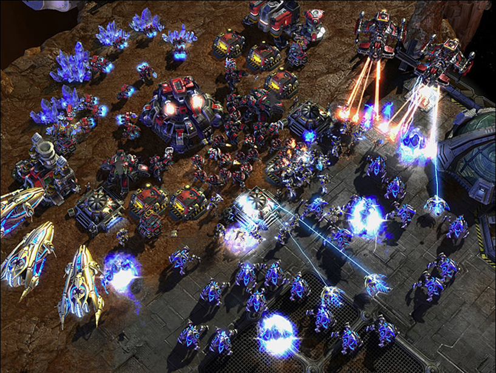

良好的空间设计，玩家体验的基础

 如果你对这些维度感兴趣，请阅读游戏设计教材！

### 1.2 游戏世界空间模型（技术）

**世界坐标**：一个游戏或游戏场景的 **绝对坐标** 系统。每个游戏对象的位置、角度、比例的值都这个坐标系下是唯一的。

**对象坐标**：游戏对象相对父游戏对象的位置、角度、比例。又称为 **相对坐标**

**3D 空间**

坐标比较简单，典型 3D 正交坐标系统

* Z 轴：深度维度，前后方向。Z 越小越靠前
* Y 轴：高度维度，上下方向。Y 越大越高
* X 轴：水平维度，左右方向。

 **左手、右手坐标系统**

掌握此非常重要，相对坐标系中可快速确定位置

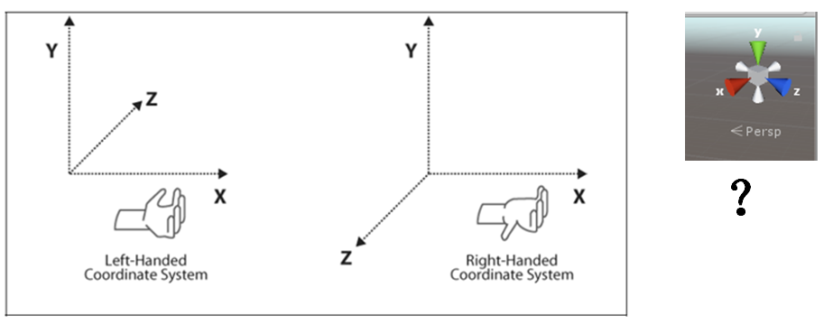

 Unity 是左手坐标系统？右手坐标系统？

**2D 空间**

2D 空间会复杂一些

* 离散 2D 坐标。瓦片空间，或网格空间，或棋盘空间都是一个概念。即使用整数完成游戏对象运动、碰撞等计算（早期计算机浮点性能很差哦），特别是蜂窝状六边形地图（你玩过的！）
* 连续 2D 坐标
* 混合坐标系统。看上去游戏对象连续运动，但内部计算是网格模型。例如，3D象棋

## 2、坐标变化与运动

游戏运动本质就是使用矩阵变换（平移、旋转、缩放）改变游戏对象的空间属性。

### 2.1 体验简单运动与叠加

 操作 03-01 ，简单运动练习：

```csharp
public class MoveLeft : MonoBehaviour {

	// Use this for initialization
	void Start () {
		
	}
	
	// Update is called once per frame
	void Update () {
		this.transform.position += Vector3.left * Time.deltaTime;
	}
}
```

* 先准备如上脚本 MoveLeft 
    - 这个代码每秒钟使得游戏对象向左移动一个单位
    - Vector3 是一个类，Vector3.left 是单位常数
    - Time 是离散引擎的核心类，Time.deltaTime 这个循环与上个循环之间的时间差
* 将代码拖放到任意游戏对象之上
* 运行游戏
* 观察，游戏对象左移了
* 终止游戏

 编程练习 03-02，复合运动：

编程要求与提示：

* 参照 MoveLeft 创建脚本 MoveUp
* 将脚本拖放到 MoveLeft 或它的子对象上
* 观察效果
* 修改 MoveLeft 代码如下

```csharp
public class MoveLeft : MonoBehaviour {

    public int speed = 2;

	// Use this for initialization
	void Start () {
		
	}
	
	// Update is called once per frame
	void Update () {
		this.transform.position += speed * Vector3.left * Time.deltaTime;
	}
}
```

* MoveLeft (Script) 多出一个 Speed 属性，修改它
* 运行并观察游戏；


### 2.2 Transform 部件

[TransForm 部件](https://docs.unity3d.com/ScriptReference/Transform.html) – **1、属性**

* 位置、欧拉角、比例、旋转
    - 世界坐标：position, eulerAngles, scale, rotation
    - 相对坐标：localposition, local…
* 对象空间轴（单位向量）
    - up, right, forward
* 空间依赖
    - parent, childCount

欧拉角（eulerAngles）：x、y和z角表示围绕z轴的旋转z度、围绕x轴的旋转x度和围绕y轴的旋转y度。

 操作 03-03 ，欧拉角练习：

* 在场景视图中放置一个长方体，如 scale = (4,1,1)
* 用左手握住 z 轴方向，修改 z 角度，如 45 度

转动（Rotation）：四元数（Quaternion）。 [Quaternion](https://docs.unity3d.com/ScriptReference/Quaternion.html) 使用向量（x,y,z,w）表示物体旋转，维基百科说它与欧拉角等价。所以：

* Quaternion.Euler(x,y,z) 可以得到四元数表示
* 一个四元数也可以使用方法 eulerAngles 的到欧拉角

反正你不要尝试修改四个元素的值，官方描述：`Don't modify this directly unless you know quaternions inside out.`

 思考：四元素与三个元素的欧拉角等价，为什么要浪费空间用四个元素表示旋转？

**2、方法**

与直接修改游戏对象属性相比，TransForm 部件提供相关的方法，让程序猿编写更利于理解的运动程序。主要方法包括：

* 平移：[Translate](https://docs.unity3d.com/ScriptReference/Transform.Translate.html)
* 旋转：[Rotate](https://docs.unity3d.com/ScriptReference/Transform.Rotate.html)
* 围绕：[RotateAround](https://docs.unity3d.com/ScriptReference/Transform.RotateAround.html)
* 面向：[LookAt](https://docs.unity3d.com/ScriptReference/Transform.LookAt.html)

Unity 每个 API 都给出了丰富的案例解释这些方法，每个方法都有几个重载。

 API 设计者要以使用者易于理解、使用方便为目标，重载函数或方法是重要设计手段。

 编程练习 03-04，围绕运动：

编程要求与提示：

* 阅读 RotateAround 方法 API 案例
* 用一个球体表示太阳，一个球体表示地球
* 使用 RotateAround 让地球围绕太阳运动

### 2.3 向量与变换

如果程序员线性代数还过得去，一定会首选向量与变换控制运动，这毕竟是万能和高效的方法，虽然不易于理解。

**1、Vector3** 

Vector3是三维向量，是一个结构体。尽管 c# 把它化妆成对象模样，事实上我们仅需关心它的静态常数、成员与成员函数、静态方法即可

* 静态常数：zero, up, left, forward
* 成员与成员函数：x, y, z, normalized, magnitude
* 静态方法与算子:
    - Dot, Cross，Project，ProjectOnPlane
    - Distance，Angle，Normalize，Reflect
    - MoveTowards，RotateTowards
    - Lerp，Slerp

 编程练习 03-05，移动A到B运动：

编程要求与提示：

* 在设计器中放置两个游戏对象，A是一个球，B是空对象
* 阅读 Vector3.MoveTowards API 说明
* 编写一段程序让 A 使用 5 秒移动到 B 所在的位置

**2、Quaternion** 

Quaternion 是一个四维向量，是一个结构体。它表示了一个旋转变换，有着与矩阵运算类似的计算特性，能高效完成旋转变换。

玩过抽陀螺吗？也许会更好理解四元组


**Quaternion 物理意义与基础编程**

物体在对象空间中旋转，事实上仅需要知道 **旋转轴单位向量** `e = (x,y,z)` **角度** `a`，如下图所示。 四元素 `q = ((x,y,z)sin(a/2),cos(a/2))` 。这样表示有许多好处与数学。 建议参考维基百科（复杂问题博客介绍 90% 不到位）。

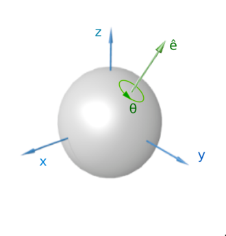

【注意】 维基百科图使用的是右手坐标系！

我们先看一个特例，欧拉角（0，0，90）表示围绕 z 轴转 90度。 `q = ((0,0,1)sina(45),cos(45))` ，这样我们用四个数表示了旋转矩阵。因此，我们用一些代码检验我们的想法：

 操作 03-06 ，理解 Quaternion 练习：

* 先录入以下代码，注意了解使用的 Quaternion 方法含义：

```csharp
	void Start () {
		float anyF = 2.0f;
		Vector3 e = Vector3.forward * anyF;
		Quaternion q = Quaternion.AngleAxis (90, e);
		Debug.Log (q); //(0,0,0.7,0.7) expected

		Vector3 p1 = new Vector3 (1, 0, 0);
		// maxtrix left multify to a vetcor 
		Debug.Log (q * p1); // (0,1,0) expected

		Quaternion q1 = Quaternion.AngleAxis (45, e);
		// 90 rotate around z , and then 45
		Debug.Log (q1 * q * p1); // (0.7,.7,0,0) expected

        Quaternion q2 = Quaternion.Inverse (q);
		// Quaternion.identity
		Debug.Log (q2 * q); // (0.0, 0.0, 0.0, 1.0) expected
		Debug.Log (Quaternion.identity);
	}
```

你完全可以将 Quaternion 看成一个非常直观的旋转矩阵，利用矩阵乘向量得到旋转后的位置，矩阵连乘得到复合旋转！

四元素一个有以下特性：

* q 的长度是 1 
* q 就是旋转矩阵的一种表示，仅需要四个元数

因此，我们只要将左手握住物体的旋转轴，确定角度就可以方便的旋转了！！！它是旋转运动编程的第一选择。（与菜鸟区别的标志之一）

* 录入让物体按任意方向旋转的代码
* 挂入一个对象，运行它！

```csharp
public class RotateBeh : MonoBehaviour {

	public int speed = 20;
	public Vector3 e = Vector3.forward;

	// Update is called once per frame
	void Update () {
		Quaternion q = Quaternion.AngleAxis (speed * Time.deltaTime, e);
		transform.localRotation *= q; 
	}
}
```

* 在运行过程中修改速度和方向轴

 编程练习 03-07，编写 RotateAround 运动：

编程要求与提示：

* 在设计器中放置两个游戏对象，A是一个球，B是空对象
* 给定一个 speed 和 e
* 编写一段程序让 A 围绕 B 旋转

**更深理解四元素**

API 提供静态方法 Quaternion.Euler(x,y,z)，直观上按 z、x、y 轴旋转的一个序列。数学上就是 `q = qy * qx * qz`。【注意】不可交换。同样  q.eulerAngles 给出了一个四元素的欧拉角表示。

Quaternion.FromToRotation API 给了两个向量计算 q 的方法。直观上，有一个物体围绕三角型 c 点从 ca 方向转到 cb 方向，显然 e 就是三角面过 c 点的法向量， a 就是角 acb。

现在我们设想有一个物体先绕 x 轴转动，渐变到围绕 y 轴转动。似乎是 Quaternion.RotateTowards 静态方法

 编程练习 03-08， 验证 RotateTowards 练习：

编程要求与提示：

* 理解 Quaternion
* 阅读 Quaternion.Angle 两个四元数夹角是两个旋转轴夹角吗？
* 编写你的测试程序

 思考：四元素有哪些成员函数和静态方法是比较有用的？你能让某个物体按螺旋线向外运动吗？

温馨提示：

* 根据 e, a 计算 q
* 在旋转中心物体坐标下，给出单位向量 b
* 螺旋线坐标 `V = Vc + q * b * l`， 其中 l 是到旋转点的距离
* 椭圆轨迹呢？

### 2.4 游戏对象的空间组合

在游戏层次视图中，游戏对象按树组织似乎天经地义。事实上，游戏对象是按它的空间关系组织设计。对象设计图如下：

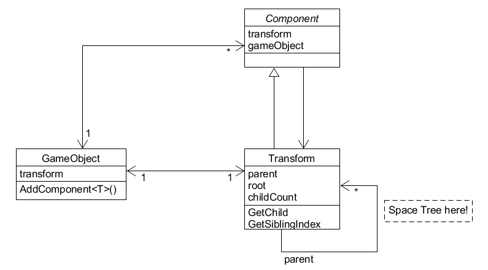

 Transform 类能作为 Transform 类对象的容器，是典型的 **组合模式**！

首先，Transform 类的对象有 root，parent，childrens 的概念与相关操作。由于每个 transform 对象唯一绑定了一个 gameObject 对象，所以，直观上让使用者以为游戏对象层次是 GameObject 形成的。 使用空间树，可方便不同对象空间坐标到绝对坐标或其他对象坐标的转换，如果程序员需要经常实现两个空间的坐标的转换，直接用该树的结构构造一个变换矩阵，提升程序效率。

其次，如果你细心，你可能以发现 Component、TransForm 都没有提供公共的构造函数，则意味者 Unity 设计师不希望你构建这些对象，我们怎么办呢？按组合关系（强聚合关系）的原则，自然创建与回收 Component 的任务是由 GameObject 完成的。阅读 GameObject.AddComponent API，它只有用类型作为参数，并没有添加一个对象的方法。

再次，gameObject，transform, 和 components 是紧密耦合的，在编程中经常相互引用。因此，tranform，gameObject 等属性都是只读的，有 gameObject 管理和维护。即使不是只读的，任何修改都可能造成不可预测的结果。

 你必须知道的 TransForm 属性与方法：

* 属性 
    - localToWorldMatrix
    - worldToLocalMatrix
* 方法
    - TransformVector
    - InverseTransformVector

 思考题：构建一个矩阵实现两个对象空间坐标的转换；

## 3、课堂实验（模拟太阳系）

任务结果要求：

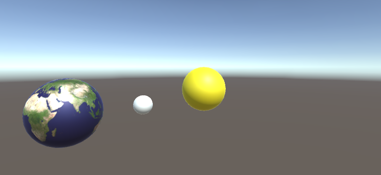

 编程练习 03-09， 简单太阳系练习：

编程要求与提示：

* 搜索关键字 “[太阳系贴图](https://cn.bing.com/search?q=%e5%a4%aa%e9%98%b3%e7%b3%bb%e8%b4%b4%e5%9b%be&FORM=HDRSC1)”
* 选择设计素材，如 [红动网](http://so.redocn.com/taiyang/ccabd1f4cfb5c7e5cefaccf9cdbc.htm)。只要是长方形图片（低分辨）即可，将地球图片另存到本地
* 创建 3 个球分别命名 sun, earth, moon
* 按你自己理解设置它们的大小、位置等
* 将地图图片拖入 Assets，再拖放到 球体对象 上，我们看到地球了。系统会自动生成一个材料目录，将图片变为贴图材料。
* 如上方法，加入太阳、月亮、金星等
* 添加脚本，大致如图所示

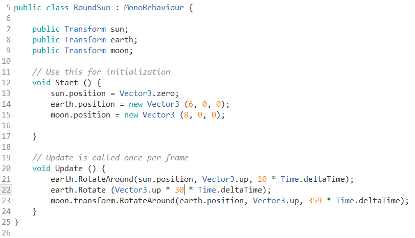

 思考题：太阳系中对象是否要组成空间树呢？例如：地球在太阳的空间中，月球在地球的空间中。请给出你的理由

## 4、面向对象的游戏编程

既然 Unity 引擎的设计中到处都是设计模式，现在我们也期望我们的游戏满满有设计感！

本节介绍的游戏编程框架将贯穿整个教程。本节仅是一个基础结构，随着课程进展，将有越来越多部件加入该框架，以适应越来越复杂的游戏。也许开始你会觉得痛苦，因为这么简单的事情用这么复杂的代码。师兄、师姐的经验会告诉你，这付出绝对值得，因为你也能一周出品一个有相当代码量的游戏了！不是因为我编程速度快，而是前期的许多类一直在重复使用。

  具体程序代码：[motion](https://github.com/pmlpml/unity3d-learning/tree/motion)

### 4.1 游戏编程的挑战

现代游戏引擎非常好使用，已不需要你做管理游戏等基础工作。但是，随着游戏规模增加（游戏对象多），游戏对象、行为和事件的管理越来越难。因此，需要按一定的规则有效的组织起来。

对于游戏编程新手来说，以下挑战尤其突出：

* 游行行为或事件是并发的、无序的
    - 不对！ update 在 start 后发生，离散仿真引擎就这样设计的。但是，那么多 start 行为，哪个先执行呢？
    - 可以确定顺序！ 这项目设置时，可以设定脚本执行顺序。但是，你能制定几个呢？
    - 因此，默认这些行为是并发的、无序的会培养你良好的编程习惯，当需要特定顺序时使用适当的方法控制这些顺序。
        - 但是，无序的程序如何调试呢？ Debug.Assert 似乎有点意思
* 游戏行为脚本的功能职责要分明
    - 回看过去代码，新手们最喜欢就是一个脚本搞定游戏。这样好么？至少，下个游戏很难利用上个游戏的代码
    - 因为每个脚本功能太多或任务交叉，一旦发现错误非常难以从直观判断哪个脚本可能错误
* 面向对象设计如设计模式，看别人说的总是**不明觉厉**
    - 觉得很难下手！码农不懂设计师的世界，这非常正常
    - 如何入门？坚持编写高品质的代码，学习高手的代码
    - Unity 官方 demo 代码如何？ 中等偏下，因为它要在有限的篇幅内告知你它的强大

### 4.2 基于职责的设计与游戏的MVC总体框架

面向对象设计的核心：**基于职责的设计**

即：模拟人类组织管理社会的方法，根据不同人拥有资源、知识与技能的不同，赋予不同人（或对象）特定的职责。再按一定结构（如设计模式），将它们组织起来。

先直接给出游戏框架设计：


为什么有这个图呢？按 Cocos 2d 的设计理念，设计一个游戏如同组织一场话剧。既然要搞话剧或游戏，就至少需要以下角色：

* 导演，1名（仅要一个）
    - 类型：SSDriector
    - 每届都有人问 SSDriector 是什么意思？Software School Director，嘿嘿
    - 职责：把握全局；控制场景
* 场记若干，话剧有很多场，每场需要一个。
    - 抽象类型（角色）：ISceneController
    - 具体类型：FirstController
    - 职责：第一场的场记，控制布景、演员的上下场、管理动作等执行
* 吃瓜群众，1个
    - 抽象类型：IUserAction
    - 具体类型：IUserAction
    - 职责：边吃瓜子边和场记聊天

似乎不错的样子！

* 说好的 MVC 呢？
* 程序是啥样？

### 4.3 框架核心代码与设计解读

**1、组织游戏资源**

Unity 项目视图设计器已经给出了推荐组织方案：

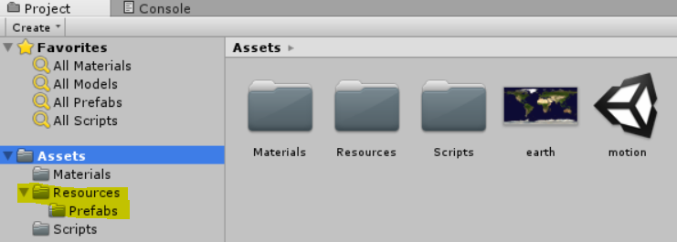

一般小游戏就一个场景。请严格按以下目录组织：

* 材料（Materials）。
* 预制（Resources/Prefabs）。所有游戏对象都已预制形式存在
* 脚本（Scripts）。

**2、创建场景启动对象和控制器**

* 构造 Main 空对象，并挂载 FirstController 代码，使得游戏加载行为在你的控制下。

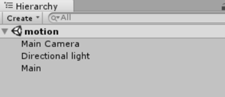

启动时，游戏就一个对象有代码。

**3、Director（导演）对象与单实例模式**

创建 SSDirector 类，其职责大致如下：

* 获取当前游戏的场景
* 控制场景运行、切换、入栈与出栈
* 暂停、恢复、退出
* 管理游戏全局状态
* 设定游戏的配置
* 设定游戏全局视图

【注】职责定义见参见 《Learn cocos2D Game Development with iOS 5》

 要点：面向对象设计核心就是基于职责的设计

* 每个对象有尽可能单一、语义明确的职责（与现实保持一致）
* 尽可能少暴露内部细节

大致代码如下：


 要点：

* 它是单实例的。具有典型单实例类编程特征
* 它拥有一些全局属性，如 running，fps等，这样可以让任何地方的代码访问它
* 它继承至 C# 根对象，所以不会受 Unity 引擎管理，也不要加载
* 它通过一个抽象的场景接口访问不同场的场记（控制器）
    - 例如：它不知道每个场景需要加载哪些资源
    - 它可以与实现 ISceneController 的不同场记对话

**4、SceneController（场记）**

创建 XXXSceneController 类，例如 FirstSceneController，其职责大致如下：

* 管理本次场景所有的游戏对象
* 协调游戏对象（预制件级别）之间的通讯
* 响应外部输入事件
* 管理本场次的规则（裁判）
* 各种杂务

大致代码如下：

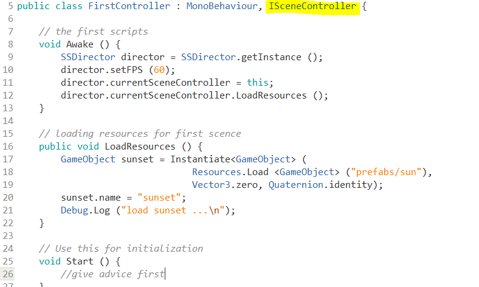

 要点：

* 由于它实现了 ISceneController 接口，所以当导演切换场景时，就可以利用多态的特性，让不同场景加载不同资源
* 在场景被加载（awake）时，它也会自动注入导演，作为当前场景

**5、接口**

在面向对象程序设计中，接口（Interface）概念至关重要。接口可以这样描述与理解：

* 定义一些对象某些方面的能力。例如一个对象具有 Drivable 接口，则其他对象就可以通过 Drivable 的申明去 Drive 它。所以它的命名通常是 动词+able；
* 定义一些对象是某种角色。例如中大人 SYSUer，中大教师、教工、学生、毕业生等可具备 SYSUer，它的命名是 XXX+er；
* 接口用 able 或 er？随特定语言或编程场景习惯。

从编程角度，接口就是数据类型，它定义了一组操作。例如：ISceneController 前面的前缀 I 表示接口类型。具体定义如下：


为什么要定义这样接口呢？这个案例中

* 每个场景都有自己的场记，导演需要与不同场景打交道
* 导演只知道场记有加载资源、暂停、恢复等行为，但并不知道实现细节，如：暂停前要保存哪些状态等
* 导演也不希望知道细节，而是规定场记们必须会做什么，怎么做自由发挥。这个规定就是接口

总之，通过 ISceneController 多态实现，场记和导演之间关系变松弛了。导演不需要知道场记是张三、李四，仅需要知道这个人穿了件带场记标记（接口）的衣服，就可执行导演的指挥任务。

**6、门面（Fasàde）模式与交互行为设计**

门面（Fasàde）模式的概念概念

* 外部与一个子系统的通信必须通过一个统一的门面(Facade)对象进行。

对于游戏设计，用户的交互行为是非常少的。以 tic-tac-toe 为例，交互的行为包括：

* NewGame()
* int GetOnesTurn()
* Put(X,Y)

一个游戏，这样的交互行为通常只有十几个。如果你发现需要几百个，这游戏可能不是人能玩的了。

我们仔细分析这些交互行为，它与游戏规则密切相关。如果，我们把规则中用户行为列个表

| 动作 | 参数 | 结果 |
| --- | --- | --- |
| 启动游戏 |  | 游戏初始界面 |
| 显示游戏方 |  | 0/1 |
| 放置棋子 | 位置 | 结束/未结束|

显然，这个表就是人机交互与游戏控制之间的接口。玩家并不关心游戏程序得到结果的过程，而仅关注能做什么。这样，游戏交互管理程序与游戏控制程序通过这个接口实现相互独立的开发。用专业一些的词汇，两个对象实现了解耦合。

定义一个用户动作接口，这样就实现了用户行为与游戏系统规则计算的分离。优势是显而易见的，例如：用户行为编程人员可以选择菜单、键盘、或组合实现用户交互行为，而模型处理人员可以自由定义游戏规则。

因而，我们称这个接口就是游戏逻辑与用户之间交互的门面（Fasàde）。代码示例如图所示：

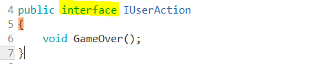

太简单了，用户只能结束游戏。

结束的逻辑是什么？所以，FirstSceneController 必须实现 IUserAction 接口;

用户界面程序只要把 FirstSceneController 作为 IUserAction，用它就 OK 了。具体代码示例：

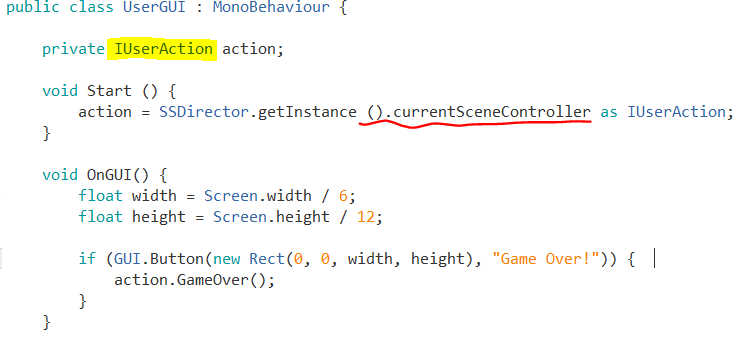

 课程讨论：神一般的类型转换，它对吗？

尽管这个代码只能做一个动作，退出游戏。

### 4.4 MVC架构 

MVC是界面人机交互程序设计的一种架构模式。它把程序分为三个部分：

* 模型（Model）：数据对象及关系
    - 游戏对象、空间关系
* 控制器（Controller）：接受用户事件，控制模型的变化
    - 一个场景一个主控制器
    - 至少实现与玩家交互的接口（IPlayerAction）
    - 实现或管理运动
* 界面（View）：显示模型，将人机交互事件交给控制器处理
    - 处收 Input 事件
    - 渲染 GUI ，接收事件

 要点：回到 4.2 节框架图，M、V、C 在游戏框架各是哪些类？这些类如何有效的组织起来呢？

## 5、小结

* 绝对坐标、对象（相对）坐标系统；判断左手、右手坐标系
* 三种控制运动的方法：直接修改坐标值、Transfrom 部件方法、向量与变换
* 强力建议使用向量与变换完成运动控制，让你的游戏程序优雅（高）、高效（大）、通用（上）
* 组合模式 --  基于空间关系的游戏对象组合方法 
* 基于职责的设计 -- 使用面向对象方法，构建小游戏开发框架
    - 接口
    - MVC架构
    - 游戏交互接口（门面模式）

## 6、作业与练习

**c# 自学**

搜素 “c# 集合类型”， 了解以下类型的使用。 不知道使用，自己复习 C++ 模板库。

* List
* HashTable

不负责任的链接： http://blog.csdn.net/ceclar123/article/details/8655853

**作业内容**

1、简答并用程序验证【建议做】

* 游戏对象运动的本质是什么？
* 请用三种方法以上方法，实现物体的抛物线运动。（如，修改Transform属性，使用向量Vector3的方法...）
* 写一个程序，实现一个完整的太阳系， 其他星球围绕太阳的转速必须不一样，且不在一个法平面上。

2、编程实践

* 阅读以下游戏脚本

> Priests and Devils
>
> Priests and Devils is a puzzle game in which you will help the Priests and Devils to cross the river within the time limit. There 
> are 3 priests and 3 devils at one side of the river. They all want to get to the other side of this river, but there is only one 
> boat and this boat can only carry two persons each time. And there must be one person steering the boat from one side to the other 
> side. In the flash game, you can click on them to move them and click the go button to move the boat to the other direction. If the 
> priests are out numbered by the devils on either side of the river, they get killed and the game is over. You can try it in many >
> ways. Keep all priests alive! Good luck!

程序需要满足的要求：

* play the game ( http://www.flash-game.net/game/2535/priests-and-devils.html )
* 列出游戏中提及的事物（Objects）
* 用表格列出玩家动作表（规则表），注意，动作越少越好
* 请将游戏中对象做成预制
* 在 GenGameObjects 中创建 长方形、正方形、球 及其色彩代表游戏中的对象。
* 使用 C# 集合类型 有效组织对象
* 整个游戏仅 主摄像机 和 一个 Empty 对象， **其他对象必须代码动态生成！！！** 。 整个游戏不许出现 Find 游戏对象， SendMessage 这类突破程序结构的 通讯耦合 语句。 **违背本条准则，不给分**
* 请使用课件架构图编程，**不接受非 MVC 结构程序**
* 注意细节，例如：船未靠岸，牧师与魔鬼上下船运动中，均不能接受用户事件！

3、思考题【选做】

* 使用向量与变换，实现并扩展 Tranform 提供的方法，如 Rotate、RotateAround 等

**作业提交要求**

* 仅能用博客或在线文档提交作业，建议使用 Github 提交代码和作业。**不能使用docx、pdf等需要下载阅读的格式**
* deadline 问课程 TA

&nbsp;

[返回目录](./)  
