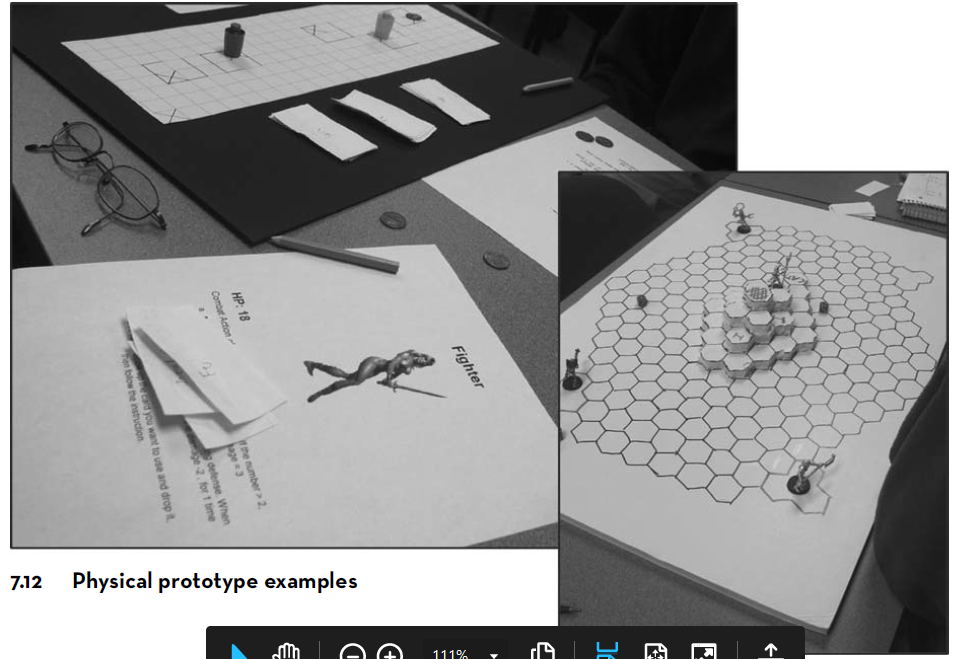
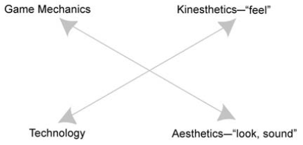
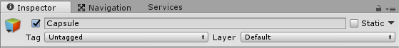
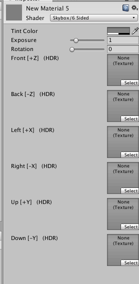
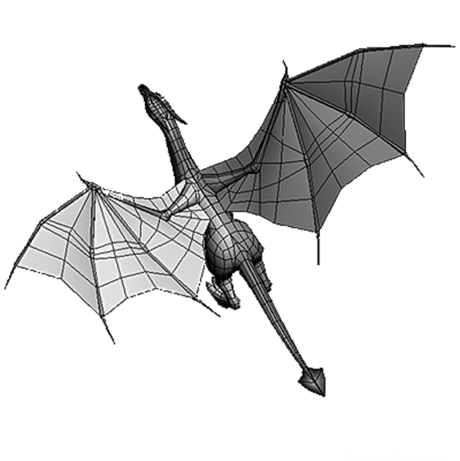
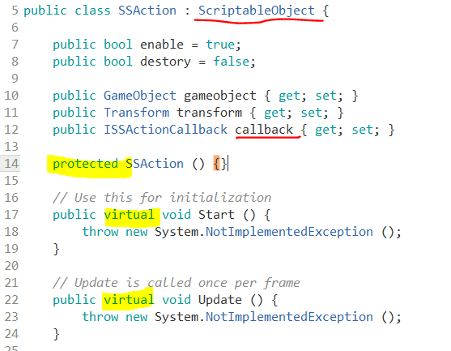
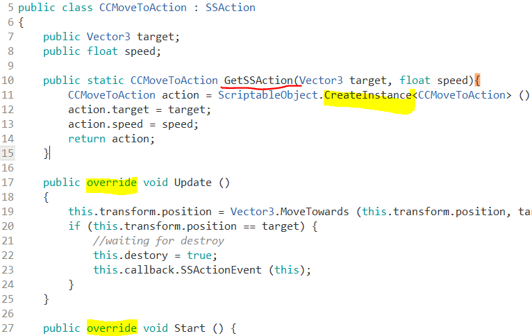
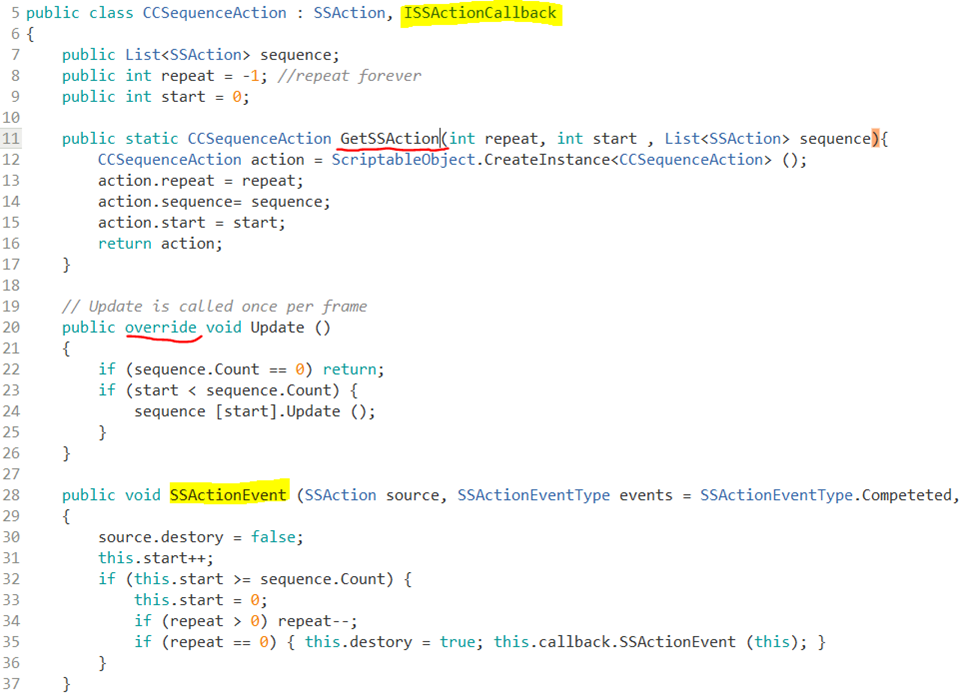
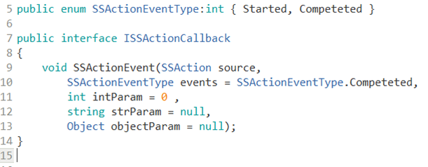

# 四、游戏对象与图形基础
{:.no_toc}

>   
> **_It was beautiful, historical, artistically subtle in a way that science can't capture, and I found it fascinating_**  
>   
> --- Steve Jobs, Stanford Report, June 14, 2005
>  

* 目录
{:toc}

_预计时间：2-3 * 45 min_

## 1、构建游戏世界

### 1.1 游戏原型设计

艺术就是利用语言、声音、文字、绘画、眼神、呼吸、肢体等表达形式，创造游戏场景或情境，使人通过感知（看、听、嗅、触）得到某种审美的满足。因此，尽早的呈现游戏世界并与它互动，是感知游戏世界的第一步。例如：作家唐三描述了《斗罗大陆》，设计师就需要不断用绘图、手办等去描绘与改进这个世界。一方面，满足作者的目标，即“成神之路就是对世界法则的认知，每个人的有自己独特的成神之路，必须靠自己的努力”；另一方面，满足玩家的审美，特别是要逐步挖掘玩家（千百年来中国人）内心深处的梦想或情节（执念） -- “修仙成神”。所以 Adams 强调，游戏过程就是玩家在人造世界中的实现梦想之路。

Tracy Fullerton 在《游戏设计工坊》用原型设计描述这个步骤

> 原型是优秀游戏设计的核心。原型开发是为您的想法创建一个工作模型，允许您测试其可行性并对其进行改进。虽然游戏原型是可玩的，但通常只包含对美术作品、声音和功能的粗略近似。它们非常像草图，其目的是让你专注于一小部分游戏机制或功能，并观察它们是如何运作的。
>
> 许多第一次设计游戏的设计师宁愿投身其中并立即开始创造“真正的”游戏，而不是从原型开始。但是如果你投入时间，你就会发现没有什么比一个好的原型制作过程更有价值去提高游戏玩法了。当您在制作原型时，您不需要考虑如何完善它的外观或技术是否优化。您所需要担心的只是基本机制，如果这些机制能够维持游戏测试人员的兴趣，那么您就知道您的设计是可靠的。

游戏原型设计将设计师从编程或技术细节中解脱出来，聚焦于 MDA ：机制（Mechanics）、动态（Dynamics）和美学（Aesthetics）

判断一下你成为游戏设计师的概率：

* 你有多少手办？大概多少投入？

 如果你对游戏世界设计感兴趣，请阅读游戏设计教材，Tracy Fullerton《游戏设计工坊》！

### 1.2 数字游戏原型设计

如果你有一支靠谱的设计与编程团队，他们不仅能用数字化手段支持游戏原型设计，而且能在短期内（3-7天）制作出游戏 Demo。甚至，编程团队可以创造出专用游戏设计引擎，支撑游戏的长期运行。

数据原型聚焦：

数字原型是可玩的，因此可以通过玩家测试，建立以数据为基础的分析与研究，持续改进游戏。

* 机制与动态：规则的复杂性、玩家成长曲线等基于数字的分析
* 运动：玩家的感觉分析
* 美学：玩家的试听分析
* 技术：渲染（shader）、VR、AI等

游戏设计工具：

* 平面设计工具，Photoshop...
* 3d 模型与动画设计工具，Maya...
* 游戏快速设计工具，Unity 3D, construct2...
* 专用游戏设计工具，...（游戏引擎都这么来的）

### 1.3 构建游戏 demo 的重要性

游戏开发是高风险（必须进入排名头部10~20%）、高投入（资源制作、市场开发与运维）的行业。

* 一个游戏故事，几幅游戏原画很难打动投资人
* 一个好题材，企业内部可能同时有几支团队并行开发 demo, 你必须成为最快最好的团队
* 你缺乏与题材合适的资源（形象设计、动画等）

Unity提供的资源和工具，可帮助你快速构建设想的游戏世界！

## 2、游戏常见对象构建

游戏世界构建在 Unity 中主要涉及两个菜单 GameObject 和 Assets。 当然最重要的还是 **Asset Store**！ 它不只是资源，更是我们学习构建游戏世界的素材。因为你未来可能在上面发布资源，成为贡献者或受益者。

### 2.1 基础游戏对象

**1、GameObject 菜单**

GameObject 菜单上游戏元素是最基础的。尽管实际游戏生产中我们更多依赖模型、预制，但它们都是由这些元素构成。只有理解它们才能更好的控制它们。

* Empty （不显示却是最常用对象之一）
    - 作为子对象的容器
    - 创建一个新的对象空间
* 3D 物体
    - 基础 3D 物体（Primitive Object）：立方体（Cube）、球体（Sphere）、胶囊体（Capsule）、圆柱体（Sylinder）、平面（Plane）、四边形（Quad）
    - 构造 3D 物体：由三角形网格构建的物体：如地形等
* Camera 摄像机，观察游戏世界的窗口
* Light 光线，游戏世界的光源
* Audio 声音
* UI 基于事件的 new UI 系统（专题介绍）
* Particle System 粒子系统与特效（专题介绍）

**2、基础物体**

Unity可以与用建模软件创建的任何形状的3D模型一起工作。但是在Unity中也有许多可以直接创建的原始对象类型，如立方体、球体、胶囊、圆柱体、平面和四边形。这些对象通常本身就很有用(例如，平面通常用作平面)，但是它们也提供了一种快速的方法来创建占位符和用于测试目的的原型。使用 GameObject -\> 3D Object菜单（或 API），可以将这些原始对象添加到场景中。

基础游戏物体使用，参见：[Primitive and placeholder objects](https://docs.unity3d.com/Manual/PrimitiveObjects.html)

以胶囊体（Capsule）为例：

它在场景视图中，是这样的多面体：

这个多面体非常有用，它通常作为人形物体的碰撞检测盒。特别在手机游戏中，并没有足够的计算资源进行复杂物体碰撞计算，而是用胶囊体取代。你常会发现你的手或臂膀能穿树而过，这不是因为你有特异功能，而是游戏技术就是这样！

**游戏物体共有的属性**

* Active
    - 不活跃则不会执行 update() 和 rendering 等消息或事件
* Name
    - 对象的名字，**不是ID**，不同对象可以重名。ID 使用 GetInstanceID()
* Tag
    - 字串，有特殊用途。如标识主摄像机等
* Layer
    - [0..31]，分组对象管理。常用于摄像机选择性渲染等
* transForm
    - 空间属性

### 2.2 Camera 摄像机 – 游戏场景渲染

相机是在场景空间中定义视图的对象。该对象的位置定义了观察点，而对象的正向(Z)和向上(Y)轴分别定义了视图方向和屏幕顶部。相机组件还定义了视图中区域的大小和形状。设置好这些参数后，相机就可以向屏幕显示它当前“看到”的内容。

摄像机对象使用，参见：[Cameras](https://docs.unity3d.com/Manual/CamerasOverview.html)

**1、摄像机与基本属性**

摄像机除了空间部件外，有一个 Camera 部件。甚至说，拥有 Cemara 部件的游戏对象都是摄像机！

 操作 04-01 ，摄像机 Cemara 基本属性练习：

* 新建一个场景，确保 Main Camera 位置（0，0，-10），欧拉角（0，0，0）
* 在场景中添加一些游戏元素
* 选择摄像机，观察场景视图中 Camera Preview
    - 选择移动工具 ，像机上显示红、绿、蓝三根轴
    - 选中 Z 轴（黄色），移动鼠标修改 Z 值
* 类似，选择旋转工具，修改旋转角 Z 值
* 修改 Camera 部件的投影（Project）属性，比较视图差别
    - 透视图（Perspective），修改位置 Z 的值
    - 正交视图（Orthographic），修改位置 Z 的值
* 修改 Camera 部件的视野角度（Field of View）

 要点

* 漫游是最简单的游戏软件，建好模型，控制好摄像机移动即可
    - 所谓第一人称游戏，就是摄像机作为玩家的眼睛
    - 所谓第三人称游戏，就是摄像机跟随玩家运动
* 透视图 vs 正交视图
    - 立体投影，越近物体越大
    - 平面投影，距离不影响视图

**2、Camera部件属性说明**

* Background: 背景颜色
* Culling Mask: 剔除遮罩。用于指定摄像机所作用的层(Layer)。
* Field of View(FOV): 视野范围。只针对透视镜头，用于控制视角宽度与纵向角度。
* Size: 视口大小。只针对正交镜头，设定为相当于屏幕高度的一半。
* ClippingPlanes: 表示摄像机的作用范围。只显示距离为[Near, Far]之间的物体。
* Viewport Rect: 控制摄像机呈现结果对应到屏幕上的位置以及大小。屏幕坐标系：左下角是(0, 0)，右上角是(1, 1)。
* Depth: 当多个摄像机同时存在时，这个参数决定了呈现的先后顺序，值越大越靠后呈现。

更多属性说明：[官方](https://docs.unity3d.com/Manual/class-Camera.html)， [中文](http://docs.manew.com/Manual/Cameras.html)

**3、多摄像机基础**

 操作 04-02，双摄像机“鸟瞰图练习”基础练习：

* 在场景中放置一些 3D 物体
* 放置第二摄像机
    - 设置正交视图；
    - 位置与旋转： positon(0,3,0), rotation(90,0,0)；
    - (x,y,w,h) = (0.9,0,0.1,0.12)
    - 0 （必须大于主摄像机深度）
* 运行结果：右下角出现了一个小窗口

 这种方法简单，但需要两倍的渲染时间。实战应该用 2D GUI 制作。例如：在 OnGUI 中先画地图，然后在制定位置画个红点。性能、性能、性能，重要的事情说三遍！

 多摄像机是制造效果的重要手段。游戏中同时显示多个场景镜头的实时渲染与合成，会产生特别的效果。这是一个中级话题。多摄像机合成的重要属性包括：

* Clear Flag：覆盖、叠加？
* Culling mask：选择渲染物体
* Depth：像机渲染的顺序

**课程实践：Unity中使用多个相机**

* 中文 [在Unity中使用多个相机 - 及其重要性](http://www.manew.com/thread-47076-1-1.html)
* 原文 [Using Multiple Unity Cameras – Why This May Be Important?](http://blog.theknightsofunity.com/using-multiple-unity-cameras-why-this-may-be-important/)

### 2.3 天空盒

天空是任何游戏离不开的设定，而且要按季节与时间变化，是表示时间的重要工具。从 Unity 5 开始，官方不再资源天空提供资源，一般从 Asset Store 获取
使用 skybox 在 Store 中搜索，下载你喜欢的天空，例如：

* Skybox
* Fantasy Skybox FREE

**1、天空盒的原理与制作**

天空盒是一种材料，例如：我们通过六面体构建一个天空盒。

 操作 04-03，天空盒练习：

* 先下载天空盒，它会包含一些天空贴图（免去自己制作麻烦）
* Assets 上下文菜单 -\> create -\> Material 起名 mysky
* 在 Inspector 视图中选择 Shader -\> Skybox -\> 6Sided
* 结果如图

* 在资源贴图中选择合适的图片，拖放到对应位置！

**2、使用天空盒**

* 在 Camera 对象中添加部件 Rendering -\> Skybox
* 将天空盒拖放入 Shybox！

对应摄像机就使用自定义天空盒。

**3、设置恢复系统默认天空**

* 删除摄像机自定义天空
* 菜单 -\> window -\> lighting
* Scene -\> skybox -\> Default-skybox

### 2.4 光源

光与影是让游戏世界富有魅力。灯光是每个场景的重要组成部分。网格和纹理定义了场景的形状和外观，而灯光定义了3D环境的颜色和情绪。你可能会在每个场景中使用不止一盏灯。让他们一起工作需要一些练习，可能是相当惊人的结果。

两个光源的案例，具体细节参见 [Lights](https://docs.unity3d.com/Manual/Lights.html)

**1、创建一个灯光**

以下两种方法一样：

* 菜单 GameObject -\> Light
* 创建一个空对象，添加灯光组件

**2、光源组件的基本属性**

* 灯光类型（type）
    - 平行光（类似太阳光）
    - 聚光灯（spot）
    - 点光源（point）
    - 区域光（area）
* 阴影（shallow）
* 剪影（cookies

光组件的更多细节：[官方](https://docs.unity3d.com/Manual/class-Light.html)，[中文](http://docs.manew.com/Manual/index.htm)

### 2.5 声音源与拾音器

如果没有声音，不管是背景音乐还是音效，游戏都是不完整的。Unity的音频系统灵活而强大。它可以导入大多数标准的音频文件格式，并具有复杂的功能，可以在3D空间播放声音，还可以选择使用echo和过滤器等效果，也可以采用多层混音器构建复杂效果。Unity还可以从用户机器上的任何可用麦克风录制音频，以便在游戏过程中使用或存储和传输。

**1、立体声的原理与 Unity 部件**

在现实生活中，声音是由物体发出并被听者听到的。声音被感知的方式取决于许多因素。听者可以粗略地分辨出声音来自哪个方向，也能从声音的响度和音质中获得一定的距离感。由于多普勒效应，快速移动的声源(如落下的炸弹或经过的警车)在移动时音调会发生变化。此外，环境会影响声音的反射方式，所以洞穴里的声音会有回音，而在空旷的环境中则不会。

Unity 通过在对象上附加音频源（Audio Source），另一个对象(通常是主摄像机)的附加音频拾音器（Audio Listener）接收发出的声音。Unity可以模拟源与侦听器对象之间的距离和位置产生的立体声效果，并向用户播放。源和拾音器对象的相对速度也可以用来模拟多普勒效应，以增加真实感。

但是，Unity 并不会根据游戏场景的物体表面计算声音的反射产生回音的声效。你可以给有音源的部件添加音频过滤器（Audio Filters）来模拟，在物体可以在强回波环境中移动的情况下，在场景中添加混响区（Reverb Zone）。例如，你的游戏可能包括汽车通过隧道，如果你在隧道里放一个混响区，那么当汽车进入隧道时，发动机的声音就会开始回声，而当汽车从隧道的另一边出来时，回声就会减弱。

你也可以使用混音器（Audio Mixer）收集多路声音，以产生更复杂的效果。

**2、声源设置与3d效果**

第一步导入音频文件（Audio Clips）

 操作 04-04，Audio Clips 练习：

* 将语音格式文件（如 mp3，wav等）拖放入 Assets 的相关目录
* 用 audio 在资源仓库中搜索，导入如 Android Native Audio 这样的资源
* 选择 Audio Clips, 观察属性
* 在属性视图下面的预览窗口，播放该音乐

 操作 04-05，播放立体声练习：

* 创建音源：建一个空对象，并挂载 AddComponent -\> Audio -\> Audio Source  
* 将 Assets 中的 AudioClip 拖放入音源部件
* 选中 play On Wake 和 Loop，保证程序启动后不断播放声音
* 空间音效：Spatial Blend 设置为 3D
* 3D 设置
    - 语音衰减方法：Logarithmic Rolloff
    - Min Distance = 1
    - Max Distance = 5
* 将声源放置在 postion =（-5，0，-10），即与主摄像机同一水平位置
* 运行程序
    - 使用移动工具
    - 修改声源 x 值，听立体声效
    - 修改声源 x，y 值，听立体声效
* 终止程序运行

## 3、3D物体与渲染

Unity 几乎支持所有工具构建的3D模型与动画。

### 3.1 3D 模型基础

**1、网格与物体形状**

三角网格是游戏物体表面的唯一形式。将场景视图从 Shade -\> Wirframe 就看到所有物体包括立方体，圆都是网格。

3D 物体常见显示部件：

* Mesh 部件：
    - 物体表面三角网格，形成物体形状
* Mesh Renderer部件：
    - 表面渲染器，显示物体色彩
    - 其中：Material 和 Shader 对象
    - （材料与着色器 Shader）则是绘制物体的工具

### 3.2 材质与着色器

（Materials and Shaders

* 纹理（Texture）：位图，表示物体本身的色彩。
* 材质（Material）：包含一个或一组 Texture，以及元数据（meta-data）属性，着色程序（Shader）。
* 其中 meta-data 定义了 Texture 与 mesh 的映射关系，材料的光线吸收、透明度、反射与漫反射、折射、自发光、眩光等特性
* Shader 是着色程序。它能利用显卡硬件渲染特性，按 meta-data 将材质按物体纹理、光线特性，结合游戏场景中的光线生成用户感知的位图（像素点）。
* Shader 的编程超出了本课程的范围，涉及大量图形学与显卡计算的知识。一句话，物体发光、质感、层次、镜像等效果取决于Shader。

更多知识参见：[Materials, Shaders & Textures](https://docs.unity3d.com/Manual/Shaders.html)

 维护中的章节

材料与着色变化较大，需要进一步维护

### 3.3 地形系统 – 创建与编辑

 维护中的章节

### 3.4 光照贴图

光照贴图（Lightmapping）是预先计算场景中表面的亮度，并将结果存储在图表或“光映射”中，以备以后使用的过程。

 维护中的章节

因为 Unity 4.0、5.0、以及 2019.2 版本的光照贴图界面都有些不一样。

[2019.2 Lightmapping: Getting started](https://docs.unity3d.com/Manual/Lightmapping.html)

[Unity 5 光照贴图快速入门](http://docs.manew.com/Manual/Lightmapping.html)

[4.0,5.0 Unity光照贴图Lightmapping](https://blog.csdn.net/andyhebear/article/details/50480348)

## 4、面向对象的游戏编程

如果感觉到场记（控制器）管的事太多，不仅要处理用户交互事件，还要游戏对象加载、游戏规则实现、运动实现等等，而显得非常臃肿。一个最直观的想法就是让更多的人（角色）来管理不同方面的工作。显然，这就是面向对象基于职责的思考，例如：用专用的对象来管理运动，专用的对象管理播放视频，专用的对象管理规则。就和踢足球一样，自己踢5人场，一个裁判就够了，如果是国际比赛，就需要主裁判、边裁判、电子裁判等角色通过消息协同来完成更为复杂的工作。

### 4.1 动作管理器的设计

为了用一组简单的动作组合成复杂的动作，我们采用 cocos2d 的方案，建立与 CCAtion 类似的类。设计思路如下：

* 设计一个抽象类作为游戏动作的基类
* 设计一个动作管理器类管理一组游戏动作的实现类
* 通过回调，实现动作完成时的通知

这样的目的是让程序可以方便的定义动作并实现动作的自由组合，使得：

* 程序更能适应需求变化
* 对象更容易被 **复用**
* 程序更易于维护

### 4.2 核心代码与设计解读

**1、动作基类（SSAction）**

直接给代码：

设计要点：

* [ScriptableObject](https://docs.unity3d.com/ScriptReference/ScriptableObject.html) 是不需要绑定 GameObject 对象的可编程基类。这些对象受 Unity 引擎场景管理
* `protected` 防止用户自己 new 对象
* 使用 `virtual` 申明虚方法，通过重写实现多态。这样继承者就明确使用 Start 和 Update 编程游戏对象行为
* 利用接口（`ISSACtionCallback`）实现消息通知，避免与动作管理者直接依赖

**2、简单动作实现**

实现具体动作，将一个物体移动到目标位置，并通知任务完成：

设计要点：

* 让 Unity 创建动作类，确保内存正确回收。别指望手机开发者是 c 语言高手。
* 多态。C++ 语言必申明重写，Java则默认重写
* 似曾相识的运动代码。动作完成，则期望管理程序自动回收运行对象，并发出事件通知管理者。

 **3、顺序动作组合类实现**

实现一个动作组合序列，顺序播放动作：

 
 

设计要点：

* 让动作组合继承抽象动作，能够被进一步组合；实现回调接受，能接收被组合动作的事件
* 创建一个动作顺序执行序列，-1 表示无限循环，start 开始动作。
* `Update`方法执行执行当前动作
* `SSActionEvent` 收到当前动作执行完成，推下一个动作，如果完成一次循环，减次数。如完成，通知该动作的管理者
* `Start` 执行动作前，为每个动作注入当前动作游戏对象，并将自己作为动作事件的接收者
* `OnDestory` 如果自己被注销，应该释放自己管理的动作。

这是标准的组合设计模式。被组合的对象和组合对象属于同一种类型。通过组合模式，我们能实现几乎满足所有越位需要、非常复杂的动作管理。

 建议大家了解 Cocos 2d CCAction 类 或 Unity 动画系统，本课程方法是这些系统的实现的关键技术。

**4、动作事件接口定义**

接口作为接收通知对象的抽象类型：

设计要点：

* 事件类型定义，使用了枚举变量
* 定义了事件处理接口，所有事件管理者都必须实现这个接口，来实现事件调度。所以，组合事件需要实现它，事件管理器也必须实现它。
* 这里展示了语言函数默认参数的写法。

**5、动作管理基类 – SSActionManager**

这是动作对象管理器的基类，实现了所有动作的基本管理

 维护中的章节

## 5、小结

## 6、作业与练习

**自学资源**

* c# 结构体

不负责的连接： http://www.cnblogs.com/kissdodog/archive/2013/05/11/3072832.html

* C# 枚举与常数

不负责任的连接： http://www.cnblogs.com/kissdodog/archive/2013/01/16/2863515.html

**作业内容**

1、基本操作演练【建议做】

* 下载  Fantasy Skybox FREE， 构建自己的游戏场景
* 写一个简单的总结，总结游戏对象的使用

2、编程实践

* 牧师与魔鬼 动作分离版
    - 【2019新要求】：设计一个裁判类，当游戏达到结束条件时，通知场景控制器游戏结束

3、材料与渲染联系【可选】

* 从 Unity 5 开始，使用新的 Standard Shader 作为自然场景的渲染。
    - 阅读官方 [Standard Shader](https://docs.unity3d.com/Manual/shader-StandardShader.html) 手册 。
    - 选择合适内容，如 [Albedo Color and Transparency](https://docs.unity3d.com/Manual/StandardShaderMaterialParameterAlbedoColor.html)，寻找合适素材，用博客展示相关效果的呈现
* Unity 5 声音
    - 阅读官方 [Audio](https://docs.unity3d.com/Manual/Audio.html) 手册
    - 用博客给出游戏中利用 Reverb Zones 呈现车辆穿过隧道的声效的案例

**作业提交要求**

* 仅能用博客或在线文档提交作业，建议使用 Github 提交代码和作业。**不能使用docx、pdf等需要下载阅读的格式**
* deadline 下周二 24 点前

