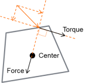
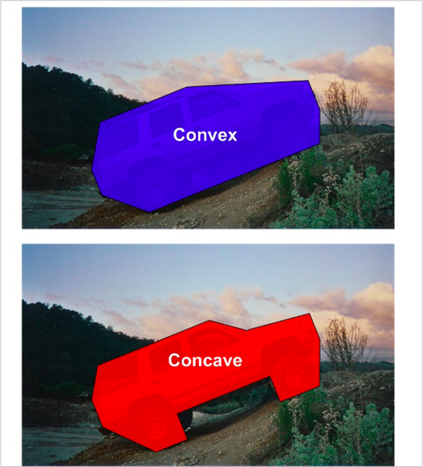

# 六、物理系统与碰撞
{:.no_toc}

>   
> **_It was awful tasting medicine, but I guess the patient needed it. Sometimes life hits you in the head with a brick. Don't lose faith_**  
>   
> --- Steve Jobs, Stanford Report, June 14, 2005
>  

* 目录
{:toc}

_预计时间：4-6 * 45 min_

&nbsp;

## 课程相关资源

[资源与代码下载](https://github.com/pmlpml/unity3d-learning/tree/ex-physics)

## 1、物理引擎基础

这是《守望先锋》游戏的一段场景。作为暴雪出品的首款团队射击游戏，自然要展现让玩家沉浸在超越真实世界的感官之美（如同验证音乐发烧器材，放些砸碎玻璃瓶瓶的声效一般）。《守望先锋》里很多物品都可以成为射击的对象，瓦斯罐、灭火器甚至是足球，并且会有不同的效果。

    

 图片来源：[《守望先锋》物理效果动图展示](https://www.newyx.net/gl/384535_1.htm)

 这个游戏场景涉及哪些技术呢？光照贴图、物理引擎、动画、粒子系统等。

### 1.1 物理引擎

**1、游戏世界运动分类**

**运动学（Kinematics）**，从几何的角度（指不涉及物体本身的物理性质和加在物体上的力) 描述和研究物体位置随时间的变化规律的力学分支。点的运动学研究点的运动方程、轨迹、位移、速度、加速度等运动特征，以及在不同空间中的变换。运动学是理论力学的一个分支学科，它是运用几何学的方法来研究物体的运动。

* 不考虑外部力作用下的运动
* 将一个物体作为几何部件，抽象为质点运动模型
* 仅考虑物体位置、速度、角度 …
* 研究方法：代数，如：线性代数

**动力学（Dynamics）**，它主要研究作用于物体的力与物体运动的关系。动力学的研究对象是运动速度远小于光速的宏观物体。动力学的研究以牛顿运动定律为基础；牛顿运动定律的建立则以实验为依据。动力学是牛顿力学或经典力学的一部分，但自20世纪以来，动力学又常被人们理解为侧重于工程技术应用方面的一个力学分支。

在游戏物理引擎中，主要是刚体动力学。主要包括质点系动力学的基本定理，由动量定理、动量矩定理、动能定理以及由这三个基本定理推导出来的其他一些定理。动量、动量矩和动能（见能）是描述质点、质点系和刚体运动的基本物理量。

* 考虑外部力对物体运动的影响
* 包括重力、阻力、摩擦力等，以及物体的重量和形状，甚至弹性物体
* 通常将一个物体当作刚体
* 模拟物体在现实世界中的运动

**2、物理引擎职责与作用**

**物理引擎（Physics Engine）**是一个软件组件，它将游戏世界对象赋予现实世界物理属性（重量、形状等），并抽象为刚体（Rigid）模型（也包括滑轮、绳索等），使得游戏物体在力的作用下，仿真现实世界的运动及其之间的碰撞过程。即在牛顿经典力学模型基础之上，通过简单的 API 计算游戏物体的运动、旋转和碰撞，现实的运动与碰撞的效果。

使用物理引擎，游戏开发者仅需考虑给游戏物体赋予形状（假设为均匀分布）和力，在游戏引擎驱动下自动完成运动与碰撞的计算。

### 1.2 物理引擎的实现

随着技术的进步，作为典型密集计算场景，物理引擎逐步形成了两大流派，分别对应以 NVIDIA 为代表的 PhysX 和 以 Intel + AMD 为代表的 Havok 两大平台。 

[PhysX 技术](https://www.geforce.com/hardware/technology/physx/) 目前是多数游戏引擎支持的平台。以下是官方的介绍

> 如果没有精准的物理效果模拟，即使再华丽的游戏也会显得静态而沉闷呆板。PhysX 技术可利用 GPU 的处理能力来执行复杂的物理效果计算。「无主之地 2 (Borderlands 2)」以及「地铁: 更后光芒 (Metro: Last Light)」等流行游戏均采用 PhysX 技术，该技术可为游戏带来充满动感的破坏效果、基于粒子的流体效果以及逼真的动画，令游戏变得栩栩如生。

[Kavok](https://www.havok.com/products/) 也是部分开源的物理引擎，也是被广泛支持的引擎。被 Intel 收购后，Havok特别针对多核多线程 CPU 进行优化。多线程 CPU 的普及以及Havok Physics引擎本身的高效率特点，使得 Havok 仅仅依靠 CPU 计算就能达到很好的物理模拟效果。

### 1.3 物理引擎基础知识

**1、物理引擎学习与使用**

物理引擎的使用可能是最简单的。你要做的事情可能就是将力作用在游戏物体上。

尽管你不必学习物理引擎原理与算法，如

* 物理引擎涉及复杂的运动学知识
* 碰撞计算与优化

为了有效使用物理引擎，你需要：

* 了解物理运动的基本知识
* 理解游戏离散仿真产生的特殊现象，避免游戏失真
* 了解可能导致性能问题的方面，使得游戏更加流畅

**2、运动与物体建模**

**刚体（Rigid body）**

刚体是指在运动中和受力作用后，形状和大小不变，而且内部各点的相对位置不变的物体。

* 绝对刚体实际上是不存在的，只是一种理想模型，因为任何物体在受力作用后，都或多或少地变形，如果变形的程度相对于物体本身几何尺寸来说极为微小，在研究物体运动时变形就可以忽略不计。
* 齿轮、绳索、滑轮不属于刚体，但属于该引擎。因此：物理引擎不只是刚体

**运动的点模型**

将物体的运动作为一个点，则一个如图物体 

：

* 具有质量
* 具有中心
* 具有质心（不考虑形状）
    - 假设1：物体是均质的
    - 假设2：中心与质心重合
* 物体作用力分解为：
    - 作用中心点上的力（Force）
    - 围绕中心点旋转的力矩（Torque）

**碰撞与物体几何形状**

当有形状的物体发生碰撞时：

* 使用点模型？
* 必须计算在哪个点产生碰撞，并计算力和力矩

可计算碰撞的物体：

* 必须是 **（Convex）物体**
   - 如何判定
* 必须是三角形表示的多面体（三角网格）
   - 2D：物体分解为若干三角形
   - 3D：凸物体表面用三角形，分解为四面体表示
* 如果是 Concave 物体
    - 必须分解为多个凸物体组合

## 2、Unity 物理引擎实现

为了拥有令人信服的物理行为，游戏中的物体必须正确加速，并受到碰撞、重力和其他力的影响。Unity的内置物理引擎为您提供了处理物理模拟的组件。只需几个参数设置，您就可以创建以现实方式被动行为的对象(例如，它们将被碰撞和跌落移动，但不会自己开始移动)。通过从脚本中控制物理，您可以为对象提供车辆、机器甚至一块织物的动态。

Unity 物理引擎建立在 PhysX 基础之上。

### 2.1 常用物理组件

## 作业与练习

1、改进飞碟（Hit UFO）游戏：

* 游戏内容要求：
    1. 按 _adapter模式_ 设计图修改飞碟游戏
    2. 使它同时支持物理运动与运动学（变换）运动

2、打靶游戏（**可选作业**）：

* 游戏内容要求：
    1. 靶对象为 5 环，按环计分；
    2. 箭对象，射中后要插在靶上
        - **增强要求**：射中后，箭对象产生颤抖效果，到下一次射击 或 1秒以后
    3. 游戏仅一轮，无限 trials；
        - **增强要求**：添加一个风向和强度标志，提高难度

    
 