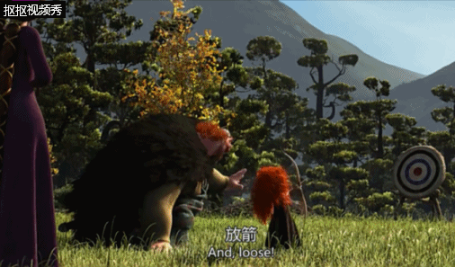

# 六、物理系统与碰撞
{:.no_toc}

>   
> **_It was awful tasting medicine, but I guess the patient needed it. Sometimes life hits you in the head with a brick. Don't lose faith_**  
>   
> --- Steve Jobs, Stanford Report, June 14, 2005
>  

* 目录
{:toc}

_预计时间：4-6 * 45 min_

&nbsp;

## 课程相关资源

[资源与代码下载](https://github.com/pmlpml/unity3d-learning/tree/ex-physics)

## 1、物理引擎基础

这是《守望先锋》游戏的一段场景。作为暴雪出品的首款团队射击游戏，自然要展现让玩家沉浸在超越真实世界的感官之美（如同验证音乐发烧器材，放些砸碎玻璃瓶瓶的声效一般）。《守望先锋》里很多物品都可以成为射击的对象，瓦斯罐、灭火器甚至是足球，并且会有不同的效果。

    

 图片来源：[《守望先锋》物理效果动图展示](https://www.newyx.net/gl/384535_1.htm)

 这个游戏场景涉及哪些技术呢？光照贴图、物理引擎、动画、粒子系统等。

### 1.1 物理引擎

**1、游戏世界运动分类**

**运动学（Kinematics）**，从几何的角度（指不涉及物体本身的物理性质和加在物体上的力) 描述和研究物体位置随时间的变化规律的力学分支。以研究质点和刚体这两个简化模型的运动为基础，并进一步研究变形体（弹性体、流体等） 的运动。点的运动学研究点的运动方程、轨迹、位移、速度、加速度等运动特征，这些都随所选参考系的不同而异。刚体运动按运动的特性又可分为平动、绕定轴转动、平面平行运动、绕定点转动和一般运动。运动学为动力学、机械学提供理论基础，也是自然科学和工程技术必需的基础知识。运动学是理论力学的一个分支学科，它是运用几何学的方法来研究物体的运动。

* 不考虑外部力作用下的运动
* 将一个物体作为几何部件，抽象为质点运动模型
* 仅考虑物体位置、速度、角度 …
* 具体实现方法：线性代数的矩阵变换

**动力学（Dynamics）**，理论力学的一个分支学科，它主要研究作用于物体的力与物体运动的关系。动力学的研究对象是运动速度远小于光速的宏观物体。动力学是物理学和天文学的基础，也是许多工程学科的基础。动力学的研究以牛顿运动定律为基础；牛顿运动定律的建立则以实验为依据。动力学是牛顿力学或经典力学的一部分，但自20世纪以来，动力学又常被人们理解为侧重于工程技术应用方面的一个力学分支。

在游戏物理引擎中，主要是刚体动力学。主要包括质点系动力学的基本定理，由动量定理、动量矩定理、动能定理以及由这三个基本定理推导出来的其他一些定理。动量、动量矩和动能（见能）是描述质点、质点系和刚体运动的基本物理量。

* 考虑外部力对物体运动的影响
* 包括重力、阻力、摩擦力等，以及物体的重量和形状，甚至弹性物体
* 通常将一个物体当作刚体
* 模拟物体在现实世界中的运动

**2、物理引擎职责与作用**

**物理引擎（Physics Engine）**是一个软件组件，它将游戏世界对象赋予现实世界物理属性（重量、形状等），并抽象为刚体（Rigid）模型（也包括滑轮、绳索等），使得游戏物体在力的作用下，仿真现实世界的运动及其之间的碰撞过程。即在牛顿经典力学模型基础之上，通过简单的 API 计算游戏物体的运动、旋转和碰撞，现实的运动与碰撞的效果。

使用物理引擎，游戏开发者仅需考虑给游戏物体赋予形状（假设为均匀分布）和力，在游戏引擎驱动下自动完成运动与碰撞的计算。

### 1.2 物理引擎的实现

随着技术的进步，作为典型密集计算场景，物理引擎逐步形成了两大流派，分别对应以 NVIDIA 为代表的 PhysX 和 以 Intel +AMD 为代表的 Havok 两大平台。 

## 2、Unity 物理引擎实现

### 2.1 常用物理组件

## 作业与练习

1、改进飞碟（Hit UFO）游戏：

* 游戏内容要求：
    1. 按 _adapter模式_ 设计图修改飞碟游戏
    2. 使它同时支持物理运动与运动学（变换）运动

2、打靶游戏（**可选作业**）：

* 游戏内容要求：
    1. 靶对象为 5 环，按环计分；
    2. 箭对象，射中后要插在靶上
        - **增强要求**：射中后，箭对象产生颤抖效果，到下一次射击 或 1秒以后
    3. 游戏仅一轮，无限 trials；
        - **增强要求**：添加一个风向和强度标志，提高难度

    
 