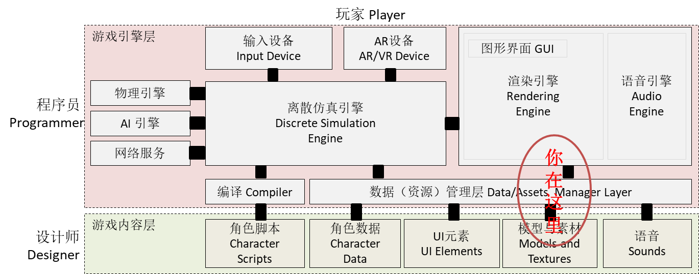
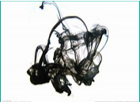
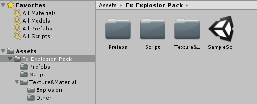
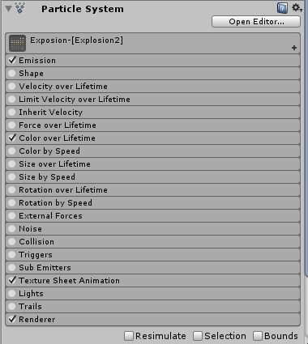
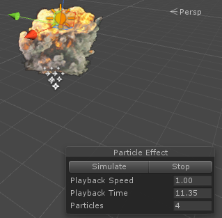
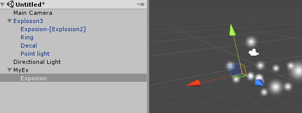
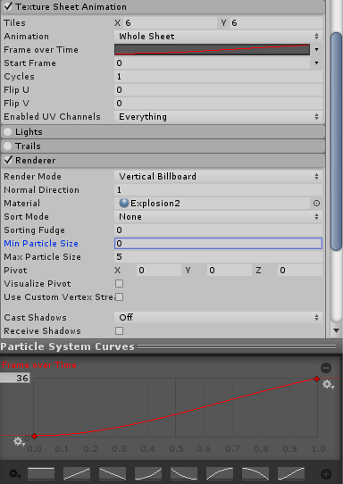
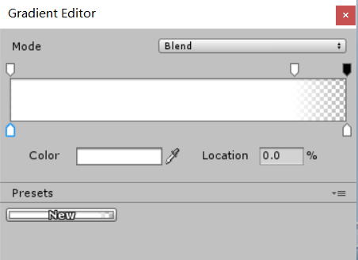
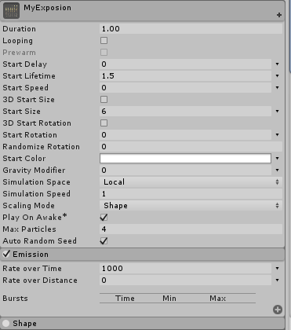
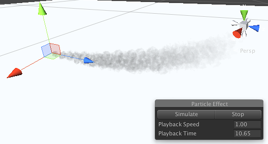

# 第八章、粒子系统
{:.no_toc}

> **_东风袅袅泛崇光，香雾空蒙月转廊。_**  
>   
> --- 【宋】苏轼 《海棠》

* 目录
{:toc}



## 课程资源

 [Fx Explosion](https://github.com/pmlpml/unity3d-learning/raw/ex-particle-system/zips/Fx-Explosion-Pack.zip)


## 1、粒子系统概述

### 1.1 粒子系统及其作用

**粒子系统**是模拟一些不确定、流动现象的技术。它采用许多形状简单且赋予生命的微小粒子作为基本元素来表示物体(一般由点或很小的多边形通过纹理贴图表示)，表达物体的总体形态和特征的动态变化。人们经常使用粒子系统模拟的现象有火、爆炸、烟、水流、火花、落叶、云、雾、雪、尘、流星尾迹或者象发光轨迹这样的抽象视觉效果等等。


### 1.2 粒子系统背后的知识

自然界许多现象看似随机的，但它们却受一些简单的规律只配，叠加随机噪声形成的。发现这些规律，并利用计算机模拟、仿真这些现象是推动了物理学、计算机科学等学科相互交叉。粒子系统只是其中之一。

做好粒子系统仅学编程是远远不够的！XX电视剧说某计算机大神写了一个游戏成功创业引的无数女神尽折腰，只是文学作品的提炼。要想完成类似上图的效果，涉及哪些课程和技术呢？

首先，需要提到的人就是香农（[Claude Shannon](https://baike.baidu.com/item/%E5%85%8B%E5%8A%B3%E5%BE%B7%C2%B7%E8%89%BE%E5%B0%94%E4%BC%8D%E5%BE%B7%C2%B7%E9%A6%99%E5%86%9C/10588593?fromtitle=%E9%A6%99%E5%86%9C&fromid=1146248)）。你可能以了解香农采样定理，香农最大的贡献就是熵（entropy）的概念，他证明熵与信息内容的不确定程度有等价关系，奠基了“信息论”。即不确定是可度量的。高中讲的水分子运动（布朗运动）就是最好的案例，墨水扩散的效果就是典型的粒子系统效果。

其次，人们发现整体与局部的相似性，如分形（fractal）图。例如，海岸线和山川形状，从远距离观察，其形状是极不规则的。从近距离观察，其局部形状又和整体形态相似。在计算机图形学中，利用这种自相似性，可以构造自然而复杂的物体。

最后，作为粒子系统，每个粒子运动一般具有简单的数学模型和它们之间具有自形似的运动过程。通过引入特定的随机分布作用于粒子，使得系统整体呈现复杂的现象，这是粒子系统的本质。

 

分形构造的树叶；墨水的扩散

因此，粒子运动涉及物理学、信息论、计算机图形学、系统控制与仿真、随机过程等课程的内容。

### 1.3 粒子系统涉及的概念

使用粒子仿真物理现象，涉及多门课程。为了让普通人也能使用粒子创作，人们设计了各种粒子系统工具。这些工具一般会涉及以下概念：

**1、粒子（Particle）**

粒子是粒子系统管理的基本单位。一般它是材料（Material）。材料包含两个内容，纹理（texture）、shader，分别负责形态、光照效果、两个方面。通常，粒子系统包含基础材料库供用户选择。

如果是动画材料，需要设置 2D 动画

 **生命周期**

每个粒子都有自己的生命周期。包括初始化状态、运动变化状态、回收状态。**根据归一化生命周期，控制粒子的运动与变化。**

**2、渲染（render）**

渲染是定义粒子材料与摄像机之间的关系。主要包括材料面方位、显示顺序、光照等信息

如果是 3D 渲染，需要 uv 贴图网格

**3、运动管理**

粒子运动学或物理学管理。包括颜色、力场、速度、碰撞等属性

**4、发射器管理**

粒子工厂的管理。包括粒子初始化、喷射位置与形状等等


## 2、从零开始设置粒子系统

本部分要求你从一个默认粒子系统，经过一系列设置步骤，产生指定效果的粒子系统。目的是帮助你理解上述基本概念，学习 Unity 相关组件的使用。

**请创建一个新的空Unity项目**，开启粒子系统之旅。

### 2.1 准备工作

 操作 08-1

* 下载参考粒子资源 Fx Explosion 并解压
    - 将目录 Fx Explosion Pack 拖入 Assets 面板
    - 点 run 按钮， 系统报编译错误
    - 菜单 Assets -\> Run API Updater... 并确认



* 从 Prefabs 中将 Exposon3 拖入 Scene 面板
    - 展开 Exposon3 对象树，它由3个粒子系统和一个光源组成
    - 选择 Exposion-[Explosion2] 物体
    - 观察 Inspector 面板



 一个粒子系统由许多子部件构成，包含四个需要设置的部件  

 一个粒子效果需要多个粒子系统配合

* 观察场景



* 点击图中 Particle Effect 中 Simulate 按钮观察效果
* 菜单 GameObject -\> Create Empty 命名为 MyEx
* 选择 MyEx 对象，上下文菜单 -\> Particle System 并命名为 MyExposion



我们的目标是从原始的粒子系统设置成 Exposion-[Explosion2] 效果！

### 2.2 选择粒子材料并设置渲染

设置选择粒子材料与渲染，通常是第一步

 操作 08-2

* 选择 MyEx 的 MyExposion 对象
* 选择 Inspection 面板
* 展开 Particle Syetem 的 Render 设置：
    - Material 选择 Exposion2 材料，观察到 6*6 的面片飞出
    - Render 模式选择 Vertical Biliboard
    - Max Parricle Size 设置成 5
* 展开 Texture Sheet Animation, 选择动画设置
    - Tiles 设置为 6*6
    - 选择 Frame over Time， 在最下面有曲线编辑器，最终结果如图所示



这时，粒子系统发射无数的爆破云动画

### 2.3 设置运动与发射器

 操作 08-3

* 选择 Color over Time
    - 设置运动状态色彩变化，如图

你看到渐变编辑器：



上面是 Alaph 通道（透明度），下面是色彩渐变

* 取消 Shape 则发射成直线
* 选择并展开 Emission 
    - 设置 Rate Over Time 为 1000
* 展开 particle 主控
    - 设置 Duration 为 1
    - 设置 Start Lifetime 为 1.5
    - 设置 Start Speed 为 0
    - 设置 Start Size 为 6
    - 设置 Scaling Mode 为 Shape
    - 设置 Max Particles 为 4
    - 设置 Looping 为 false



这时，你已看到了最后的效果。任务完成！

 要点：

* 强力建议你从下之上设置，即先选择粒子、渲染、运动、发射器顺序

### 2.4 完成 Exploson3 仿制

参照 2.2 和 2.3 步骤设置 MyRing 和 MyDecal

 创建 MyRing 对象，并设置

 创建 MyDecal 对象，并设置

完成设置后，请保存为预制。

## 3、粒子系统的使用与控制

粒子部件是一个非常复杂的对象，分为许多子部件，每个子部件也有许多属性，你很难精通这些部件，因此制作与控制粒子系统同样是复杂的问题。
本部分考虑我们获取一个粒子效果预知后，如何使用或控制。

### 3.1 直接实例化使用粒子系统

* 设置粒子系统 main 的属性
    - Play On Awake 属性设置为 True
    - 一般情况下， Lopping 属性设置为 False

在预制资源上，添加以下代码

```cs
using UnityEngine;
using System.Collections;

public class DestroyEffect : MonoBehaviour {

	public float t = 0f;

	void Update ()
	{
		t += Time.deltaTime;
		if (t > 1.5f) {
			Destroy(transform.gameObject);
		}
	
	}
}
```

在需要粒子效果时，直接使用 `Instantiate(...)` 该效果。

### 3.2 使用 ParticleSystem 组件简单控制

手册给了[样例代码](https://docs.unity3d.com/Manual/PartSysExplosion.html),
请看 ParticleSystem 的 API 查看如何 Play，Stop 等操作

### 3.3 模拟汽车尾气（拟物控制）

更高级的控制是用粒子系统模拟现实，我们需要通过编码，使游戏开发人员通过定制的可理解参数控制物理现象。官方在手册中给出[汽车尾气模拟](https://docs.unity3d.com/Manual/PartSysExhaust.html)的案例。

阅读之前，先体验以下尾气模拟的效果：

 操作 08-4

* 导入标准粒子资源
    - 从菜单 Assets -\> Import Package -\> Particles 导入系统提供的粒子资源
    - 将标准资源中 ParticleSystems/Prefabs 下 Smoke 拖入场景 （2018版是 Somke4）
    - 选择粒子材料  ParticleSmokeBlack （2018版是 Somke4）
    - 用鼠标拖动 Smoke 对象模拟汽车运动，类似汽车尾气现象将呈现

* 选择 ParticleSystem 的 Force over Lifetime
    - 粒子推动力为 (-1，0，0) 



通过手册给出给的代码，你可以用更直观的参数使用粒子。

```cs
using UnityEngine;
using System.Collections;

public class PartScriptTestCS : MonoBehaviour {

    public float engineRevs;
    public float exhaustRate;

    ParticleSystem exhaust;


    void Start () {
        exhaust = GetComponent<ParticleSystem>();
    }


    void Update () {
        exhaust.emissionRate = engineRevs * exhaustRate;
    }

}
```

这段代码让用户更加容易的使用粒子系统产生不同引擎效果。它定义了引擎类型、引擎磨损程度与排烟效果之间的关系，这样用户通过调整这些易于理解的参数就可以控制效果。

 这是本课程的基本要求！

### 3.4 粒子级别控制

  请参考脚本手册 [TriggerModule](https://docs.unity3d.com/ScriptReference/ParticleSystem.TriggerModule.html)，中文参考 [案例](http://www.cnblogs.com/CaomaoUnity3d/p/7056673.html)

### 3.5 小结

 要点：

* 适当找一些资源，通过粒子组合可满足很多游戏场景需要
* 用一些简单程序控制粒子，可满足绝大多数应用需要

## 4、粒子流编程

 **编程练习 08-1：**

 请参考翻译文章 [Unity制作神奇的粒子海洋！](http://www.manew.com/thread-47123-1-1.html)

[源代码地址](https://github.com/RafalWilinski/Particle-Sea)

## 5、作业与练习

本次作业基本要求是**三选一**

1、简单粒子制作

* 按参考资源要求，制作一个粒子系统，[参考资源](http://www.cnblogs.com/CaomaoUnity3d/p/5983730.html)
* 使用 3.3 节介绍，用代码控制使之在不同场景下效果不一样

2、完善官方的“汽车尾气”模拟

* 使用官方资源资源 Vehicle 的 car， 使用 Smoke 粒子系统模拟启动发动、运行、故障等场景效果

3、参考 http://i-remember.fr/en 这类网站，使用粒子流编程控制制作一些效果， 如“粒子光环”

* 可参考以前作业


&nbsp;

