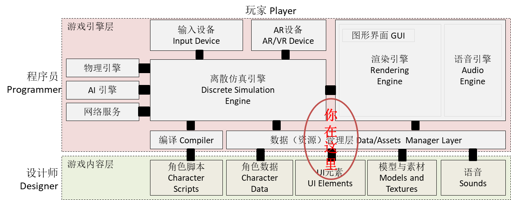

# 第九章、UI系统
{:.no_toc}

> **_横看成岭侧成峰，远近高低各不同。不识庐山真面目，只缘身在此山中。_**  
>   
> --- 【宋】苏轼 《题西林壁》

* 目录
{:toc}

## 课程内容与资源

**1、资源下载**

 [Game Jam Menu Template](https://github.com/pmlpml/unity3d-learning/raw/ex-ui/zips/Game%20Jam%20Menu%20Template.zip)

 [Unity 官方实例 ：SampleUI](https://github.com/pmlpml/unity3d-learning/raw/ex-ui/zips/SampleUI.zip)

**2、相关知识**

* [对象方法扩展 和 Dotween 的实践](x3-07-method-extend-lambda)

## 1、UI 技术概述

## 5、作业与练习

**以下作业四选一：**

1、血条（Health Bar）制作。具体要求如下
    - 分别使用 IMGUI 和 UGUI 实现
    - 使用 UGUI，血条是游戏对象的一个子元素，任何时候需要面对主摄像机
    - 分析两种实现的优缺点

2、 UI 效果制作（你仅需要实现以下效果之一）

* 进入 [NGUI](http://www.tasharen.com/?page_id=140) 官方网站，使用 UGUI 实现以下效果 
    - [Inventory](http://www.tasharen.com/ngui/exampleX.html) 背包系统
    - [Quest Log](http://www.tasharen.com/ngui/example9.html) 公告牌
    - [Scroll View](http://www.tasharen.com/ngui/example7.html) 选择板
* 以上例子需要使用 Unity web player， 仅支持以下操作系统与浏览器，参见[官方下载](https://unity3d.com/cn/webplayer)
    - Windows 版 **IE11**
    - **Mac OS X 10.7**  Safari
    - 出现界面需要等待较长时间，打开页面让它慢慢加载

3、 如果你觉得 UI 不是你的菜，喜欢复杂的设计与代码

* 研究 DOTween 网站 http://dotween.demigiant.com/getstarted.php 网页， 它在 Specific settings 中 transform.DoMove 返回 Tween 对象。请实现该对象，实现对动作的持续管理。
    - 本作业有较大难度，**务必参考师兄的作业**

4、如果你喜欢凭空构思场景，请自制有趣的 UI 场景

*  例如：“几个小动物（3D）开会，语句从每个动物头上飘出，当达到一个大小，会出现清晰的文字！如果文字较多，会自动滚动”

