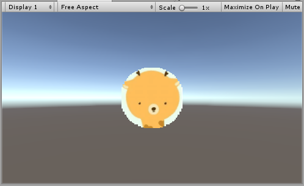
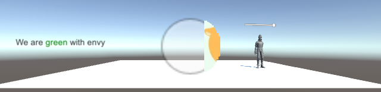
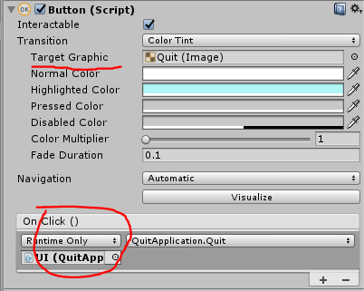
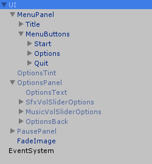
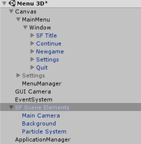
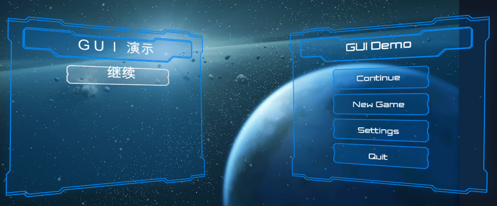
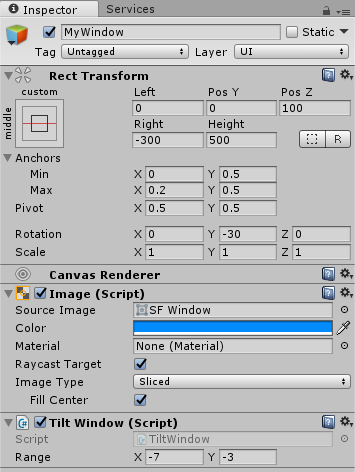
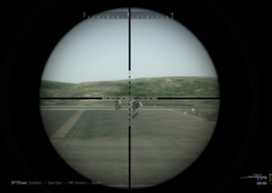

# 第九章、UI系统
{:.no_toc}

> **_横看成岭侧成峰，远近高低各不同。不识庐山真面目，只缘身在此山中。_**  
>   
> --- 【宋】苏轼 《题西林壁》

* 目录
{:toc}

## 课程内容与资源


**1、资源下载**

 [Game Jam Menu Template](https://github.com/pmlpml/unity3d-learning/raw/ex-ui/zips/Game%20Jam%20Menu%20Template.zip)

 [Unity 官方实例 ：SampleUI](https://github.com/pmlpml/unity3d-learning/raw/ex-ui/zips/SampleUI.zip)

**2、相关知识**

* [对象方法扩展 和 Dotween 的实践](x3-07-method-extend-lambda)

_预计时间：6 * 45 min_

## 1、Unity UI 技术概述

### 1.1 Unity GUI 简介

UI 即 User Interface（用户界面）的简称。在许多软件中，采用狭义的概念，特指窗体、面板、按钮、文本框等人们熟悉的人机交互元素，及其组织与风格（也称皮肤）。Unity UI 系统采用上述狭义概念。

Unity 目前支持两套完全不同风格的 UI 系统：

* IMGUI（Immediate Mode GUI）及时模式图形界面。它是代码驱动的 UI 系统，即没有图形化设计界面，只能在 OnGUI 阶段用 GUI 系列的类绘制各种 UI 元素。 
* Unity GUI /  UGUI 是面向对象的 UI 系统。所有 UI 元素都是游戏对象，有友好的图形化设计界面， 在场景渲染阶段渲染这些 UI 元素。

### 1.2 IMGUI 过时了？

IMGUI 的存在符合游戏编程的传统，即使在今天它依然没有被官方宣判为遗留（将要淘汰的）系统（Legacy Systems）。在修改模型，渲染模型这样的经典游戏循环编程模式中，在渲染阶段之后，绘制 UI 界面无可挑剔（参考[Execution Order of Event Functions](https://docs.unity3d.com/Manual/ExecutionOrder.html)）。这样的编程即避免了 UI 元素保持在屏幕最前端，又有最佳的执行效率，一切控制掌握在程序员手中，这对早期计算和存储资源贫乏的游戏设备来说，更是弥足珍贵。当然，早年 UI 交互手段就是绘制图片和文本，检测输入事件等基本任务。

按 Unity 官方说法，IMGUI 主要用于以下[场景](https://docs.unity3d.com/Manual/GUIScriptingGuide.html)：

* 在游戏中创建调试显示工具
* 为脚本组件创建自定义的 Inspector 面板。
* 创建新的编辑器窗口和工具来扩展 Unity 环境。

IMGUI系统通常不打算用于玩家可能使用并与之交互的普通游戏内用户界面。为此，应该使用 Unity 的基于 GameObject 的 UGUI 系统。

显然，如果不做复杂的界面，如下代码简单易用的代码是程序员喜欢的：

```cs
using System.Collections;
using System.Collections.Generic;
using UnityEngine;

public class IMGUITest : MonoBehaviour {

	void OnGUI (){
		// Make a background box
		GUI.Box(new Rect(10,10,100,90), "Loader Menu");

		// Make the first button. If it is pressed, Application.Loadlevel (1) will be executed
		if(GUI.Button(new Rect(20,40,80,20), "Level 1")) {
			Application.LoadLevel(1);
		}

		// Make the second button.
		if(GUI.Button(new Rect(20,70,80,20), "Level 2")) {
			Application.LoadLevel(2);
		}
	}
}
```

因此，掌握了解 IMGUI 是非常必要：

* 新手 UI 入门容易，帮助新手理解引擎的游戏循环
* 高级程序员，创建在线调试环境
* 工具开发者，定义 Unity 新的编程工具

### 1.3 UGUI 的产生与优势

随着游戏开发的普及，为了让设计师也能参与参与程序开发，从简单的地图编辑器、菜单编辑器等工具应运而生。设计师甚至不需要程序员帮助，使用这些工具就可直接创造游戏元素，乃至产生游戏程序。除此之外，现代游戏 UI 必须要满足以下要求：

* 跨设备执行，自动适应不同分辨率
* UI 元素与游戏场景融为一体的交互
* 复杂的布局
* 多摄像机支持

以至于即使优秀的程序员在现代 UI 面前，传统代码驱动的 UI 面临效率低下，难以调试等问题。 对于 Unity 平台， 当 [NGUI](http://www.tasharen.com/?page_id=140): Next-Gen UI kit 的出现使得不依赖 Unity Pro 功能，使用所见即所得（WYSIWYG）设计工具，集成了 tweening 运动管理系统， 可以制作多数 2D 游戏，直接威胁了 Unity 的生意。 Unity 最终高薪聘了 NGUI 的主设计师，最终又分道扬镳，于是就有了 UGUI，青出于蓝而胜于蓝！

UGUI 的优势：

* 所见即所得（WYSIWYG）设计工具
* 支持多模式、多摄像机渲染
* 面向对象的编程

## 2、UGUI 基础

本部分内容主要来自官方手册。  请参考 [UI 系统](https://docs.unity3d.com/Manual/UISystem.html)

### 2.1 画布

画布（Cavas）是绘图区域, 同时是 ui 元素的容器。 容器中 ui 元素及其子 UI 元素都将绘制在其上。 拥有Canvas组件的游戏对象都有一个画布，它空间中的子对象，如果是 UI 元素将渲染在画布上。

画布区域在场景视图中显示为矩形。这使得定位UI元素变得非常容易，无需随时显示游戏运行视图。

**1、UI元素的显示顺序**

画布中的UI元素按照它们在层次结构中出现的顺序绘制。如果两个UI元素重叠，后面的元素将出现在较早的元素之上。因此，最后一个孩子显示在最上面。

要更改哪些元素出现在其他元素的顶部，通过拖动它们在 Hierarchy 视图中的位置。这顺序也可以通过 Transform 组件的方法在脚本中控制。 如：SetAsFirstSibling，SetAsLastSibling 和SetSiblingIndex。

**2、渲染模式**

画布组件有渲染模式（Render Mode）设置，可用于使其在屏幕空间（Screen Space）或世界空间（World Space）中渲染。

 UI元素采用像素单位表示位置和尺寸， UI元素默认在 UI 层

**屏幕空间 - 叠加（Screen Space - Overlay）**

将UI元素放置在场景顶部渲染的屏幕，画布会自动更改大小匹配屏幕。Canvas 默认中心点为屏幕中心！


**屏幕空间 - 相机（Screen Space - Camera）**

画布放在制定的渲染摄像机前，如 100 的位置，画布会自动匹配为屏幕分辨率。Canvas 默认中心点为屏幕中心！


**世界空间（World Space）**

画布行为与场景中的其他任何对象一样，UI元素将放置在其他对象的前面或后面渲染。**画布大小和位置任意设置**，这对于意在成为世界一部分的用户界面非常有用。


**3、测试渲染模式**

 操作 09-01，渲染模式练习：

* 菜单 GameObject -\> UI -\> Button

在游戏对象层次视图中出现 Canvas 和 EventSystem。

* 展开 Canvas 看到 Buttion
* 展开 Button 看到 Text
* 菜单 GameObject -\> 3D Object -\> Cube 添加 Cube 作为参考物
* 检查、设置以下对象属性
    - Main Camera 的 Position = （0，1，-10）
    - Canvas::Button 的 （PosX,PosY,PosZ） = (0,0,0)
    - Cube 的 Position = （0，**0.5**，0）
* 使用鼠标中间滚轮在场景视图中缩小，直到看到整个画布，中间有一个 Button

研究渲染模式：

* 选择 Canvas 对象的 Inspector 面板中 Canvas 组件
    - 设置 Render Mode 为 Screen Space - Overlay

在 Game 视图中，看到按钮覆盖在 Cube 上。

* 选择 Canvas 对象的 Inspector 面板中 Canvas 组件
    - 设置 Render Mode 为 Screen Space - Camera
    - 设置 Render Camera 为 Main Camera

结果在  Game 视图中，看到按钮在 Cube 后面。

* 选择 Main Camera
    - 在  Camera 组件面板中修改 Field of View

在 Game 视图中，Cube 变化大小，而按钮保持不变。

* 切换到 Scene 视图
* 在  Camera 组件面板中修改 Field of View

观察到画布随着视口自动改变大小。

 Cube 变化大小，按钮保持不变。 为什么？

### 2.2 UI 布局基础

每个UI元素都被表示为一个矩形，为了相对于 Canvas 和 其他 UI 元素实现定位，Unity 在 Transform 基础上定义了 RectTransform （矩形变换） 支持矩形元素在 2/3D 场景中变换。

**1、矩形变换**

矩形变换像常规变换一样具有位置，旋转和比例，但它也具有宽度和高度表示矩形的尺寸。


 矩形位置和尺寸请使用像素，以匹配素材！

以下是矩形变换的重要概念：

**Pivot/旋转点/轴心**：旋转点在场景视图中显示为蓝色圆圈。用规范化坐标表示位置，如 （0.5,0.5）表示矩形的中心。


修改 Rotation 属性，矩形围绕此点旋转。

**Anchors/锚点**：锚点在场景视图中显示为四个小三角形手柄（四叶花）。每个叶子位置对应矩形的四个顶点。当描点随父对象变换时，矩形的顶点与对应的锚点**相对位置必须保持不变**。

 操作 09-02 ，锚点练习：

* 将场景视图设为 2D 模式
* 使用鼠标中间滚轮在场景视图中缩小，直到看到整个画布，中间有一个 Button
* 将 Canvas 的 Reader 设为 World Space，以便改变父对象（画布）的大小


UI元素锚定到父项的中心。该元素保持到中心的固定偏移量。


UI元素锚定在父级的右下角。该元素保持右下角的固定偏移量。


左侧角落的UI元素锚定在父代的左下角，右侧角落锚定在右下角。元素的角落保持固定的偏移到他们各自的锚点。


具有左角的UI元素锚定到距离父元素左侧一定百分比的点，右角点锚定到距父矩形右侧一定百分比的点。

 如何实现父元素与子元素等比缩放？

**2、矩形工具**

Unity 在界面上提供了工具以方便修改 UI 元素的变换参数。


提供了移动、旋转、比例、矩形四个工具。该图选择了矩形工具的工具栏按钮


在选择矩形工具时，设置为“旋转”和“局部”视图，通常便于操作

**3、锚点预设**

在 Inspector 面板中，可以在 Rect Transform 组件的左上角找到 Anchor Preset 按钮。点击该按钮会弹出 Anchor Presets 下拉菜单。


### 2.3 UI 组件与元素

UI 部件都是用 Script 开发的自定义组件。包括在 UI、Layout 和 Rendering 等分类中。

**1、可视化组件**

[可视化组件](https://docs.unity3d.com/Manual/UIVisualComponents.html)，在组件 UI 分类中，包括：

* Text：显示的文本的文本区域。可以设置字体，字体样式，字体大小以及文本是否具有丰富的文本功能。
* Image：显示图片的区域。可以设置**GUI精灵**、色彩。
* Raw Image：原始图像采用纹理，进行 UV 矩形贴图。
* Mask：Mask不是一个可见的UI控件。遮罩将子元素限制（即“掩蔽”）为父元素的形状。如果孩子比父控件大，那么只有适合父节点遮罩的部分是可见的。
* Effects：应用各种简单的效果，例如简单的投影或轮廓。

**2、UI 交互元素**

UI 交互元素是 GameObject，它拥有 UI 交互组件、UI可视化组件、及相关组件的组合，以及一些 UI 子元素构成，以方便用户在设计场景中创建交互界面。

例如：Button 元素，除了 UI 必须拥有的 RectTransform 和 Canvas renderer 外，还有 Image 和 Button 组件，以及一个 Text 子元素。

* Button
* Toggle
* Toggle Group
* Slider
* Scrollbar
* Dropdown
* Input Field
* Scroll Rect (Scroll View)

详细信息，参见官方 [UI 元素](https://docs.unity3d.com/Manual/UIInteractionComponents.html)

### 2.4 圆形遮罩、动画、富文本、血条

圆形遮罩、动画、富文本、血条等都是菜单制作，初步理解 Text，Image，RowImage，Mask 等的基本使用技巧。

**1、圆形遮罩**

准备一个可爱动物卡通头像，例如：

任务是使用 Mask 遮罩制作圆形头像

 操作 09-03 ，Mask 练习：

* 准备一个新项目
* 将 png 图片拖入 assets 视图，作为 texture
* 层次视图 context 菜单 -\> UI -\> Panel 创建 Panel 
* 在 Panel 下添加 RawImage 元素
* 将图片拖入 RawImage 的 Texture 插槽
* 场景选择 2D 视图，并缩放至看到整个画布
* 选择 Panel 对象
    - 在 RectTansform 组件选择预制描点 （middle，center）
    - 用 Rect 工具，将 Panel 与图片大小一致
    - 添加 Mask 组件
    - 选择 Image 组件，选择 Source Image 为 Knob
* 选择 Game 场景，如图效果



网上有许多 Mask 的技术，例如：[使用透明度实现Mask遮罩的Unity Shader](https://www.jianshu.com/p/1d9d439c28fa)

**2、录制动画**

 操作 09-04 ，动画练习：

* 选择 RawImage
* 在视图 Animation 中，点 create 系统在该对象上创建了动画组件、动画控制器、动画文件
    - add property 按钮，选择 Archored Position 
* 选择 Scene 视图，移动 RawImage 到 Panel 左边
* 选择 Animation 视图，在 0s 位置添加关键帧
    - 将播放位置红线放置在最后
* 选择 Scene 视图，移动 RawImage 到 Panel 右边  
* 选择 Animation 视图，在最后位置添加关键帧
* 选择运行动画，结束

走马灯效果！

动画与按钮的集成，参见官方 [动画集成](https://docs.unity3d.com/Manual/UIAnimationIntegration.html)

**3、富文本**

为了显示格式复杂的文字，Unity 提供了 **类似HTML** 标签，控制字体、字号、颜色。

* 在 Canvas 下添加 Text 元素
* 在 Text 组件输入： `We are <color=green>green</color> with envy`  

详细参见官方 [Rich Text](https://docs.unity3d.com/Manual/StyledText.html)

**4、简单血条**

任务是给动画人物 Ethan 添加 Health Bar。

 操作 09-04 ，health bar 练习：

* 菜单 Assets -\> Import Package -\> Characters 导入资源
* 在层次视图，Context 菜单  -\> 3D Object -\> Plane 添加 Plane 对象 
* 资源视图展开 Standard Assets :: Charactors :: ThirdPersonCharater :: Prefab
* 将 ThirdPersonController 预制拖放放入场景，改名为 Ethan
* 检查以下属性
    - Plane 的 Transform 的 Position = (0,0,0)
    - Ethan 的 Transform 的 Position = (0,0,0)
    - Main Camera 的 Transform 的 Position = (0,1,-10)   
* 运行检查效果
* 选择 Ethan 用上下文菜单 -\> UI -\> Canvas, 添加画布子对象
* 选择 Ethan 的 Canvas，用上下文菜单 -\> UI -\> Slider 添加滑条作为血条子对象
* 运行检查效果
* 选择 Ethan 的 Canvas，在 Inspector 视图
    - 设置 Canvas 组件 Render Mode 为 World Space 
    - 设置 Rect Transform 组件 (PosX，PosY，Width， Height) 为 (0,2,160,20)
    - - 设置 Rect Transform 组件 Scale （x,y） 为  (0.01,0.01)
* 运行检查效果，应该是头顶 Slider 的 Ethan，用键盘移动 Ethan，观察



* 展开 Slider
    - 选择 Handle Slider Area，禁灰（disable）该元素
    - 选择 Background，禁灰（disable）该元素
    - 选择 Fill Area 的 Fill，修改 Image 组件的 Color 为 红色
* 选择 Slider 的 Slider 组件 
    - 设置 MaxValue 为 100
    - 设置 Value 为 75
* 运行检查效果，发现血条随人物旋转

给 Canvas 添加以下脚本 LookAtCamera.cs

```cs
using UnityEngine;

public class LookAtCamera : MonoBehaviour {

	void Update () {
		this.transform.LookAt (Camera.main.transform.position);
	}
}
```

功能的实现，不一定意味任务完成。在场景中添加一个 Cube，让 Ethan 藏在 Cube 后面，血条暴露了行踪哦！

 怎么办？在线等... 请用一句话描述你的决解方案

 性能、性能、性能，重要的事情说三次

如果你在生产中使用上述血条，足以证明你是入门级别程序员。为了显示血条，每个图片从 pixel 单位映射到 world space，再投影到摄像机空间，在变成屏幕空间（pixel 单位）。这需要多少算力？ 

因此，能用 Srceen Space 解决的问题绝不用 World Space， 能用 Overlay 解决问题绝不用 Camera！

而血条恰恰是 Srceen Space - Overlay 能决解的哦！提示，阅读脚本手册 RectTransform 

参考资源：[Faking World Space for monster health bars in Unity](http://blog.manapebbles.com/world-space-overlay-camera-in-unity/)

## 3、Screen Space - Overlay 案例研究

Game Jam Menu Template 是一个入门级别的 2D 菜单模板。请下载并导入资源。

资源商店地址：https://www.assetstore.unity3d.com/en/#!/content/40465

官方培训视频教程：https://unity3d.com/cn/learn/tutorials/modules/beginner/live-training-archive/game-jam-template?playlist=17111

### 3.1 菜单与事件响应机制

* 展开资源 Game Jam Menu Template :: Prefabs
* 将 UI 预制 拖入层次菜单

运行，发现菜单按钮不起作用

* 添加事件系统，context 菜单 -\> UI -\> EventSystem 

运行，菜单可以运行，并响应按钮 mouseover 等效果，以及 click 事件

**1、EventSystem 的作用**

按官方手册，EventSystem 在一个场景中 **有且仅能有一个**，它将游戏操纵杆、键盘、鼠标、触摸屏、触摸屏与 UI 对象交互事件，如 Click，MouseMOver，DragEnter 等等，传递给游戏对象对应的行为组件。

**2、响应事件**

按钮元素有一个 button 部件，它相当与该对象的控制器，控制消息的传递、自己及子对象属性的统一管理。这似乎是 Unity 的一个设计习惯，即一个功能独立的元素，必然有一个对应名字的组件作为控制。例如：ThirdPersonController 预制的根游戏对象，对应的控制是 Third Person User Controller 组件。

 将客户端与事物内部复杂性隔离的对象，统称门面（Facade）对象。在 GoF 中，称为**门面（Facade）模式**

**门面模式应用场景**

* 为复杂子系统提供一个简单接口
* 提高子系统的独立性
* 在层次化结构中，可以使用Facade模式定义系统中每一层的入口。

**Button 组件**

下图是 Quit 按钮的 Button 组件

 

 其中：

 * Interactable：是否允许交互，效果是禁灰
 * Transition：交互事件发生时的行为，这里选项有 None（无行为）、Color Tint（变颜色）、Sprite Swap（还图片）、Animation（动画），详细设置见 [Transition Options](https://docs.unity3d.com/Manual/script-SelectableTransition.html)
 * Navigation
 * Events: button 只支持 OnClick，用户可添加指定的消息函数。表示为：`游戏对象(行为或组件.方法)` 图中是 `UI(QuitApplication.Quit)`

```cs
using UnityEngine;
using System.Collections;

public class QuitApplication : MonoBehaviour {

	public void Quit()
	{
		//If we are running in a standalone build of the game
	#if UNITY_STANDALONE
		//Quit the application
		Application.Quit();
	#endif

		//If we are running in the editor
	#if UNITY_EDITOR
		//Stop playing the scene
		UnityEditor.EditorApplication.isPlaying = false;
	#endif
	}
}
```

这是常用的退出游戏的代码，可以处理编辑环境。

**3、响应更多类型事件（Event Trigger）**

事件触发器 (Event Trigger) 从事件系统接收事件，当收到事件时调用已注册的函数。事件系统[支持的事件](https://docs.unity3d.com/Manual/SupportedEvents.html)。

例如：以下操作使得你点击 Title 时也能退出：

* 选择 UI :: MenuPanel :: Title 游戏对象
* Inspector 面板添加事件触发器，Add Component -\> Event -\> Event Trigger 
    - Add New Event Type 为 Pointer Click
    - 添加事件处理函数 UI(QuitApplication.Quit)
* 检查 Canvas Group 组件 Blocks Raycast 为 选中

运行菜单，发现点击 Game Title 也能退出游戏！

 模块独立准则。一个独立的模块应不能依赖模块以外的数据或程序。

因此，本案例中子对象依赖 UI 游戏对象的代码，这个子对象就不再是独立的了。

### 3.2 菜单结构与布局（layout）

**1、菜单结构与窗口组织**

菜单通常由一个 Canvas 和 若干 Panel 组成的，所有 UI 元素组成一个树形结构。



其中：MenuPanel 是主菜单，OptionsPanel 和 PausePanel 是两个隐藏的窗口。

**了解 Panel**

 操作 09-05 ，Panel 容器练习：

* 创建一个新场景，保存 Game Jam Menu Template 场景如 jmt。
* 在层次视图，创建一个 Panel，不就是一个 Image 组件和 Canvas Renderer
* 切换到 Game 视图

怎么灰蒙蒙的？

* 修改 Image 组件 color 为 `#FFFFFF00` (无色透明)

[Canvas Renderer](https://docs.unity3d.com/Manual/class-CanvasRenderer.html) 是所有 UI 元素的灵魂伴侣。按官方说法，尽管它没有暴露任何属性，但可以控制通过脚本独立控制该区域的 Render 能力。

* 在 Panel 添加组件 Add Component -\> layout -\> Canvas Group

[Canvas Group](https://docs.unity3d.com/Manual/class-CanvasGroup.html) 它可以控制容器及其子对象的 Alpha 通道，交互，射线碰撞，免得你一一设置。

* 在 Panel 下用上下问菜单添加一个 button
* 选择 Panel
* 切换到 Game 视图
* 修改 Panel(Canvas group) 的 ALpha 分别为 0，0.5，1

按钮从不可见，到半透明，到完全显示

**模态窗口与非模态窗口**

游戏引擎不可能实现一个复杂的窗口系统，也没有必要做这样的窗口系统。

**模态窗口**就是在顶部的窗口且不可失去焦点，除非你关闭它，例如对话框。

因此，模态窗口最简单的方法就是仅保留一个 Panel 活动。如果要出现几个窗口，一个窗口模态，则模态窗口是 Canvas 下最后一个子对象，且其他窗口的 Canvas Group 是不可输入 和 射线 交互。

 如果需要多个窗口同时出现，怎么办？

**2、自动布局**

除了用 anchor 手动布局外，也可以使用[自动布局组件](https://docs.unity3d.com/Manual/comp-UIAutoLayout.html)。例如 UI :: MenuPanel :: MenuButton (Vertical layout Group)

* 内容尺寸适配（Content Size Fitter）
* 布局元素（Layout Element）
* 水平布局组（Horizontal Layout Group）
* 垂直布局组（Vertical Layout Group）
* 网格布局组（Grid Layout Group）

### 3.3 代码组织

在 Game Jam Menu Template :: Scripts 目录下共有 8 段代码，除了 SetAudioLevels 挂载在 OptionsPanel 上，其他都挂在了 UI 这个 root 对象上。 

 为什么 QuitApplication 作者不挂在 Quit 按钮上？这样做好吗？

## 4、Camera UI 案例研究

Sample UI 是 Unity 新 UI 的 demo 版本以展示取代 NGUI 的强大能力。你可以从中学到高级布局、多摄像机、drag & Drap、RenderTexture、光线渲染等技术，使得菜单拥有 3D 游戏的技术，如粒子等。

资源商店地址：https://assetstore.unity.com/packages/essentials/unity-samples-ui-25468

Sample UI 共有 7 个场景案例：

* Menu 3D
* Layout Groups
* RenderTexture
* Lighting
* Drag And Drop
* Draggable Panel
* Controls （Overlay Model）

### 4.1 多摄像机与3D菜单

观察 Menu 3D 效果：

* 加载场景 Sample UI :: Scene :: Menu 3D
* 运行
* 左右摇摆鼠标，点击 Setting 按钮， 点击 Back 按钮
* 最后点击 Quit 按钮

**1、菜单结构与摄像机设置**

在层次视图，展开菜单，如图所示



其中：Canvas 是菜单，SF Scene Elements 表示游戏元素。

对比 Main Camera 和 GUI Camera 游戏对象的 Camera 组件的设置

* Clear Flags 属性分别为 Skybox 和  Don't Clear
* Culling Mask 属性分别为 Everything 和 UI
* Depth 属性分别为 -1 和 0

这三个属性说明 GUI Camera 覆盖 Main Camera 显示内容。

 研讨以下内容：

* Canvas 组件的 Render Mode 属性 和 Render Camera
* 游戏对象显示 黑色、蓝色、灰色 的含义

**2、3D 菜单设置初步**

不使用 SF 预制，设置如图要求菜单：



 操作 09-06 ，3D 布局练习：

* 在 scene 视图选择 2D 模式
* 选择 矩阵工具
* 在 MainMenu 添加 Panel 命名为 MyWindow
    - 设置 MyWindow 的 Rest Transform 组件
    - 设置 MyWindow 的 Image 组件
    - 添加脚本 TiltWindow

MyWindow 设置参数如图所示：



 请完成剩余设置，包括动画按钮

### 4.2 画中画与 UI 光效

RenderTexture 场景实现了画中画和 UI 效果。实现要点包括：

* 使用了 3 个摄像机
    - Main Camera 在 defalut 层
        - Clear Flag 为 skybox
        - Culling Mask 为不包含 UI 层
        - Depth 为 -1
        - Position Z 为 -100
    - RT Camera 在 defalut 层
        - Clear Flag 为 Solid Color
        - Culling Mask 为 为不包含 UI 层
        - Depth 为 0
        - Position Z 为 0
        - **Target Texture* 为 RenderTexture
    - UI Camera 在 UI 层
        - Clear Flag 为 Depth Only
        - Culling Mask 为 UI 层
        - Depth 为 1
        - Position Z 为 -300
* Canvas 设置
    - Render Mode 为 **world space**
    - Position Z 为 0
    - 子游戏对象 RawImage
        - 它的纹理属性是 **RenderTexture**，即 RTCamra 渲染的结果在这里显示
* Extra Light 在 UI 层
    - Position 投射在 Canvas 右下角

按相机渲染顺序：

* Main Camera 先显示背景
* RT Camera 渲染结果保存在 RenderTexture 资源中
* UI Camera 渲染 UI 层菜单，覆盖在背景上
    - RawImage 显示 RT Camera 的结果

 从相机、UI的设置，讲述如下案例实现方案：

在某对战游戏中，需要设计狙击步枪上的瞄准镜。   


### 4.3 事件编程与Drag&Drop

Drag And Drop 场景展示拖放效果；Draggable Panel 场景展示需改面板尺寸。

Drag And Drop 场景给了两个代码 DragMe 和 DropMe。

Dragme 的部分代码，Dragme 的代码与官方手册 [IDropHandler](https://docs.unity3d.com/ScriptReference/EventSystems.IDropHandler.html) 的代码几乎一致：

```cs
public class DragMe : MonoBehaviour, IBeginDragHandler, IDragHandler, IEndDragHandler
{
    ...
}
```

IDropHandler 等接口都实现了 EventsSystem.IEventSystemHandler 的接口。按 Unity 官方解释，MonoBehaviour 实现 IEventSystemHandler 接口的接口都会自动纳入 Unity 引擎的调度，会接收到 Standalone Input Module 等模块发送的事件。 

拖动基本流程是：

* OnBeginDrag 初始化拖动的图标
* OnDrag 修改图标位置
* OnEndDrag 释放资源

 具体实现，参见[UGUI 实现Inventory(背包系统)](https://blog.kinpzz.com/2016/05/21/unity3d-ugui-Inventory/)！

## 5、小结

 门面模式的 Unity 实现

## 6、作业与练习

**以下作业五选一：**

1、血条（Health Bar）的预制设计。具体要求如下
    
* 分别使用 IMGUI 和 UGUI 实现
* 使用 UGUI，血条是游戏对象的一个子元素，任何时候需要面对主摄像机
* 分析两种实现的优缺点
* 给出预制的使用方法

2、 UI 效果制作（你仅需要实现以下效果之一）

* 进入 [NGUI](http://www.tasharen.com/?page_id=140) 官方网站，使用 UGUI 实现以下效果 
    - [Inventory](http://www.tasharen.com/ngui/exampleX.html) 背包系统
    - [Quest Log](http://www.tasharen.com/ngui/example9.html) 公告牌
    - [Scroll View](http://www.tasharen.com/ngui/example7.html) 选择板
* 以上例子需要使用 Unity web player， 仅支持以下操作系统与浏览器，参见[官方下载](https://unity3d.com/cn/webplayer)
    - Windows 版 **IE11**
    - **Mac OS X 10.7**  Safari
    - 出现界面需要等待较长时间，打开页面让它慢慢加载

3、 如果你觉得 UI 不是你的菜，喜欢复杂的设计与代码

* 研究 DOTween 网站 http://dotween.demigiant.com/getstarted.php 网页， 它在 Specific settings 中 transform.DoMove 返回 Tween 对象。请实现该对象，实现对动作的持续管理。
    - 本作业有较大难度，**务必参考师兄的作业**

4、编写一个组件，提供常用窗口服务

* 修改 Game Jam Menu Template 的脚本
    - 如 ShowPanels 脚本
* 具体要求是实现一个方法
    - 支持某个面板窗口独立显示
    - 支持某个面板窗口模态，其他面板窗口显示在后面
    - 支持几个窗口同时显示，仅一个窗口是活动窗口

5、如果你喜欢凭空构思场景，请自制有趣的 UI 场景

*  例如：“几个小动物（3D）开会，语句从每个动物头上飘出，当达到一个大小，会出现清晰的文字！如果文字较多，会自动滚动”

