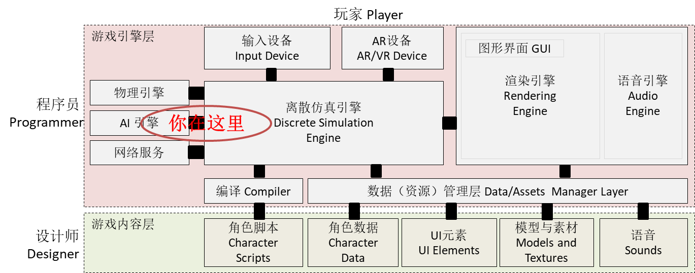
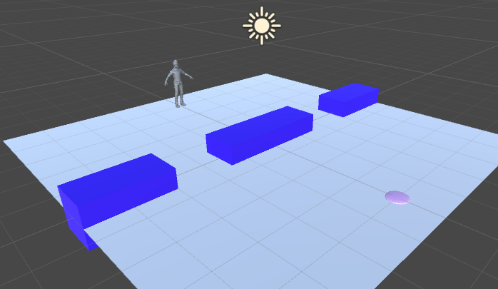
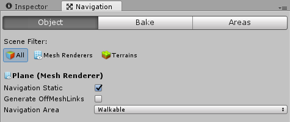
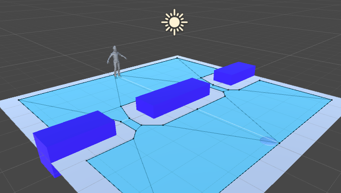
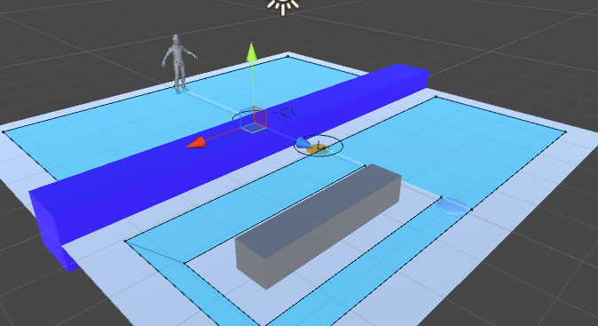

# 第十章、游戏智能
{:.no_toc}

> **_AI_**  
>   
> --- 

* 目录
{:toc}

## 课程内容与资源




## 1、游戏智能与AI

### 1.1 人工智能概述

### 1.2 游戏智能与人工智能的区别

**游戏智能**，尽管没有权威的定义，但可以理解为：在游戏规则约束下，通过适当的 **算法** 使得游戏中 NPC（Non-Player Character） 呈现为具有一定人类智能行为的 **博弈对手**，让游戏玩家面临不间断的 **挑战**，并在挑战中有所收获，包括知识和技能等。

因此，游戏智能与人工智能在设计目标上有着比较大的不同：

* 拟人化。游戏智能更注重游戏对象行为结果类似（模拟）人，既能做出令人惊讶的有效行为，也会犯各种愚笨的错误，从而与现实世界中不同的人匹配。而人工智能通常是超人设计，追求最佳结果。
* 可玩性。游戏智能并不意味着高大上的算法，它更注重针对不同类型的玩家设计不同能力的 NPC，例如：“小怪物”，“大boss” 等等，通常用等级这个参数来表达游戏智能 agent 的能力。
* 趣味性。游戏智能设计注重娱乐，而不只是算法研究。因此，算法会集合一些特效，让人感到愉悦。

### 1.3 游戏智能的应用场景

## 2、模型、方法与常用算法

### 2.1 “感知-思考-行为”模型

["sense-think-act" paradigm](https://www.researchgate.net/publication/4027028_The_sense-think-act_paradigm_revisited)（范式） 是构造 agent、robot、NPC（Non-Player Character） 的基础概念。自从上世纪80年代提出以来，我们使用 Sense-Think-Act 范例思考机器人如何工作，并设计它们。 即使机器人最终设计的方式不同，STA 通常仍然是一个有用的开始。 随着机器人技术的发展，协同技术越来越重要，机器人之间的 “Communicate”通常也纳入设计之中。本节主要关注 NPC 如何产生看似理性（Rational）的行为（**模拟人**）的设计方法。

它与算法设计思考输入、处理、输出类似，但完全不同哦！

**1、感知（Sense）**

感知是 agent 接收世界信息的行为，其获取的数据将是思考的输入。在游戏中，程序是可以获得游戏世界任意信息的，设计一个“干死”玩家的算法通常是比较容易的，因此如何限制信息获取是设计不同级别 agent 的核心问题。（类似围棋哪种“完美信息贯序博弈”算法，属于学习型智能，不在这里考虑）

在游戏中，定义获取信息能力通常可以从视觉、听觉和嗅觉等渠道去考虑：

* 视觉（Vision）
    - 识别“敌人”的位置和属性
    - 识别“障碍物”及其范围
* 听觉（Sound）
    - 识别事件的方向和距离
* 嗅觉（Smell）
    - 获得玩家/事件的痕迹

使用距离、角度、障碍物限制 agent 发现玩家位置等信息，或者使用干扰影响信息的准确性，这些是设计游戏 agent 常见的手段。如果 agent 都拥有玩家位置和导航地图，结果就是一窝蜂的现象，这是没有趣的事情。合适的限制，将使得 agent 在相同的决策算法下，呈现丰富的行为。

一种简单的方法就是 agent 结合不同类型的触发器、探头，构造不同的获取信息的场景。最后将感知的结果放在一个数据结构中（类似 UnityEngine.EventSystems.PointerEventData）

 在 Agent Thinking 时，不可获取感知以外的数据信息。

**2、思考（Think）**

Think 就是算法，它的输入是感知的数据，输出是行为（behaviours）。 思考的算法，通常就是我们所说的游戏规则的一部分，即 agent 能做什么，该做什么。 通常这不是程序员的工作，而是**游戏设计师的工作**。游戏 agent 的思考类似人脑的决策过程，这其中的关键**不是打造最强大脑**，而是建立符合游戏玩家难度曲线，可以控制、且符合社会准则的行为。另一个相关问题，玩家难度曲线在编程阶段是未知的，依赖众多玩家与 agent 的操作与对抗结果。它在游戏测试和运维过程中存在巨大不确定性（在数据驱动的设计和集成脚本引擎等章节中讨论解决方案），因此：

 将 agent 决策过程用 If ... Then ... 硬编码写入程序逻辑是不可行的！

目前，主要方法有：

**规则推理引擎**

规则推理引擎（Rule-based Inference Engine）也叫产生式系统或推理模型（inference model），是由基于规则的专家系统发展而来。基于规则的专家系统是人工智能领域中专家系统的一个分支，它模拟人类的推理方式，使用试探性的方法进行推理，并使用人类能理解的术语解释和证明它的推理结论。基于规则的专家系统，基本概念包括：

* 事实（facts）: 事实是用来表示已知的数据或信息。
* 规则（Rules）: 即产生式规则，用来表示系统推理的有关知识。 规则由条件和动作组成，格式一般为：`IF 条件 Then 动作`，例如 `Rule1: Human(x) => Mortal(x)` （一阶谓词逻辑，离散数学）

规则推理引擎的[基本部件](http://www.cnblogs.com/hanmeina/p/5948478.html)包括：


规则推理引擎有许多实现，一般基于 RETE 算法。 [入门读物](https://www.ibm.com/developerworks/cn/opensource/os-drools/)

**状态机引擎**

有限状态自动机（Finite State Machine / FSM）是可以图形化的自动执行工具。在 unity 中，它是标准化的 agent（NPC） 动作自动控制工具。

举个例子，让我们来看一个典型的射击游戏中的人工智能守卫。它的状态可以非常简单，如巡逻（Patrol）、追逐（Chase）和射击（Shoot）。因此，定义一个状态机主要工作包括：

* 状态：该组件定义了一组状态，一个游戏实体或NPC可以选择（巡逻、追逐和射击）
* 转移：该组件定义了不同状态之间的关系
* 规则：该组件用来触发状态转移（玩家在视线范围内、距离足够攻击、丢失/杀死玩家）
* 事件：该组件用于触发检查规则（守卫的可见区域、与玩家的距离等）

《雷神之锤2》里的怪物可能具有以下状态：站立、行走、跑步、躲避、攻击、空闲和搜索。有限状态机广泛地应用于游戏人工智能中，因为它们易于实现，不管对于简单还是相对复杂的游戏都游刃有余。

**决策树**

决策树（Decision Trees）又称为行为树（Behaviour Trees）。

本人属于代码程序优于可视化程序的支持者，并不喜欢用图编程序。如果你有兴趣，这篇博客可入门，[UNITY行为树制作AI简单例子](http://www.cnblogs.com/yuwenxiaozi/p/4881077.html) 。

更好的方案就是集成动态脚本程序，游戏逻辑一般不复杂，配合动态脚本和简单游戏设计工具，会有更灵活的编程体验。

以上仅是**经典人工智能**的一些方法

**3、行动（Act）**

行动（Act）将思考（Think）的结果作为输入，该部分的任务就是使得 agent 行为更符合物理世界的规律，使得“心想事成”这样理想的结果变得不确定。

例如：用户 或 agent 获取了目标位置，并发出“shoot(pos)”这个命令。这时的逻辑是子弹的时点、射击位置。如果你设计的 agent 立马将子弹送到指定位置，多少对手都死了！

通常需要考虑的要素包括：

* 准备时间。在准备时间通过光、声等方式提示对手
* 动作时间。从动作开始到结束是一个序列
* 干扰因素。利用风、地形、随机数使炮弹有一定偏差

### 2.2 寻路算法 A\*

### 2.3 势能场（Potential Field）与驾驭（steering）

### 2.4 觅食模型与群体智能

### 2.5 10 种使智能变得萌笨的方法！！！

## 3、Unity 3D 导航与寻路

### 3.1 基本概念

Unity 导航系统允许创建给游戏角色导航的游戏世界。如下图所示，游戏角色可以在蓝色联通的网格上，找到去任意一点最短的路径，且具有一定爬坡、跳沟壑的能力。


* **NavMesh** (Navigation Mesh) 是一种数据结构，它描述了游戏对象可行走的表面。通过三角网格，计算其中任意两点之间的最短路径，用于游戏对象的导航。它是根据场景几何结构自动创建或烘焙构建。
* **NavMesh Agent**组件创建具有寻路能力的角色。Agent 使用NavMesh 推理，避免彼此以及移动障碍物。
* **Off-Mesh Link**组件允许将不连接的块之间建立“传送门”。例如，跳过沟渠或围栏，或在穿过它之前打开门，都可以被描述为 Off-Mesh Link。
* **NavMesh 障碍** 组件允许您描述 agent 在移动时应避免的移动障碍。由物理系统控制的桶或箱子就是很典型的障碍。在障碍物移动的过程中，Agent 尽力避开它，但一旦障碍物变得静止，它将在导航网格上开一个洞，以便 Agent 可以改变他们的路径以绕过它，或者静止的障碍物阻塞路径，使得 Agent 找到其他路线。

更详细的描述，参见官方 [导航系统的内部工作原理](https://docs.unity3d.com/Manual/nav-InnerWorkings.html)

### 3.2 导航设置基础

本节的任务是熟悉上述概念及其使用。

 操作 10-01 ，Agent 和 Navmesh 练习：

* 创建一个新项目
* 创建一个面。层次（Hierarchy）视图， Context 菜单 -\> 3D Object -\> Plan
* 创建蓝色材料。 Project 视图， Context 菜单  -\> Create -\> Material
* 创建一个 Cube，添加蓝色材料，制成 wall 预制
* 创建一个 Sphere，添加粉色材料，制成 target 预制
* 导入角色标准资源， Project 视图， Context 菜单  -\> Import Packages -\> Characters
* 添加 AI 角色， Standard Assets :: Charaters :: ThirdPersonCharater :: Prefabs :: AIThirdPersonController
    -  AICharacterControl 脚本写的很好，用 namespace 标识独立模块是最佳实践！ 组件功能简单，它使用 NavMeshAgent 组件，保持游戏对象实时追踪目标
    -  组件 UnityEngine.AI.NavMeshAgent ，它自己有一些设置参数。  
* 布局如图地图



图中：

* camera 的 position = (0,5.-10); rotation = (30,0,0) 
* AIThirdPersonController 的 position = (0,0,-4) 
* target 的 position = (0,0,-4)，scale = (0.5,0.1,0.5)
* wall 0 的 position = (0,0,0)， scale = (3,1,1) 
* wall 1 的 position = (4,0,0)， scale = (2,1,1) 
* wall 2 的 position = (-4,0,0)， scale = (2,1,1) 

完成布局后

* 将 target 拖入 AIThirdPersonController 对象的  AICharacterControl 组件的 Target 插槽

这时运行并不会自动寻路，系统会提示 `"GetRemainingDistance" can only be called on an active agent that has been placed on a NavMesh.`
 
现在需要的是制作 Navmesh 让 NavMeshAgent 工作

* 菜单 Windows -\> Navgation，出现如下编辑面板



* 选择 Plane，target， 选择 Navgation 的 Object 面板
    - 设置 Navigation static 选中
    - 设置 Navigation area 为 Walkable
* 选择所有 wall。
    - 设置 Navigation static 选中
    - 设置 Navigation area 为 Not walkable
* 选择 Navgation 的 Bake 面板, 图含义非常清晰，官方文档有[图解](https://docs.unity3d.com/Manual/nav-BuildingNavMesh.html)
* 点解下方 Bake 按钮，出现



图中，水蓝色凸多边形构成的网格就是寻路算法的数据结构，agent 将用它来导航。

 要预先生成的 Navmesh 、光照纹理贴图，都是高资源消耗的哦！

最后对 target 挂一段熟悉的代码：

```cs
using System.Collections;
using System.Collections.Generic;
using UnityEngine;

public class PlaceTarget : MonoBehaviour {
	
	// Update is called once per frame
	void Update () {
		if (Input.GetMouseButtonDown (0)) {    
			Ray ray = Camera.main.ScreenPointToRay (Input.mousePosition);  
			RaycastHit hit;  
			if (Physics.Raycast (ray, out hit)) {  
				Debug.Log (hit.collider.name);  
				if (hit.collider.name == "Plane") {
					this.transform.position = hit.point;
				}
			}
		}
	}
}
```

运行！寻路功能完成

 操作 10-02，Obstacle 和 Off Mesh Link 练习：

* 将当前场景另存了 nav2
* 创建一个 Cylinder
    - 设置 scale = (0.5, 0.01, 0.5)
    - 添加黄色材料，制成 mark 预制
* 在层次视图创建两个 mark 游戏对象
    - position 分别是 (0,0,-1),(0,0,1)
    - 在 Naviagtion 编辑视图选择 Object，设置为 Walkable
* 添加一个 emtpy 对象，命名 mesklink
    - 在 Inspector 窗口添加组件， Add Component -\> Navigation -\> Off Mesh Link
    - 将两个 marks 分别拖入组件 start, end 插槽
    - 设置 Cost -1
* 在图上放置一个灰色 cube 命名 Obstacle
    - 在 Inspector 窗口添加组件， Add Component -\> Navigation -\> Nav Mesh Obstacle
    - Nav Mesh Obstacle **选中 Carve**，它会自动切割导航网格
* 如图布局，并 Bake 生成如图 Navmesh



运行！在运行过程中，

* 修改 Obstacle 的位置，大小
* 禁灰 mesklink 和 激活 mesklink

 做一个门打开、关闭的效果，如何实现？

### 3.3 更复杂的导航应用

掌握了以上概念，做一般项目一定没问题。以下博客阅读起来也会更容易。

 参见师兄的实践 [Navmesh使用](https://blog.csdn.net/pmlpml)


### 3.4 NavMesh 构建与工具

使用 Bake 构建的导航并不一定能满足所有游戏需求。因此有必要根据物体表面手动编辑或程序控制 navmesh。

具体参见官方手册

## 4、作业

**以下作业三选一**

1、 有趣 AR 小游戏制作

2、 坦克对战游戏 AI 设计

从商店下载游戏：“Kawaii” Tank 或 其他坦克模型，构建 AI 对战坦克。具体要求

* 使用“感知-思考-行为”模型，建模 AI 坦克
* 场景中要放置一些障碍阻挡对手视线
* 坦克需要放置一个矩阵包围盒触发器，以保证 AI 坦克能使用射线探测对手方位
* AI 坦克必须在有目标条件下使用导航，并能绕过障碍。（失去目标时策略自己思考）
* 实现人机对战

3、P&D 过河游戏智能帮助实现，程序具体要求：

* 实现状态图的自动生成
* 讲解图数据在程序中的表示方法
* 利用算法实现下一步的计算
* 参考：[P&D 过河游戏智能帮助实现](https://blog.csdn.net/kiloveyousmile/article/details/71727667)


