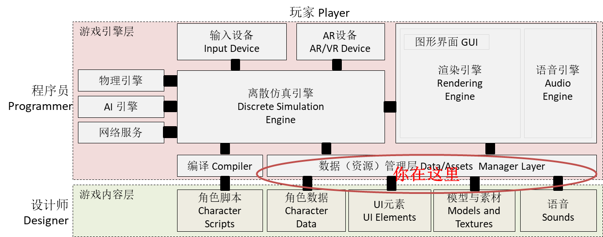

# 第十一章、数据驱动的设计
{:.no_toc}

> **_Data_**  
>   
> --- 

* 目录
{:toc}

## 课程内容与资源



**本节课内容属于游戏高级技术。如果你不打算从事游戏行业，了解即可**

课程案例：

	从官网商店下载  Asset Store -> Unity Essentials / Sample / Survival Shooter

## 1、课程简介

**课程目标：**

通过数据驱动设计，使得游戏代码更加稳固 (robustness)。我们可以通过改变数据，实现游戏规则、
场景布局、游戏难度的动态改变，而不要程序员的参与。
让游戏发布后，运维与设计师进行"后设计" (Post-Design) 成为可能。 

**课程知识点：**

* 发布一个简单项目
* 程序资源的部署结构
* json 对象序列化与反序列化
* 需要掌握的类：PlayerPrefs、Application、WWW、Resource、AssetsBoundle
* 资源下载与转储
* 数据驱动的设计


## 2、项目发布基础 (publish basic)

准备：

1. 创建一个空项目，例如 app
2. Asset Store -> Unity Essentials / Sample / Survival Shooter 选导入[import]

### 2.1 发布简单项目

任何项目至少有一个场景，当然也会有多个场景。本部分只考虑一个场景的项目
演示案例中，Assets / _CompletedAssets / Scenes / Level 01 5.x 场景。

【操作】发布项目：

1. 菜单 File -> Build Setting ... 或 Build & Run 
2. 选择你需要的平台，选择平台参数，如果没有对应平台的发布包则显示按钮 Open Download Page。非 windows 平台还需要相关 SDK 开发包。
3. 平台选择下面有一个按钮 Player Settings ... 其实是“开发者设置”才对哦
4. 选择场景。因为只有一个，如果多个就要设置 0 号场景作为启动场景
5. 选择 Build And Run， 得到一个 exe 例如 shooter.exe

【结果与观察】

* 产生了哪些目录？文件？
* 运行该游戏，玩一下！


这个游戏怎么制作的？

* 官方教程 http://unity3d.com/cn/learn/tutorials/projects/survival-shooter-project

### 2.2 理解游戏的变更类型

不用说玩家，就是你的游戏测试人员也不会喜欢一天安装一次系统，以适应游戏的变更。
如果是 iOS 平台，一次变更申请，几周就过去了。对于游戏这种竞争、模仿激烈的行业，变更慢几乎是死亡的步调。

**变更** 游戏开发必须考虑的要素之一。 其他还有那些要素？ 
**兼容** - 跨平台 ； **稳定** - 不意外崩溃 ；**节能** - 不做暖手宝 ； **性能** - 没你想的重要！
显然，每个话题都需要一系列的研究。

变更也分为几类（欢迎同学补充）：

1. 可预见的变更

	* 游戏参数调整
	* 游戏逻辑跟新
	* 游戏资源替换

2. 升级变更

	* Bug 补丁
	* 产品升级

变更的种类不同，它发生的阶段、频度、升级技术手段也不一样。
对于纯脚本语言（解释性语言）如 ，多采用局部更新策略。
对于 Unity 这样编译型的，都编译成 exe 了，如何办？

**web 3d 技术推荐**

* three.js http://threejs.org/
* Web GL (Open GL for web) https://www.khronos.org/webgl/
* Get Start http://get.webgl.org/


### 2.3 Unity资源部署结构

先简单介绍 Unity 资源部署结构，你必须理解才能分解 Unity 项目，实现程序动态更新方法。

[#f1]_ 是比较靠谱的中文总结。**尽管已经历按官网文档验证，正确性与兼容性有待实验验证**

导致各种问题主要受 平台虚拟机实现机制、安全策略 等的限制。尽管如此，Unity 程序可部署资源的位置可分为四大类：

1. Resources

	* 打包到应用程序，以资源的形式管理，每个资源都有 ID
	* 项目中任意命名 Resources 目录中的文件，都会打包成资源文件
	* 主程序自动加载， 或用 Resource 类加载
	* 无法更改，除非重新安装

2. AssetBundle [#f4]_

	* 联网资源
	* 压缩格式的资源的集合，可以按应用程序需要从游戏资源节点下载
	* 用 WWW 类从中心下载， 用 AssetBundle 加载

3. StreamingAssets [#f3]_

	* 项目文件中命名 StreamingAssets 根目录下的内容
	* 可以是任意内容，例如，一个电影的原始文件 xx.mov, 不同平台对视屏支持不一样，详见 [#f2]_ 
	* 部署时，直接复制到制定平台特定目录（安卓平台打包成 jar）。不编译，不做任何处理
	* 不同平台目录不一样
	* 建议用 WWW 类访问，否则你需要使用支持 jar (zip) 读写的类。(jar? 写也不方便) 

4. PersistentDataPath

	* 程序存放数据的目录
	* 用以用 WWW 类读，也可以用 FileStream 读写

【操作】资源部署：

1. 在项目 Assets 下建立文件夹 StreamingAssets ，然后放几个你知道的文件
2. 在项目任意位置建立文件夹 Resources ，拷贝一个文件，并记录文件大小
3. 重新发布项目

【结果与观察】

1. xx_Data 中是否多了 StreamingAssets 文件夹
2. xx_Data/Resouces 是否多了文件


## 3、 序列化技术

**序列化** 就是把一个内存对象变为与地址无关的可传输的数据格式，通常是文本格式；反序列化反之。

一般情况下，对象序列化指把一个对象用 XML，YAML 或 json 文本表示。
尽管 Unity 场景文件是 yaml 格式的，但并没有提供运行时内置支持。

Unity 已内置 json 支持。 

## 3.1 [Serialization] 标签

```cs
	[Serializable]
	public class MyClass
	{
	    public int level;
	    public float timeElapsed;
	    public string playerName;
	}
```

【操作】

1、 在一个 monoBehavior 中，添加上述类，[Serializable]标签，说明这个类可以被序列化。
2、 在 start() 中实例化一个该类的对象

```cs
	MyClass myObject = new MyClass();
	myObject.level = 1;
	myObject.timeElapsed = 47.5f;
	myObject.playerName = "Dr Charles Francis";
```

## 3.2 JsonUtility 类

该类非常简单，只有三个静态方法：


| 方法 | 说明 |
|:----|:--- |
| FromJson | 用 Json 数据实例化一个新对象 |
| FromJsonOverwrite |  用 Json 数据重新赋值一个对象 |
| ToJson | 将对象变成一个字符串 | 


### 3.3 Json序列化与反序列化

【操作】

3、 在start() 输入

```cs
	string json = JsonUtility.ToJson(myObject);
    print(json);
```

输出

```cs
	{"level":1,"timeElapsed":47.5,"playerName":"Dr Charles Francis"}
```

4、 继续输入

```cs
	myObject1 = JsonUtility.FromJson<MyClass>(json);
```

完成反序列化，生成了新的对象实例。


### 3。4 实战程序

实战中，程序一般如下编写

```cs
	public class PlayerState : MonoBehaviour
	{
		public string playerName;
		public int lives;
		public float health;

		public static PlayerState CreateFromJSON(string jsonString)
		{
			return JsonUtility.FromJson<PlayerInfo>(jsonString);
		}

		// Given JSON input:
		// {"name":"Dr Charles","lives":3,"health":0.8}
		// this example will return a PlayerInfo object with
		// playerName == "Dr Charles", lives == 3, and health == 0.8f.
		// 这里有 BUG, 因为 MonoBehaviour 没有公共的构造方法

		public void Load(string savedData)
		{
			return JsonUtility.FromJsonOverwrite(savedData, this);
		}

		// Given JSON input:
		// {"lives":3, "health":0.8}
		// the Load function will change the object on which it is called such that
		// lives == 3 and health == 0.8
		// the 'playerName' field will be left unchanged

		public string SaveToString()
		{
			return JsonUtility.ToJson(this);
		}

		// Given:
		// playerName = "Dr Charles"
		// lives = 3
		// health = 0.8f
		// SaveToString returns:
		// {"playerName":"Dr Charles","lives":3,"health":0.8}
	}

```

## 4、应用管理相关的类

### 4.1 PlayerPrefs 类

描述：保存游戏 session 之间的数据。

作用：就是一个字典，它场景切换时可保存一些数据。在游戏结束时，会自动调用 Save！

数据保存位置：开发者不需要关心。也不要调用 Save， 它可能会导致游戏停顿

函数：http://docs.unity3d.com/ScriptReference/PlayerPrefs.html

实战：定义一个单实例类管理这个字典一定没有错。字典的每个 Key 定义成常量或只读字符串。
建议保存玩家的生命值、收益等。对于用户历史战绩这样的数据，不宜放在这里。

判断准则：现场恢复相关的数据！

### 4.2 Application 类

描述：控制运行时环境，实现场景切换。包括一些静态变量和方法。

通常需要关注的静态变量

| 方法 | 说明 |
|:----|:--- |
| backgroundLoadingPriority | 控制每帧处理中，异步加载资源耗用的总时间 |
| platform | 平台 |
| productName | 产品名称 |
| version | 产品版本 |
| dataPath | app 的位置，不同平台不一样，在安卓平台也打包到 apk ，不能写 |
| persistentDataPath | 用户数据存储位置 |
| streamingAssetsPath | 用户后加载的资源位置，在安卓平台也打包到 apk ，不能写 |
| temporaryCachePath | 通常用于存储 WWW 下载时的临时文件 |

场景管理相关静态方法，5.0 以后的手册就没说明了，但可以用。

| 方法 | 说明 |
|:----|:--- |
| LoadLevel("场景名") | 加载场景，加载完清空当前场景所有对象。LoadLevel(0) 表示加载启动场景 |
| LoadLevelAsync("场景名") | 异步加载，加载完清空当前场景所有对象 |
| LoadLevelAdditive("场景名") | 添加场景 |
| LoadLevelAdditiveAsync("场景名") | 异步添加 |

当然场景管理也可以使用 UnityEngine.SceneManagement.SceneManager 类


### 4.3 读文件 WWW 类

描述：WWW 是一个万能读文件的类。支持 http://, https:// , file:// 和 jar:file://  等协议。

典型工作方法是后台线程

```cs
	public class ExampleClass : MonoBehaviour {
	    public string url = "http://images.earthcam.com/ec_metros/ourcams/fridays.jpg";
	    IEnumerator Start() {
	        WWW www = new WWW(url);
	        yield return www;
	        Renderer renderer = GetComponent<Renderer>();
	        renderer.material.mainTexture = www.texture;
	    }
	}
```

WWW 类会支持多种数据操作，例如： bytes 支持2进制数据，text 支持文本等等。
具体见 http://docs.unity3d.com/ScriptReference/WWW.html

需要关注的静态函数：

EscapeURL ：让你的 URL 可以正确处理中文、空格等字符  
LoadFromCacheOrDownload ： 下载  AssetBundle 使用指定版本。如果已下载到 cache 就不下载。  

以下是用 Cache 方式下载一个 AssetBundle

```cs
	public class LoadFromCacheOrDownloadExample : MonoBehaviour
	{
		IEnumerator Start ()
		{
			var www = WWW.LoadFromCacheOrDownload("http://myserver.com/myassetBundle.unity3d", 5);
			yield return www;
			if(!string.IsNullOrEmpty(www.error))
			{
				Debug.Log(www.error);
				yield return;
			}
			var myLoadedAssetBundle = www.assetBundle;

			var asset = myLoadedAssetBundle.mainAsset;
		}
	}
```

### 4.4 实现资源的转储

每次从互联网获取资源是不可取的，所以需要转储到 Application.temporaryCachePath 位置，
或 Application.PersistentDataPath 位置。

代码

```cs
	public class ExampleClass : MonoBehaviour {

	    public string url = "http://images.earthcam.com/ec_metros/ourcams/fridays.jpg";
	    public static readonly string cachedFile = Application.temporaryCachePath + "/fridays.jpg"; 

	    IEnumerator Start() {
	    	// ToDo：这里没有检查下载的代码
	        
	        WWW download = new WWW(url);
	        yield return download;
 
			System.IO.FileStream cache = new System.IO.FileStream(cachedFile, System.IO.FileMode.Create);
			cache.Write(download.bytes, 0, download.bytes.Length);
			cache.Close();
			// iOS 平台阻止上传云平台
			iOS.Device.SetNoBackupFlag(cachedAssetBundle);
	    }
	}
```

【操作】

1. 定义一个资源。 使用 file://协议，例如: file:///D:/pml/courses/se347-游戏/build/html/11_publish_serialization.html
2. 使用代码完成下载

【结果与思考】

1. 为什么要下载？
2. 如何实现 CacheOrDownload 呢？

