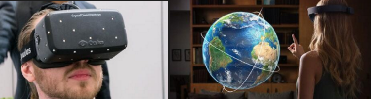
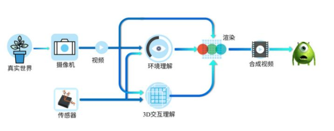

# 第 12 章 AR/MR 技术
{:.no_toc}
 
> **_路漫漫其修远兮，吾将上下而求索_**  
>   
> --- 屈原 《离骚》

* 目录
{:toc}

## 1、AR/MR 概述

什么是“真实”？你如何定义“真实”，如果你说的是你看到的、摸到的、感受到的一切，那么“真实”不过是大脑给你的电子信号而已。如果你感兴趣虚拟现实这个话题，建议阅读“[沉浸式虚拟现实中，什么是虚拟什么是现实？](http://tech.sina.com.cn/zl/post/detail/it/2016-03-31/pid_8505592.htm)”

### 1.1 什么是 AR/MR？

什么是 AR？让我们先看一个简单应用：

这是华为某手机发布会的现场，当用户拍到一个心形手势，对应位置会出现一个几个（虚拟的）心组成的动画。你喜欢这个效果吗？

**[增强现实](https://en.wikipedia.org/wiki/Augmented_reality)**（Argumented Reality (AR)）是一种将真实世界信息和虚拟世界信息“无缝”集成的新技术，是把原本在现实世界的一定时间空间范围内很难体验到的实体信息(视觉信息,声音,味道,触觉等),通过电脑等科学技术，模拟仿真后再叠加，将虚拟的信息应用到真实世界，被人类感官所感知，从而达到超越现实的感官体验。

**[混合现实](https://en.wikipedia.org/wiki/Mixed_reality)**(Mixed reality (MR)) 有时被称为超现实（hybrid reality），是真实和虚拟世界的合并，产生新的可视化环境，物理和数字对象实时共存且在其中交互。混合现实不仅发生在物理世界或虚拟世界中，而是融合了现实和虚拟现实，通过身临其境的技术包含增强现实和增强虚拟。

**VR，AR，MR的区别**

* VR，玩家可以通过各种交互技术进入虚拟世界，与虚拟世界事物交互。
* AR，把虚拟世界的物体叠加在现实世界的影像或视频中的物体上，玩家在现实的背景上与虚拟世界物体互动。
* MR，将现实世界事物实时在虚拟世界中重构，这些现实物体、虚拟物体与玩家三者互动。

    

上图中，左边是设备（Oculus），VR 要造一个世界给用户，它是头罩。右边设备（HoloLens），AR 是在现有世界中叠加虚拟事物，它是一个眼镜或者是（摄像头+显示器）。VR 和 AR  有着本质的区别：**VR是创造现实；AR是超越现实**。 实际应用中，我们对 AR 和 MR 技术通常是不区分，简称 AR/MR 技术。

### 1.2 AR技术

于其说介绍 AR 技术，不如说 **AR 坑有多深**。了解了“坑”才能知道世界之大，激励我们努力学习，不断攀登科学高峰。

如果你是技术控，请先阅读科普文章 _[凌海滨 从计算机视觉的角度漫谈增强现实](https://zhuanlan.zhihu.com/p/21450518)_

**1、增强现实技术流程**

按照Ronald Azuma在1997年的总结，增强现实系统一般具有三个主要特征：虚实结合，实时交互，和三维配准（又称注册、匹配或对准）。近二十年过去了，AR已经有了长足的发展，系统实现的重心和难点也随之变化，但是这三个要素基本上还是AR系统中不可或缺的。

上图描绘了一个典型的AR系统的概念流程。从真实世界出发，经过数字成像，然后系统通过影像数据和传感器数据一起对三维世界进行感知理解，同时得到对三维交互的理解。3D交互理解的目的是告知系统要“增强”的内容。

在AR的技术流程中，中间的对于环境和交互的精准理解就是目前的瓶颈了。上图中间的基于多模态（简单说就是影像+传感器）的环境和交互理解，是两个充满了各种或明或暗的坑的领域，足以让很多假的猛士知难而退。

**2、环境和交互理解的难点和机会**

那么，真的猛士将会直面什么样惨淡和淋漓的坑群呢？下面我们来共同赏析几个常见坑型：

1、环境坑：据说人的脑细胞里面大多数都是用来处理和理解双眼所获取的视觉信息的，很多我们惊鸿一瞥就能理解和感知的东西得益于我们强大的脑处理能力。各种环境变化对视觉信息的影响我们不但能轻松应对，有时还能加以利用。比如我们的认知能力对光照明暗的变化相当的鲁棒；比如我们可以通过阴影来反推三维关系。而这些对于计算机（确切些说是计算机视觉算法）来说都是不折不扣的坑或者大坑。总的来说，成像环境的变化常常计算机视觉算法以及AR带来很大的挑战，所以我把相关的坑统称环境坑。

2、学术坑：对于环境和交互的理解重建基本上属于计算机视觉的范畴，计算机视觉是一个有着半个世纪积累的领域，和AR相关的学术成果可以成吨来计。夸张一点的说，每篇都有坑，区别只在大小深浅明暗。从实用的解决方案的角度来看学术论文，尤其是新的论文，一定要小心其中的设定和有些话外的信息，多想一下诸如该算法是否对光照敏感，是否可能在手机端达到实时，等等。简单的建议是：对于一篇计算机视觉的论文，未有相关经验的观众请在有相关训练的成熟观众陪伴下谨慎观看。

3、上帝坑：上帝是谁？当然就是用户了。上帝的坑当然得长得有创意，常常激起开发者灵光一动恍然大哭的欲望。比如上帝说，要能判别视频中人的性别，80%的准确度，100万。哇，你是不是感动的热泪盈眶（仁慈的上帝啊），用各种时髦的方法轻松超额10%搞定。可是，交货的时候上帝说你这个系统咋认不出我们家小baby的性别啊！Oh my God，你是不是又激动得想哭了。和环境坑比较像，CV的算法很多时候是需要有假设的，强烈的假设。那怎么办呢？上帝总是正确的，所以唯一的办法就是尽早教育上帝让他更加正确：需要苦口婆心地尽早和用户科普以及尽量明确定义需求，防范坑于未成。还不行的话咋办？上帝啊，请再加点工钱吧。

其实还有其他类型的坑，比如开源代码坑，这里就不详述了。那么，这么一个充满忧患的领域，为什么又会有那么多追随呢？最重要的原因就是巨大的应用前景和钱景了。往小了说，很多具体的应用领域（比如游戏）都已经成功地引入了AR的元素；往大了说，AR的终极形态可能从根本上改变当前的非自然人机交互模式（请脑补微软Win95的成功和现在的HoloLens）。上面说的那些坑，在很多是应用上，是可能避免的或者可能填得不那么深的。**总的来说，一个好的AR应用往往是需要算法工程实现、产品设计、内容制作等方面的深度结合。**

**3、AR入行与修行**

国家每年有大量科技经费投入支持 AR 核心设备，以及在教育、医疗、文化娱乐、交通等领域的应用，虽然各种 AR SDK 不断出现并完善，VR/AR依然是火热的技术与应用的创新领域。尽管现有一些产品，已能满足做一些有趣的事情，但要成为产品就需要大量高端人才参与研发。

这里就 AR 技术给出相关课程:

| 任务 | 内容/难点 | 课程 |
| - | - | - |
| 识别 | 从场景中识别制定的事物 / 光照、遮挡 | 计算机图像处理 |
| 跟踪 | 跟踪视频中的物体，配准 / 运动      | 计算机视觉 |
| 3D 度量 | 获取像素点深度信息  | &nbsp;&nbsp; |  
| 3D 建模 | 在识别的基础上，建立对应的模型 / 缺失补全 | 计算机图形学等 |
| 语义理解 | 识别物体行为的语义 / 语境      | 模式识别/机器学习 |

* 其他相关课程：《人工智能》、《数据挖掘》  
* 基础课程：《线性代数》《数值分析》《信号处理》  

（请编程大神自己对照，然后补脑。付出越大，机遇越多！）

### 1.3 AR与游戏创新

早在1990年，增强现实（AR）技术就已经被提出，直到2016年任天堂发布的游戏《精灵宝可梦GO》，让AR技术真正的进入到数百万智能手机用户的生活中。

AR 三大顶级企业：**苹果**、**谷歌**和**微软**。但这不是巨头垄断的行业，有无数创新企业！

例如：苹果公司，2017年5月份发布了其增强现实（AR）的开发工具ARKit,并在AR技术领域申请了多项专利。不仅如此，苹果还大量收购其他有增强现实（AR）技术的公司。例如 Iphone X 的 3D 摄像头，智能无线耳机等等

 todo

至今，除了《精灵宝可梦GO》，被人们广泛接受的 AR 游戏并不多。原因是多方面，技术、经济性、可玩性。。。知乎上的讨论[AR和VR适合哪些类型的游戏？](https://www.zhihu.com/question/65792332)，需要进一步总结。

**1、真实地图寻宝、冒险、对战类**

**2、符号、动作识别类**

**3、虚拟按钮休闲小游戏类**

## 2、AR SDK 与应用

## 3、作业与练习

1、 图片识别与建模

2、 虚拟按键小游戏

3、开发城市定向越野运动 MR 游戏【可选】

* 游戏要求：
    - 准备：
        - 选择为每个用户准备一套拼图图片（含干扰图片），按一定策略发布到目标位置（随机位置偏移）
        - 越野地图一张
    - 开始游戏：
        - 玩家在起点，用手机在起点附近，捕捉图片并显示第二个目标
        - 然后每到一个目标位置，捕捉与前面捕捉的图片可拼接的图片，拼接成功，则显示下一个目标
    - 游戏结束：
        - 玩家到达终点的时间最短者胜

