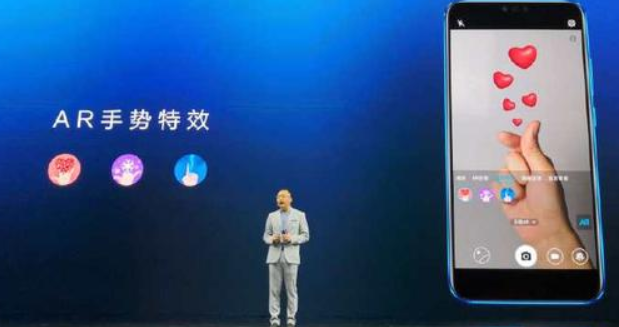

# 第 12 章 AR/MR 技术
{:.no_toc}

> **_真实不过是大脑给你的电子信号而已_**  
>   
> --- 电影《黑客帝国》 主角墨菲斯

* 目录
{:toc}

## 1、AR/MR 概述

什么是“真实”？你如何定义“真实”，如果你说的是你看到的、摸到的、感受到的一切，那么“真实”不过是大脑给你的电子信号而已。如果你感兴趣虚拟现实这个话题，建议阅读“[沉浸式虚拟现实中，什么是虚拟什么是现实？](http://tech.sina.com.cn/zl/post/detail/it/2016-03-31/pid_8505592.htm)”

### 1.1 什么是 AR/MR？

什么是 AR？网上有无数定义，让我们先看一个简单应用：

这是华为某手机发布会的现场，当用户拍到一个心形手势，对应位置会出现一个几个（虚拟的）心组成的动画。你喜欢这个效果吗？

### 1.2 AR/MR 与游戏

### 1.3 AR 技术与学术

## 作业与练习

1、 图片识别与建模

2、 虚拟按键小游戏

3、开发定向越野运动 MR 游戏【可选】

* 游戏要求：
    - 准备：
        - 选择为每个用户准备一套拼图图片（含干扰图片），按一定策略发布到目标位置（随机位置偏移）
        - 越野地图一张
    - 开始游戏：
        - 玩家在起点，用手机在起点附近，捕捉图片并显示第二个目标
        - 然后每到一个目标位置，捕捉与前面捕捉的图片可拼接的图片，拼接成功，则显示下一个目标
    - 游戏结束：
        - 玩家到达终点的时间最短者胜

