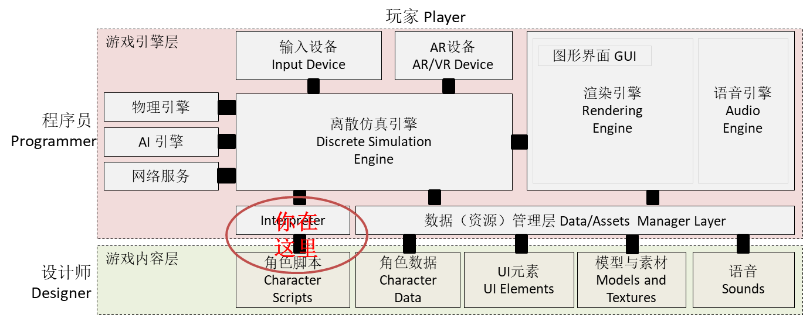

# 第十四章、集成脚本引擎
{:.no_toc}

> **_Don't let the noise of other's opinions drown out your own inner voice. And most important, have the courage to follow your heart and intuition._**  
>   
> --- Steve Jobs, Stanford Report, June 14, 2005

* 目录
{:toc}

## 课程内容与资源



**1、资源下载**

 [sLua](https://github.com/pangweiwei/slua)

**本节课内容属于游戏高级技术。如果你不打算从事游戏行业，了解即可**

_预计时间：6 * 45 min_

## 1、脚本引擎技术简介

### 1.1 什么是脚本？

在计算机领域，脚本又称动态脚本（Dynamic Scprits），一般特指解释执行语言，如 JavaScript, Python，perl，shell 等，脚本语言缩短了传统的编写-编译-链接-运行（edit-compile-link-run）过程，支持交互式编程，特别合适批任务处理、交互式命令控制或数据处理、小规模程序快速编程。

脚本语言通常都有简单、易学、易用的特性，是为非计算机专业人士定制 **领域特定语言（Domain Specific Languages）** 的利器。例如，著名的 Matlab、R 就是科学计算领域专用语言，它获得了计算领域研究人员、工程师的广泛认可。

### 1.2 游戏引擎为什么要嵌入 Lua？

简单说是 Lua 是一种通用的脚本语言，语法相对简单。 它有一个 c 语言编写的小巧的解释程序，这个程序很容易嵌入宿主（HOST）应用，并能够与宿主程序 **互操作（interoperation）**。所谓互操作，即宿主程序能调用 Lua 写的函数，反之 Lua 程序中也能调用宿主的函数。例如，微信小程序，就是在微信应用中嵌入一个 ECMAScript 的引擎，如 Google V8 或 JavaScriptCore （浏览器内核），然后在微信中开发一组共微信小程序调用的函数访问手机设备与微信内部资源。微信小程序就是脚本，微信应用就是 HOST。因此，微信小程序就是扩展微信应用的定制语言。

Lua，一种简单、高效的语言，一直是各类游戏引擎钟爱的嵌入语言，在移动设备上也有不错的表现，如 cocos2d 官方脚本集成就是 Lua。例如，与 Python 核心代码相比，Python 是 17 万行代码，而 Lua 是 2.4 万行。当然，小也是有代价的，就是没有丰富的语言特性，强大的基础函数库。通过嵌入 Lua ，游戏应用就可以被方便的扩展新功能。

**游戏嵌入脚本的作用**

* 方便角色行为逻辑设计。数据代码分离不是万能的，在游戏智能中，Agent 的规则推理机、决策树等方案不是普通设计师能理解的，使用简单的编程脚本，非计算机专业业务人员也能做一些简单游戏编程工作
* 开发一类游戏通用的引擎。开发者专注技术开发，将部分不通用、不太影响性能的游戏逻辑交给脚本实现，可大大提升同类游戏的开发效率（主程就解放了！）
* **热更新（HotFix）**。在线 **静默** 更新游戏逻辑

热更新，就是在线升级游戏，特别是手机游戏。受 IOS 等手机操作系统安全管理的制约，一个应用是没有权利修改任何可执行的代码权利，应用只可读写该应用下数据目录。这样，应用程序的更新就必须经过“App-store发布，用户下载，安装”这个流程，其中App-store发布审批一个环节就需要3-5天。脚本就是一个文本文件，如果问题代码在脚本中，直接从网上下载新版本，客户根本感受不到升级的过程。因此，“热更新”成为手机游戏的 **炙手可热** 的特征。 

### 1.3 Lua 脚本的能力与缺陷

在 Unity 中集成 Lua 引擎，一些 Lua 版本提供了完整游戏的开发能力，即一个游戏完全有 Lua 语言开发，如 SLua。

既然这么好，为什么不直接用 Lua 开发游戏？

* 慢。 假设 c 语言完成一个任务要 1 秒， C#，Java 等则需要 3 到 5 秒， Lua 等脚本语言再慢 10 倍 30 - 50 秒。 游戏是讲究 FPS 的啊！
* 调试难。 无类型语言很爽，但没有强大的静态语法检查，编译不能给你太多帮助。 大程序直接让你从内心崩溃！

集成 lua 的一些游戏产品：

* 大话西游2
* 魔兽世界Wow
* 剑侠情缘3

因此学习脚本引擎集成技术非常重要！

* 在知乎上搜 “游戏 Lua” 会有更多小伙伴讲授他们的经验和感受！  
* 如果你从此感兴趣于语言设计的秘密，请移步到《编译原理》课程。 Lua 将是该课程最佳实践教材！

## 2、Lua 入门

如果你有 c 语言和 javascript 基础（自我检查，它们的函数闭包 [closures](https://en.wikipedia.org/wiki/Closure_(computer_programming)) 怎么用？）, 建议你忽略本部分内容， 到维基百科了解 lua 语法即可。

### 2.1 lua world！

 操作 14-01，Lua入门练习：

进入 Lua 语言 [在线执行器](http://www.lua.org/demo.html)

输入 `print ("hello world!")` 然后按 run 按钮

### 2.2 lua 语言初步

我们已假设你熟悉 C/C++ 或 javascript 语言，因而在线 [参考手册](https://www.lua.org/manual/5.1/) 比较合适你阅读。

在手册第二章，你需要阅读：

* 语法习惯（Lexical Conventions）：包括 关键词、操作符、字串与数字的表示
* 值与类型（Values and Types）
    - lua 值是第一类成员（_first-class values_），它们可以存到变量中，作为函数参数。
    - 有 8 种类型的值：_nil, boolean, number, string, function, userdata, thread, table_

**值是第一类成员** 是动态类型脚本语言的核心概念，等你理解了它的含义，脚本语言就过关了！以 function 类型值为例，它看作第一类成员，所以可以作为变量值、作为函数参数、参与运算等等。

* 面向对象语言，如java，核心 _first-class objects_
* 函数式语言包括 go 等核心 _first-class functions_

以下一些代码能帮你理解一些基本的 Lua 语法

**1、赋值**

```lua
a = {}                 -- construct a global table a
i = 3
i, a[i] = i+1, 20
print (i, a[i], a[3])
```

结果是 `4       nil	20`。因为，左边先解释得到地址，后计算值，因此不会影响 `a[4]` 

**2、函数定义**

```lua
function factorial(n)
  local x = 1
  for i = 2, n do
    x = x * i
  end
  return x
end

print(factorial(3)) 
```

这段代码展示了它的函数定义、局部变量定义、控制语句等。具体有哪些控制结构，参见手册！

* 建议课后继续阅读 [lua 菜鸟教程](http://www.runoob.com/lua/lua-tutorial.html)

## 3、Unity 插件技术与 Lua 插件安装

插件是扩展 Unity 能力的利器。AR，或你编写的优化算法都必须通过插件的方式供 Unity 使用。

### 3.1 Unity 插件（plugin）

Unity 支持两种插件，[官网文档](https://docs.unity3d.com/Manual/Plugins.html)：

* Managed plugin: 是使用 Visual Studio 等工具创建的托管 .NET 程序集。它们仅包含 .NET 代码，这意味着它们无法访问 .NET 库不支持的任何功能。但是，Unity使用的标准 .NET 工具可以访问托管代码来编译脚本。因此，托管插件代码和 Unity 脚本代码之间的使用差异很小，除了插件是在 Unity 外部编译，且可能没有源代码。
* Native: 是特定机器硬件与操作系统平台的本机代码库。他们可以访问操作系统调用和第三方代码库等功能，否则 Unity 将无法使用这些功能。但是，Unity 的工具无法以托管库的方式访问这些库。常指 C/C++ 类 C 语言编译的动态库（.dll, .so）

### 3.2 Lua 动态库编译

如果你有 苹果 Mac 或 Linux PC， 可参照 SLua 的 make。 强力建议你自己 make 各个平台的库。

### 3.3 Lua 插件安装 

 操作 14-02，插件部署练习：

SLua 已编译的版本是 Lua 5.1.5，

1、下载 SLua 解压。主要目的是免去各平台下编译的烦恼，以及一些可供学习的原代码  
2、创建一个新项目 lua  
3、在 Assets 下创建目录 `Plugins` **注意 Plugins 大小写**！  

注意：各平台插件原生代码默认目录 [Plugin Inspector](https://docs.unity3d.com/Manual/PluginInspector.html) Setting!

4、加载平台本地动态库

将编译好的动态库（dll,so），从 SLua 对应目录拖入 Plugins。例如开发平台 64 位 window，则拖入 x64。

未来，你编译哪个平台，就加载哪个平台库。

5、加载 lua 与 c# 的接口库

在 Plugins 目录下建立目录 managed；

从 Slua -> Plugins -> Slua_Managed 中拖 LuaDLL.cs 和 LuaDLLWrapper.cs 进入 managed。导入 c 语言库，让 Unity 访问。

6、OK！ 运行，不应该出现任何错误。

**不出错非常重要**！不闪退就好啊。下面我们进一步验证安装。

## 4、Lua 虚拟机 与 Lua 栈

### 4.1 Lua 应用程序接口

Lua 既可以作为独立应用，但多数情况下会嵌入其他应用，如游戏、Nginx 或 其他应用，方便动态扩展业务功能，提升应用的灵活性。

[Lua 手册](http://www.lua.org/manual/5.3/) ！ 的最后给出了 lua 语言标准库 和 与应用程序接口 C API。

* 语言标准库包括： _basic, math, string, io, coroutine, os, debug, package_
* C API 包括： C API, auxiliary library
* 环境变量与常数

### 4.2 Lua 虚拟机

**Lua 虚拟机** 即一个 Lua 脚本程序的执行环境 或 沙箱。它由 `lua_newstate` 创建。

每个线程 **只能有一个 Lua 虚拟机**。因此，仅有且只有第一个 Lua 虚拟机在 **程序主线程** 中，可以访问 Unity 的游戏对象。

  **Unity 不支持除主线程以外的线程访问游戏对象**，或与渲染相关的任何对象。当然，值类型、JsonUtility 通常是线程安全的

 不同虚拟机之间是相互隔离的。因此，一个游戏一般仅需要一个 lua 虚拟机实例。

### 4.2 Lua 栈

每个虚拟机都有一个与应用程序交换数据的栈。这个栈默认有 **20 个元素**。应用程序必须保证栈的安全、正确使用。

Lua 每个 api 都有一个标志，[-o, +p, x] 表示 [ 出栈参数个数，入栈结果个数，是否返回异常] 。例如：:

```
lua_getglobal         [-0, +1, e]

int lua_getglobal (lua_State *L, const char *name);
Pushes onto the stack the value of the global name. Returns the type of that value
```

分别表示调用该 API ，没有元素出栈，有一个结果元素入栈，会有异常。

```
lua_tointeger          [-0, +0, –]

lua_Integer lua_tointeger (lua_State *L, int index);
Equivalent to lua_tointegerx with isnum equal to NULL.
```

api 中 index 参数表示数据在栈中位置，index 为负数，如 -1 表示栈顶，-2，-3 类推；  
index 为正数，表示位置， 如 1 是栈底，2，3 类推；  
lua_gettop 返回当前栈的高度；0 表示 空栈。

## 5、 应用（host）与 Lua 虚拟机互操作入门  

这部分讲述如何利用虚拟机的栈，实现 应用程序 与 lua 之间数据交换和函数调用。

### 5.1 访问 Lua 虚拟机的全局变量

 操作 14-03，读写 lua 变量练习：

```cs
using SLua;
using System;

public class my : MonoBehaviour {

        // Use this for initialization
        void Start () {
                IntPtr _L = LuaDLL.luaL_newstate ();    // create a lua VM
                LuaDLL.luaL_openlibs(_L);               // open lua libs

                LuaDLL.lua_dostring (_L,"num = 3");     // Excute a simple lua Script
                LuaDLL.lua_getglobal (_L, "num");       // push the lua var named ‘num’ on the stack
                int i = LuaDLL.lua_tointeger (_L, -1);  // read return value on the top of stack
                LuaDLL.lua_pop(_L,1) ;                  // pop, your must maintain the stack carefully!!!
                Debug.logger.Log(i);
                //this.transform.position = new Vector3 (0, i, 0);

                LuaDLL.lua_close (_L);
        }
}
```

这个程序非常简单，第一步创建虚拟机；然后执行简单赋值，然后把变量结果通过栈传给应用；关闭虚拟机。

 错误操作特容易产生闪退，请及时保存程序！！

  解释以下代码？栈有错误吗？

```cs
LuaDLL.lua_pushinteger (_L, 2);
LuaDLL.lua_setglobal (_L, "a");
LuaDLL.lua_pushinteger (_L, 3);
LuaDLL.lua_setglobal (_L, "b");
LuaDLL.lua_dostring (_L,"c = a+b");
LuaDLL.lua_getglobal (_L, "c");
Debug.logger.Log( LuaDLL.lua_tointeger (_L, -1) );
LuaDLL.lua_pop(_L,1) ;
```

`lua_setglobal` ，请翻译[手册描述](http://www.lua.org/manual/5.1/manual.html#lua_setglobal)，并解释 API 栈行为！

### 5.2 相互调用函数

 操作 14-04，相互调用函数练习：

该段代码第一部分是 HOST 调用 Luau 虚拟机中的 `foo (x,y)`，然后，Lua 程序调用 HOST 的 `dofile("luafile.lua")` 函数

```cs
using UnityEngine;
using System.Collections;

using System;
using UnityEngine.UI;
using SLua;    //using LuaInterface;   // lua DLL C# 封装

public class Lua_func : MonoBehaviour {

        public GameObject text;

        // Use this for initialization
        void Start () {
                Text txt = text.GetComponent<Text> ();

                // Create Lua State
                IntPtr _L = LuaDLL.luaL_newstate ();
                LuaDLL.luaL_openlibs(_L);

                // define lua fuction
                String func = @"
function foo (x,y)
        return x+y
end
                ";
                LuaDLL.lua_dostring (_L,func);
                // call lua fuction
                LuaDLL.lua_getglobal (_L, "foo");               // push the lua function var on the stack
                LuaDLL.lua_pushnumber (_L, 6);                  // push paramters on the stack
                LuaDLL.lua_pushnumber (_L, 3);
                // http://www.lua.org/manual/5.1/manual.html#lua_call
                LuaDLL.lua_call (_L, 2, 1);                     //call foo with two parameter on Stack. [-(nargs+1), +nresults, e]
                // get result
                int i = LuaDLL.lua_tointeger (_L, -1);
                LuaDLL.lua_pop(_L,1) ;
                txt.text = i.ToString();

                // define cFunction in Lua machine，and then call it 
                LuaDLL.lua_pushcfunction (_L, dofile);  // set LuaCSFunction
                LuaDLL.lua_setglobal (_L, "dofile");    // assign to "dofile"
                LuaDLL.lua_dostring (_L, "dofile(\"tail.lua\")");       //call dofile(_L) in c#


                LuaDLL.lua_close (_L);
        }

        // lua dofile("luafile.lua") callback handler, must static
        [MonoPInvokeCallbackAttribute(typeof(LuaCSFunction))]
        internal static int dofile(IntPtr L)
        {
                int n = LuaDLL.lua_gettop (L);          // number of arguments
                Debug.logger.Log (n);
                string fileName = LuaDLL.lua_tostring(L, 1); // index +/positive
                Debug.logger.Log (fileName);
                return 0;                                                       // number of results
        }
}
```

* 创建 Lua_func.cs 程序
* 在场景中放置 text UI 游戏对象
* 挂入代码，将 text 对象拖入插槽
* run！

应用程序调用 Lua 定义的函数非常简单，将函数 ***参数的值** 压入栈底，压入参数，然后 lua_call, 然后从栈顶取回 **返回值** 即可！

从 Lua 调用 c# 的函数就不那么简单了。

* 设置函数变量
* 调用 C 函数

[Lua 官方手册](http://www.lua.org/manual/5.1/manual.html#lua_CFunction) 给出了 CFunction 的通讯协议

```c
typedef int (*lua_CFunction) (lua_State *L);
```

协议规定，Lua 函数参数按左到右，正方向压入栈。即 C 语言从 栈的 1，2，3 ... 位置读参数，API lua_gettop(L) 是参数的个数。 返回结果给 Lua 按接收顺序压入堆栈，返回值是参数的个数。

  以下是 C 的函数，请翻译成 C# 并调用该函数

```c
static int foo (lua_State *L) {
  int n = lua_gettop(L);    /* number of arguments */
  lua_Number sum = 0;
        int i;
  for (i = 1; i <= n; i++) {
    if (!lua_isnumber(L, i)) {
      lua_pushstring(L, "incorrect argument");
      lua_error(L);
    }
   sum += lua_tonumber(L, i);
  }
  lua_pushnumber(L, sum/n);        /* first result */
  lua_pushnumber(L, sum);         /* second result */
  return 2;                   /* number of results */
}
```

* 如果 Lua 回调函数中存在异步加载、或继续调用 Lua 虚拟机？ 晕了，难以想象！
* 为什么必须使用 MonoPInvokeCallbackAttribute 呢？自己搜索！

### 5.3 复杂数据的交换

简单数据交换很方便，但是 C# 有 命名空间、类、结构、数字、字典等。Lua 有 函数 与万能的 table，它们是如何建立对应关系的呢？

数据交换，必须了解 lua_[push\|to\|is][*] 系列 API 函数。 例如： lua_pushnumber 将 c 语言 double 值压入栈成为 lua 认识的 number。 Lua 常见类型值：boolean，number，string，nil, none, cfunction, function, ... 都可以处理。

**1、Lua 表**

如果你熟悉 javascript , lua 表和 javascript 表概念是没有区别的。javascript 每个实例有一个根表 `window` 而 Lua 是 `_G` 罢了。

例如: 在 javascript 中 `window.x = 3`、`x = 3` 与 `window["x"]=3` 都是同样语义。

表就是一个 key-value 对集合的数据结构（字典）。表用 key 索引访问，索引一般是字符串或整数。虽然可以号称任意对象做索引，似乎也没有太多的必要。

 操作 14-04，复杂数据练习：

```lua
point = { x = 10, y = 20 }   -- Create new table
print(point["x"])            -- Prints 10
print(point.x)               -- Has exactly the same meaning as line above. The easier-to-read
                             --     dot notation is just syntactic sugar.
```

其中，`{...}` 表示表，是一个字典。dot 符号称为“语法糖”，让人类读起来舒服一些，易于理解一些。 

让案例再复杂点:

```lua
point = { x = 10, y = 20 }
point[1] = "string1"
point[2] = "string2"
point[5] = "string5"
point[-1] = nil
point[point] = { x = 30, y = 40 }

print(point[2],point["x"],#point,point[3],point,point[point].x)
```

输出是:

```
string2 10      2       nil     table: 0x15f1f10        30
```

其中，# 操作符是计算数组的大小。 为什么不是 5 是 2 呢 ？ 

在 lua 执行器运行以下代码：

```lua
point = { x = 10, y = 20 }
point[1] = "string1"
point[2] = "string2"
point[5] = "string5"
point[-1] = nil
point[point] = { x = 30, y = 40 }

print(point[2],point["x"],#point,point[3],point,point[point].x)

for i,v in pairs(point) do
    if (type(i) ~= "table") then print ("pair:"..i.." = "..v) end
end

for i,v in ipairs(point) do
    if (type(i) ~= "table") then print ("ipair:"..i.." = "..v) end
end
```

其中 `..` 表示字符 cat 操作；pairs 是内置迭代函数。 pairs 迭代表中所有元素对， ipair 迭代从 1 开始连续的整数 key。 `#` 表示有 1，2 两个元素。 

其实，这样赋值：

```lua
point = {"string1","string2",nil,x = 10, y = 20,nil,"string5" }
```

输出也一样。

在 Lua demo 有一个 dump 全局变量的 lua 案例程序 globals， lua 代码如下：

```lua
-- globals.lua
-- show all global variables

local seen={}

function dump(t,i)
	seen[t]=true
	local s={}
	local n=0
	for k in pairs(t) do
		n=n+1 s[n]=k
	end
	table.sort(s)
	for k,v in ipairs(s) do
		print(i,v)
		v=t[v]
		if type(v)=="table" and not seen[v] then
			dump(v,i.."\t")
		end
	end
end

dump(_G,"")
```

**2、结构（记录）、数组的交换**

Lua 应用程序 API 提供以下函数满足交换的要求。因为栈就只有 20 个单元，不可能把所有数据压上。数据处理过程如下:

假设栈内 index 位置元素是一个表（指针指向表）, 常用 API 有 lua_getglobal, lua_createtable；判断 lua_istable
读表的方法 lua_getTable, 写表就是 lua_settable

下边的代码就是我们读一个 points 数组到 c#

```cs
void Start () {
        // Create Lua State
        IntPtr _L = LuaDLL.luaL_newstate ();
        LuaDLL.luaL_openlibs(_L);

        //read vector[]
        String luaStr = @"_g = { {x=1,y=2},{x=3,y=4},{x=5,y=6} }";
        LuaDLL.lua_dostring (_L, luaStr);
        LuaDLL.lua_getglobal (_L, "_g");
        int index = LuaDLL.lua_gettop (_L);   // index of the table on the stack
        Debug.logger.Log ("index = " + index.ToString ());
        for (int i = 0;  i < 3; i++) {
                LuaDLL.lua_pushinteger (_L, i+1);           // idx of array _g
                LuaDLL.lua_gettable (_L, index);            // get _g[idx] [-1, +1, e] on the top

                int vind = LuaDLL.lua_gettop (_L);          // index of the sub table on the stack
                LuaDLL.lua_pushstring (_L, "x");
                LuaDLL.lua_gettable (_L, vind);
                v2 [i].x = (float)LuaDLL.lua_tonumber (_L, -1);
                LuaDLL.lua_pushstring (_L, "y");
                LuaDLL.lua_gettable (_L, vind);
                v2 [i].y = (float)LuaDLL.lua_tonumber (_L, -1);
                Debug.logger.Log ("vec y = " + v2[i].y.ToString ());
                LuaDLL.lua_pop (_L, 3);                                 // why pop(3)?
        }
        LuaDLL.lua_pop (_L, 1);

        LuaDLL.lua_close (_L);
}
```

 写一段程序，将一个 Vecter3 写到 Lua 中。

### 5.4 批量注册宿主的函数

**1、c# 委托与 c 函数指针**

Lua 只有 C 接口，那么 C# 的安全的“指针”，如何转为 c 的函数指针呢？  让我们分析 luaDLL.cs 的函数  lua_pushcfunction 的原代码：

```cs
public static void lua_pushcfunction(IntPtr luaState, LuaCSFunction function)
{
    IntPtr fn = Marshal.GetFunctionPointerForDelegate(function);
    lua_pushcclosure(luaState, fn, 0);
}

[DllImport(LUADLL, CallingConvention = CallingConvention.Cdecl)]
public static extern void lua_pushcclosure(IntPtr l, IntPtr f, int nup);
```

Marshal 类解包得到非托管的函数指针。MSDN 描述是“提供了一个方法集合，这些方法用于分配非托管内存、复制非托管内存块、将托管类型转换为非托管类型，此外还提供了在与非托管代码交互时使用的其他杂项方法” [。 可见，当我们享受托管带来的编程便利时，似乎忘记了底层关键技术，然而，要让 Lua 与 Unity 无缝交互，你需要知道语言的执行机理、编译技术、复杂的指针转换 ...

**Marshal 实现的托管对象 与 IntPtr 转换**：

* 委托 与 函数指针
    - GetFunctionPointerForDelegate
    - GetDelegateForFunctionPointer
* 结构值（值类型） 与 非托管内存（* byte[]） 
    - StructureToPtr
    - PtrToStructure 
    - SizeOf

**2、批量注入 c# 函数**

lua 只能调用静态的函数，以下代码展示了如何利用表注册一批 C# 函数供 lua 使用。

```cs
using System.Collections;
using System.Collections.Generic;
using UnityEngine;
using System;
using SLua;


public class lua_register : MonoBehaviour {

	// Use this for initialization
	void Start () {
		// Create Lua State
		IntPtr _L = LuaDLL.luaL_newstate ();
		LuaDLL.luaL_openlibs(_L);	

		lua_register.RegisterLib(_L,"my_math", mathlib);

		LuaDLL.lua_dostring (_L, @"
a = my_math.my_cos(1)
"
		);
		LuaDLL.lua_getglobal (_L, "a");       // push the lua var named ‘num’ on the stack
		double ff = LuaDLL.lua_tonumber (_L, -1);  // read return value on the top of stack
		print( "watch output = " + ff );
		LuaDLL.lua_pop(_L,1) ;                  // pop, your must maintain the stack carefully!!!
		// Close Lua State
		LuaDLL.lua_close (_L);
	}

	public static void RegisterLib (IntPtr luaState, string libName, LuaL_Reg[] lib) {

		LuaDLL.lua_newtable (luaState);  			// Creates a new empty table and pushes it onto the stack. It is equivalent to lua_createtable(L, 0, 0).
		int tableIdx = LuaDLL.lua_gettop(luaState);

		foreach (LuaL_Reg reg in mathlib){
			LuaDLL.lua_pushstring (luaState, reg.funcName);     // set k
			LuaDLL.lua_pushcfunction (luaState, reg.func);   	// set v = LuaCSFunction
			LuaDLL.lua_settable(luaState, tableIdx);			// index of table on the stack
		}	

		LuaDLL.lua_setglobal (luaState, libName);	// set to table
	}

	[MonoPInvokeCallbackAttribute(typeof(LuaCSFunction))]
	public static int my_math_sin (IntPtr L) {
		LuaDLL.lua_pushnumber(L, Math.Sin(LuaDLL.luaL_checknumber(L, 1)));
		return 1;
	}

	[MonoPInvokeCallbackAttribute(typeof(LuaCSFunction))]
	public static int my_math_cos (IntPtr L) {
		LuaDLL.lua_pushnumber(L, Math.Cos(LuaDLL.luaL_checknumber(L, 1)));
		return 1;
	}

	public static LuaL_Reg[] mathlib = {
		new LuaL_Reg ( "my_cos",   my_math_cos ),
		new LuaL_Reg ( "my_sin",   my_math_sin ),
	};

}

public struct LuaL_Reg
{
	public string funcName;
	public LuaCSFunction func;

	public LuaL_Reg(string name, LuaCSFunction f ) {
		funcName = name;
		func = f;
	}
};  

```

程序要点：

* RegisterLib 创建一个表作为命名空间，将 C# 函数作为该表的成员函数
* 编写合格的静态函数，处理 lua 函数使用的调用栈，如 my_math_sin

## 6、lua 面向对象编程与互操作  

Lua 没有类的概念，但可以使用 MetaTable 的特性实现面向对象编程。 它类似 JavaScript 的 ProtoType 机制，加上一些语法糖来方便表示面向对象的概念。

由于 Lua 和 C# 都是带有自动垃圾回收机制的语言，仔细管理对象的生命周期。这几乎是 C# 与 Lua 对象交互编程的噩梦，不小心就会导致非法引用或内存泄漏。 C# 是安全的托管语言， 这导致与 Lua 互操作的复杂性。如值类型（如结构）与引用类型（如对象）指针获取的差异。

### 6.1 元表（MetaTable）机制

Lua 中给个值可以有一个元表。 元表就是一个普通的Lua表，它定义了原始值某些特定操作行为。 例如，当非数字值进行加法操作，如果元表中有一个 `__add` 的函数，则会调用该函数。 

如果访问值类型没有的字段或函数，则会触发事件，交给对应元表执行。

元函数：元表 `__XXX` 形式命名的函数成员是元函数。常用元函数包括：

* `__index` 当访问值中不存在的成员时调用；
* `__newindex` 当设置值中不存在的成员时调用；
* `__add` 当操作值的 `+` 操作时调用；
* 其他运算，详见官方手册 metetable

使用 `getmetatable ` 函数可以获得一个值的元表；  
使用 `setmetatable ` 函数你智能改变表类型的元表。 在 lua 中你不能改变其他类型的元表，除非你使用 C API。

除了 表 和 userdata 具有单独的元表（尽管多个表和userdata可以共享元表），所有其他类型的值每种类型共享一个 metatable; 也就是说，所有数字只有一个 metatable，用于处理 toString 等操作。

对于一个对象（值），我们可以定义它的方法（成员函数）在元表中。利用语法糖 `:` 定义方法，`function table:func(args)` 它等价于 `function table.func(self, args)`。 使用该方法时 `object:func(args)` 实际调用是 ` object.func(object, args)`

### 6.2 lua 面向对象的实现方法

 操作 14-05，lua 对象练习：

创建一个 vector 对象（值），它有元表 Vector，具体 Lua 代码是：

```lua
local Vector = {}
Vector.__index = Vector

function Vector:new(x, y, z)    -- The constructor
  return setmetatable({x = x, y = y, z = z}, Vector)
end

function Vector:magnitude()     -- Another method
  -- Reference the implicit object using self
  return math.sqrt(self.x^2 + self.y^2 + self.z^2)  --self is the vector not Vector
end

local vec = Vector:new(0, 1, 0) -- Create a vector
print(vec:magnitude())          -- Call a method (output: 1)
print(vec.x)                    -- Access a member variable (output: 0)
```

 **vector 和 Vector 都是普通表！** ，当多个值的元表共享 Vector 时， Vector 就产生了类定义的效果。

 修改以上代码，说明错误的原因。

* 注释第二句 `--Vector.__index = Vector` ，有错误吗？ why？
* 在后面添加以下代码，会有期望的结果吗？ 如何改？

```lua
local x = vec.new(3,4,0)
print(x.magnitude())  
```
### 6.3 访问 unity 中的游戏对象

这里我们以游戏对象的访问，研究 lua 如何与面向对象语言互操作。以下代码展示了用 Lua 的 userdata 类型值指定一个 metatable，实现 lua 中操纵游戏面向的方法，具体 C# 代码如下：

```cs
using System.Collections;
using System.Collections.Generic;
using UnityEngine;
using System;
using System.Runtime.InteropServices;
using SLua;

public class AccessGameObject : MonoBehaviour {

	// Use this for initialization
	void Start () {
		IntPtr _L = LuaDLL.luaL_newstate ();
		LuaDLL.luaL_openlibs(_L);	

		RegisterGameObject (_L);

		LuaDLL.lua_dostring (_L, @"
a = GameObject.Find('Cube')
-- GameObject.__index = GameObject
a:Move(3,4,0)
b = a.name
");

		LuaDLL.lua_getglobal (_L, "b");       // push the lua var on the stack
		print(" watch trieved attribution name = "+ LuaDLL.lua_tostring (_L, -1));  // read return value
		LuaDLL.lua_pop(_L,1) ;

		LuaDLL.lua_close (_L);
	}
	
	public static void RegisterGameObject (IntPtr luaState) {

		LuaDLL.luaL_newmetatable (luaState, "GameObject");  	//.Only metatable can be set to userdate
		int tableIdx = LuaDLL.lua_gettop(luaState);

		foreach (LuaL_Reg reg in gameObjectReg){
			LuaDLL.lua_pushstring (luaState, reg.funcName);     // set k
			LuaDLL.lua_pushcfunction (luaState, reg.func);   	// set v = LuaCSFunction
			LuaDLL.lua_settable(luaState, tableIdx);			// index of table on the stack
		}	
			
		LuaDLL.lua_setglobal (luaState, "GameObject");	// set to table
	}

	[MonoPInvokeCallbackAttribute(typeof(LuaCSFunction))]
	public static int gameObjectFind (IntPtr L) {
		String name = LuaDLL.lua_tostring (L, -1);
		print (name);
		GameObject o = GameObject.Find (name);
		if (o == null) {
			LuaDLL.lua_pushnil (L);
			return 1;
		}
		// https://stackoverflow.com/questions/17339928/c-sharp-how-to-convert-object-to-intptr-and-back
		GCHandle handle = GCHandle.Alloc(o);
		IntPtr parameter = (IntPtr) handle;
		// set metatable for userdate
		LuaDLL.lua_pushlightuserdata(L, parameter); 
		LuaDLL.luaL_getmetatable(L, "GameObject");
		LuaDLL.lua_setmetatable (L, -2);
		print ("o=" + o);
		print ("g=" + parameter);
		//handle.Free();     //free it before Lua release it, but we don't known!
		return 1;
	}

	[MonoPInvokeCallbackAttribute(typeof(LuaCSFunction))]
	public static int gameObjectMove (IntPtr L) {
		print (LuaDLL.lua_gettop (L));
		float z = (float)LuaDLL.lua_tonumber (L, -1);  
		float y = (float)LuaDLL.lua_tonumber (L, -2);  
		float x = (float)LuaDLL.lua_tonumber (L, -3);  
		IntPtr parameter = LuaDLL.lua_touserdata (L, -4);

		GCHandle handle = (GCHandle) parameter;  // convert to original object
		GameObject o = handle.Target as GameObject;

		o.transform.position = new Vector3 (x, y, z);
		return 0; // non return value
	}

	[MonoPInvokeCallbackAttribute(typeof(LuaCSFunction))]
	public static int GetValue (IntPtr L) {
		string fname = LuaDLL.lua_tostring (L, -1);        // stack 2
		IntPtr parameter = LuaDLL.lua_touserdata (L, -2);  // stack 1

		print ("fname = " + fname); 
		LuaDLL.lua_getmetatable (L, -2);   // meta stack 3  
		LuaDLL.lua_pushstring (L, fname);  // meta stack 4
		LuaDLL.lua_rawget (L, -2);
		if (!LuaDLL.lua_isnil (L,-1)) {    // get from meta
			LuaDLL.lua_remove (L, -2);     // remove metatable index
			return 1;			
		} 
		// not found in meta
		LuaDLL.lua_pop(L,2);
		GCHandle handle = (GCHandle) parameter;  // convert to original object
		GameObject o = handle.Target as GameObject;
		if (fname == "name") {
			LuaDLL.lua_pushstring (L, o.name);
			return 1;
		}
		LuaDLL.lua_pushnil (L);
		return 1;
	}

	public static LuaL_Reg[] gameObjectReg = {
		new LuaL_Reg ( "Find",  gameObjectFind ),
		new LuaL_Reg ( "Move",  gameObjectMove ),
		new LuaL_Reg ( "__index",  GetValue ),
		//new LuaL_Reg ( "__newindex",  SetValue ),
	};
}

public struct LuaL_Reg
{
	public string funcName;
	public LuaCSFunction func;

	public LuaL_Reg(string name, LuaCSFunction f ) {
		funcName = name;
		func = f;
	}
}; 
```

程序要点：

* RegisterGameObject 创建一个元表对象
    - **非表值的元表必须使用 luaL_newmetatable 创建元表**
    - 添加该类的成员函数或你自定义的函数的静态封装， 如 gameObjectMove
* 编写 Lua 对象生产函数
    - 这里的案例是 gameObjectFind
    - 第一步：处理参数，从左至右入栈
    - 第二步：生产或使用已有游戏对象，转换 Object 到 Intptr
        - 这里有一个潜在内存泄露点，GCHandle.Alloc 没有对应的 Free（关键是不能 Free）
        - 注意，如果一个对象以 alloc 是否需要继续 alloc ？？？
    - 第三步：将句柄入栈为 userdata 并添加元表
    - 第四步：将对象返回 Lua
* 编写 Lua 对象成员函数
    - 这里的案例  gameObjectMove
    - 请先了解 `:` 语法糖的含义，因此栈底一定是 Lua 调用对象
    - 第一步：处理参数，从左至右入栈
    - 第二步：将 Lua 调用对象转为对应的 GameObject 实例
    - 第三步：执行操作，返回参数
* 编写元表的 `__index` 和 `__newindex`
    - 这里的案例 GetValue，它实现了 **对象属性访问** 与 **成员函数的调用**
    - 如果没有 `__index` 元函数，Lua 对象将找不到它元表中的方法
    - 第一步：处理参数，分别是 索引值、调用对象
        - 索引值可能是字串、整数、或任意对象的值，一般只有前两种
        - 调用对象只有可能是 userdata 或 table
    - 第二步：取调用对象的元表，检查是否有该成员。如存在，直接返回该成员值
    - 第三步：如果是该对象属性，取值并返回，否则返回 nil 或设置 LuaError
* 编写元表的 `__gc`
    - 当 lua 垃圾收集启动，释放该对象时使用。 函数形式：`function gc_event (udata)`
    - Free 为该 Lua 对象分配的 Handle。 如何编程？
    - 注意：**并没有销毁对象！**

其实编写上述程序非常困难，且 bug 很多，栈错误、栈中数据处理不当，都会导致游戏退出。不得不说，c# 托管对象节约了程序员很多时间，也不用太专注空间回收。好在这样的程序很有规律，可以用程序自动生成。

## 7、Lua 集成技术小结

以上描述了 Lua 与 C# 交互的主要关键技术。但这样编程太艰难了！

事实上，好早就有人做好了这一切。早期，luanet.dll [工具](http://www.cnblogs.com/sifenkesi/p/3901831.html)使用反射技术，实现了 C# 与 Lua 的无缝交互 。 以下是按时间组织的 Lua 与 Unity 交互的部分项目：

* LuaInterface (2004~2009) http://luaforge.net/projects/luainterface/
* Lua for Windows (2008~2010) http://luaforge.net/projects/luaforwindows/
* NLua (2009~2014) http://nlua.org/ 或 https://github.com/NLua/NLua
* CsToLua（2014.10~2015） https://github.com/topameng/CsToLua
* ULua (2015~2016.3) http://ulua.org/ 或 https://github.com/topameng/tolua
* SLua (2015~2016) https://github.com/pangweiwei/slua

如何选择开源项目?

* 活跃度 ： 在 Github 上打开项目， 菜单 Insights -\> Contributors 看 Commits 
* 成熟度 ： 分指数、release 数目

按上述标准，ULua 和 Slua 都是可选的！

如何阅读修改源代码？

* 从早期项目开始，如 CsToLua 作为起点，代码会简单一些。
* 然后，适当阅读一些博客

本文仅讲述了脚本集成技术的基础，离实战有较多距离，但可以帮助你走好未来的路。

## 8、作业与练习

**1、检查你的学习成果**

阅读以下博客

* [Unity3d中使用Lua](http://www.cnblogs.com/cqgreen/p/3483026.html)
    - 这个程序有没有 bug，如有请指出并解决它！
* [用好lua+unity，让性能飞起来——lua与c#交互篇](http://www.cnblogs.com/zwywilliam/p/5999924.html)
    - 阅读这样的文章是不错的，但效果好不好，真不知道啊！
    - 个人认为，让 lua GC 释放对象指针的 GCHanle 成本小，内存比较可控。 因此文中观点 2 在 Unity 中不一定成立，因为设计合理的游戏程序几乎不销毁游戏对象。
    - 你都赞成作者观点吗？如不，给出1-2点你的观点
    - 所以，要保持批判性思维，以自己的实践为基础讨论问题。不能人云我云，道听途说，这是做工程的大忌哦！

**2、编程题**

用搜索引擎搜 “luacomponent”，不使用 Ulua 或 SLua 高层封装条件下，用 lua 代码完成一个游戏对象的简单运动，
例如: 在 5 秒内，一个 Cube 从 (0,0,0) 匀速移动到 (3,4,0) 。

要求： 编写一个简单 luaComponent C# 代码，在 update 中调用一个 lua 表的中 `lua_update` 函数,  lua_update 会 调用 cube 对象的 SetPostion 方法。

## 课后参考阅读

1. [Lua游戏AI编程入门](https://book.douban.com/subject/26722255/)  绝对是 NB 程序员必读！ 
2. [Lua游戏开发实践指南](https://book.douban.com/subject/20392269/)  Lua 游戏入门指南


