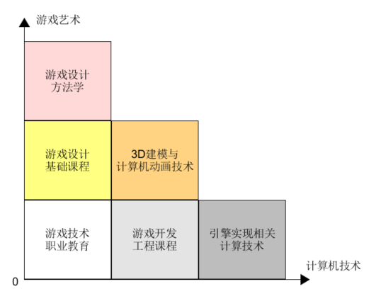
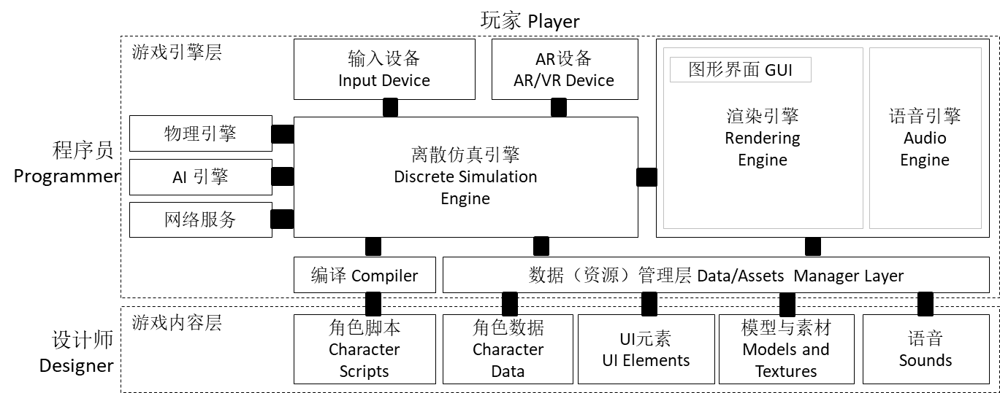

# 前言
{:.no_toc}

>   
> **_You've got to find what you love_**  
>   
> --- Steve Jobs, Stanford Report, June 14, 2005
>  

* 目录
{:toc}

## 1、Welcome

首先看一段视频（李易峰-2018江苏卫视-角色）：

“年少的人难免轻狂，...”，当最后看到“男神”忍不住踢腿与虚拟世界的“球”互动的那一刻，作为程序员的你是否也产生了那瞬间地冲动，希望投身于这个让世界变得更美好的事业。

## 2、为什么要学习游戏编程

说到为什么要学习 3D 游戏，很多人会说这是“钱”途大好的行业。有很多数据调查支持这个论点，例如：

- 年轻人游戏消费的时间
- 电车上手机使用行为
- 层出不穷游戏电竞活动
- 五花八门的游戏直播

这么俗气的答案并不能满足志向远大的青年。除了娱乐外，游戏（也称 _Serious Games_）能为我们这个社会做什么？

- **影视效果**。大片 VR 效果，一直是行业的风向标。
- **辅助医疗**。例如 [帕金森](http://games.sina.com.cn/g/n/2013-07-01/1024715328.shtml)、抑郁等常见病，游戏是最佳的辅助治疗工具之一。[Why?](http://www.sohu.com/a/157823801_455313)
- **辅助教育**。寓教于乐就是这个啊，古人早就发明了“孔明环”、“象棋”、“围棋”作为游戏的道具，开发人类的智力。
- **游戏与技能培训**。大家常见到的是赛车、飞行游戏。当给你一个接近真实的4D模拟训练驾驶舱，那个爽字就不用说了。如果你知道一个真实飞机的风行寿命和一次飞行的成本，你是不是感觉得到 3D 游戏技术对社会的巨大贡献呢！类似技术常用于星际探索控制、精密仪器使用等领域
- **游戏与电子商务**。为了一个红包，你得和“猫猫”“狗狗”们玩一番。在电子地图上周游一圈，到处扑打红包，在不经意之间，一个个商标，你周边商店的名字在你身边走过。如果你喜欢吃“糖炒栗子”，在那店附近打“27优惠3元”优惠券是大概率事件。你不得不感叹“基于行为的广告精准投放”这样的学术命题在游戏中竟然如此直观！
- **游戏与社交**。很多人都看过“[微微一笑很倾城](http://list.youku.com/show/id_z9cd2277647d311e5b692.html)”，既可能在游戏中社交，也可以是社交中游戏。
- **游戏与学术**。游戏是最强大的虚拟现实仿真工具之一，可应用游戏引擎作模仿现实世界，解释各种自然和社会现象，预测未来。

随着 _Augmented reality_ (AR) / 增强现实 技术的发展，游戏（虚拟）世界与现实世界日益融合，配合游戏自身的竞技属性，游戏正在脱离以娱乐为目的影子，游戏技术正在改变着我们的生活。

如果你是计算机专业学生，参加[微软创新杯/Imagine Cup](https://imagine.microsoft.com/)这类竞赛，强力建议你放弃娱乐类游戏命题，转向游戏技术改变生活，这有利于你技术能力的发挥。

## 3、关于读者

如果你看过“微微一笑很倾城”，看到计算机系的肖奈大神凭着游戏创意和一组原画就征服了 **立志成为游戏工程师** 的学霸女神贝薇薇，从而也立志学习游戏。动机不错，这显然和作家犯了类似的错误 - 不了解计算机学科和游戏的关系，大概只有职业技术类学校的计算机游戏专业才会把类似内容纳入教学体系。游戏在历史上就不是计算科学，只是计算机产业的发展使得 **视频游戏（Video Game）** 得到普及，在计算机动画、3D建模等技术支持下，人们创造了无限想象的有趣的玩法的游戏。

### 3.1 游戏入门课程分类

游戏是技术与艺术的结合体，学习游戏需要也需要结合个人的特质及需求选择合适的内容。下图从 **艺术** 和 **技术** 两个维度对游戏学习课程做了划分。所谓艺术就是利用语言、声音、文字、绘画、眼神、呼吸、肢体等表达形式，创造游戏场景或情境，使人通过感知（看、听、嗅、触）得到某种审美的满足。所谓技术，就是游戏生产的技能，使得游戏场景得以逼真的实现、质量得到保证，达到艺术效果。通过 **游戏艺术** 和 **计算机技术**，我们把游戏课程划分如图几种类型：

在游戏艺术维度显现了对读者艺术灵感要求，在计算机技术维度显示了对读者计算机能力的要求。对于入门者，显然有三个明确的方向：

* 游戏设计基础
* 3D建模与计算机动画（CG）
* 游戏软件开发

### 3.2 遵从你心，选择合适的入门方向

游戏是入门跨度非常大的行业。如果你想编写“像素鸟”这样的游戏娱乐自己，上述课程你都不需要，也有一定概率红遍全球。零CS（计算机）基础的人，用 construct 2 这类的工具足够搞定 手机 或 HTML5 的游戏开发。有点 c 语言基础，上网学习 Cocos2d-X，可以编写更高性能和效果更好的程序。如果你想编写出“植物大战僵尸”、“愤怒的小鸟”这类有艺术和技术水准的游戏，你需要的不只是一个会用  Cocos2d-X 这样有质量、有效率的工具的程序员，你需要一个团队，分别负责游戏设计、CG设计、软件开发，你才有可能在游戏这个竞争残酷的市场上立足。任何幻想获得一个三者全能的“高手”都是梦想，三者全能等于三者平庸水平，不足以支撑这样的游戏开发与持续运营。

**1）游戏设计基础**

如果你充满艺术气息，思维活跃，喜欢历史、文学艺术、绘画、音乐等，幻想用游戏给人带来满足，这类人应该学习这类课程。因为你必须回答一个问题，什么样的游戏会产生“粘性”并使人“沉浸”其中。为了回答这个问题，你必须了解构成游戏的基本元素、游戏的玩法与创新、游戏规则与难度的控制、游戏空间布局、人机交互环境的作用、游戏故事的组织方法、游戏测试（用户体验分析）技巧、关卡设计等等，你才能设计出可玩性较好的，有较大概率不亏本的游戏。

推荐经典入门教材：

* ★★★★☆ Ernest Adams / Andrew Rollings _游戏设计基础_ [豆瓣读书](https://book.douban.com/subject/3529767/)
* ★★★★★ Tracy Fullerton _游戏设计梦工厂_ [豆瓣读书](https://book.douban.com/subject/26780782/)

**2) 3D建模与计算机动画（CG）**

如果你被游戏精细的模型、传神的动画、绚烂的效果所吸引，或编程与算法玩不过大神、艺术天赋有一些，在这个方向上发展是不错的选择。容易生产具有强力自我自豪感的作品，做到艺术圈子计算机水平最高、计算机圈子最艺术的人。喜欢 Photoshop、Maya或 3D Max 只是基础，玩转 Shader 编程，你大神。毕竟游戏也是光与影的艺术，几乎没有女神能抵挡梦幻版绚烂的世界的诱惑，而你是这个世界的缔造者。

CG 课程范围比较广泛，数字媒体专业包括计算机原画设计、3D建模、动画设计、艺术渲染、Shader 编程等内容

计算机专业通常浓缩为一门课程：多媒体技术原理

**3） 游戏软件开发**

即使你完全没有艺术细胞，醉心于优美的代码，学习游戏软件开发是最佳的选择。它比较合适有一定计算机语言基础的人学习游戏开发，甚至有游戏编程经验的人，系统地学习游戏软件工程化开发。介绍游戏的开发流程、游戏引擎的基本架构、如何使用面向对象的思想编写模块化，运用设计模式，最终生产高品质、可扩展、可维护的游戏作品。

推荐教材：

* ★★★☆☆ 戈德  _面向对象的游戏开发_  [豆瓣读书](https://book.douban.com/subject/1392493/)
* ★★★★☆ Jason Gregory _游戏引擎架构_ [豆瓣读书](https://book.douban.com/subject/25815142/)
* ★★★★☆ Bob Nystrom  _游戏编程模式_ [中文翻译在线](https://gpp.tkchu.me/) 

类似课程推荐：

* ★★★★★ [GDIAC Courses](https://gdiac.cis.cornell.edu/courses/gdiac-courses.php)， cornell University

**4) 其他**

游戏开发市场上有许多教程，80% 属于职业教育类。这些教材以科普、工具学习为主，特别是一些 step by step 系列，非常合适初学入门或作为案头书。20%属于专业教材，不是大段文字的理论、就是长长的代码、或者满篇令人生畏的数学公式。以下一些建议可以让你快速进入游戏世界。

* 对于非计算机专业人士，学习使用 Construct 2，是构建游戏原型、测试游戏效果最有效的工具之一；
* 对于计算机专业人士，学习 Cocos2d-X 或 Unity 3D 编程入门，再去最求自己的梦想是比较平坦的道路；

## 4、关于本文

### 4.1 目标人群

本文的目标人群是分为两类：

* 醉心于优美的代码，希望在乐趣中学习“设计模式”，提升程序应对变化能力的程序猿
* 游戏工程开发入门，希望了解游戏引擎，有技巧的使用引擎部件实现游戏各类系统的程序猿

### 4.2 适用专业

本文关注游戏软件工程。与传统软件工程（信息系统，如网上商城等）比，游戏软件开发具有以下特点：

* 高度不确定的需求、更快的演化周期
    - 传统软件开始或多或少写 “软件需求规格说明书” 的文档，描述客户及其业务的核心需求，软件成品一般不会与该说明书有太大的偏差
    - 游戏软件开始一般只有2~3页的“游戏创意文档”，就开始了游戏软件生产，“_demo - evaluation - update_” 循环从此开启，只有通过市场评估后，才能获得游策、人设等团队资源。 这因为游戏产品风险大、投入大。
* 视频游戏存在高资源消耗与设备计算能力的矛盾

因而，游戏开发者门槛远高于普通程序猿，当然对应的是收入！游戏开发工程师核心能力表现为：

* 程序设计技术和技巧，以能快速适应需求变化
    - 设计模式应用
    - 通用模块与构件设计
* 熟悉语言与技术框架的内部实现，以优化资源占用
    - 内存对象组织与访问模型
    - 空间回收机制
    - 反射机制
    - 消息驱动机制
    - 引擎核心工作机制

为了达到上述要求，程序员必须接受高强度面向对象设计与编程（OOD & OOP）能力训练。而且，在多数情况下，入门者在初始阶段并无法理解为什么要这么设计，对于100行代码和500行代码完成同样任务的选择，任何人都乐意选择前者。然而，只有较少的人理解并接受通用设计的代价，这对于需求不确定的游戏，这样的设计至关重要。如果你做过大一些的游戏，已受过反复重构代码的折磨，你理解的可能会深刻一些。因此本文不会对初入门者太友好。

本文的目标是最为优秀游戏软件工程师的入门的专业教材，且具有一定的趣味性。帮助读者从业余水平，变为专业游戏开发程序猿，因此本文内容是初中级教程。 本文使用 unity3d 作为开发环境，但不会过多讲述 unity3d 的操作。本文重点围绕游戏引擎结构，采用面向对象设计方法，通过若干案例讲述“设计模式”在游戏中的应用。

### 4.3 核心内容

+ 本文核心内容：
    - 3D 游戏编程基础（不限于 Unity）
    - 面向对象的游戏设计方法（不仅是 Programming）
    - 3D 游戏架构与框架（不限定引擎）

选择 Unity 3D 只有一个理由，**简单、易用、素材库丰富、自学资源多**， 关于 Unity 3D 介绍请移步官网。

### 4.4 本文内容组织

本文的组织是按通用游戏的架构组织，如下图所示：

游戏的架构主要设计三类用户。

* 玩家，通过游戏引擎提供的多媒体人机交互界面，用用户体验这个标准评价游戏设计师、程序员合作的作品
* 程序员，关注最大限度的使用好游戏引擎，提供高性能、逼真的游戏场景
* 设计师，关注数据、模型、素材等资源的制作，用创意不断刺激用户，提高游戏的粘性

课程内容围绕离散仿真引擎，在高层（High Level）描述游戏引擎每个部分的职责、任务、原理与作用。结合 Unity 的 Manual 和 Develop API 说明每个部分的编程技术与要点。本文不打算深入引擎内部底层（Low Level）的实现，因为游戏引擎任何一部分实现都会涉及一门或以上计算机专业相关课程。例如 AR 技术就会设计智能设备、计算机视觉、模式识别、人工智能等多门课程。应用一些 AR tools Kits 已可以做许多创新应用，但要形成“杀手级”的应用效果，则需要最新的科学技术支撑！

游戏编程需要高度的技巧和能力，程序员必须理解计算机程序设计语言的核心技巧，掌握面向对象程序设计，达到中级或以上能力，才能经得起无限迭代、不断变更的游戏程序的折磨。因此，配套游戏引擎各部分编程需要，通过附件介绍涉及的 **面向对象设计模式** 以及 **C#语言中级知识**。

## 5、本文的管理

### 5.1 本文中符号

 要点

 注意事项

 第三方资源下载

 维护中的章节

 提示

 课程讨论

 思考题

 Unity 操作练习

 编程练习

 教程代码下载

### 5.2 提交对本文的疑问和建议

1. 首先你需要一个 Github 账号
2. 点击这里 [这里](https://github.com/pmlpml/unity3d-learning/issues) 可进入 issue 页面
3. 如果你乐意参与本文的共同编写，请 fork 本文

### 5.3 课程作业代码资源

本文代码资源都是学员主动奉献，代码的细节不能代表本文观点。

[博客与代码汇总](http://blog.csdn.net/pmlpml/article/details/72236930)

&nbsp;

[返回目录](./)