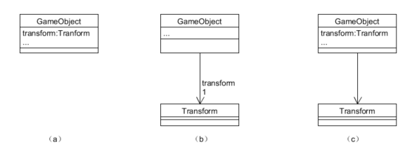
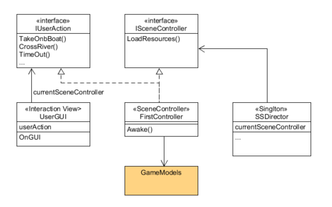

# 附件一、UML符号与面向对象的设计
{:.no_toc}

&nbsp;

> **_工欲善其事，必先利其器_**  
>   
> --- 孔子 《论语》

* 目录
{:toc}

## 1、什么是 UML？

Unified Modeling Language（统一建模语言）是一种标准的图形化编程语言用于软件分析与设计结果的可视化。

本文主要用于描述游戏程序的设计的原理，主要用于类图设计，作用是：

* 表达游戏程序关键结构的设计，方便程序员快速理解程序
* 解释设计模式在游戏中的应用，帮助理解游戏设计场景与设计模式的关系
* 陈述游戏设计要求，指导读者按设计者要求编写程序

很多人觉得设计模式难学，关键问题之一就是不了解 **UML 符号体系**，如同学高等数学，缺乏对公式的符号体系的理解，对问题模型自然就萌萌擦了。其次 UML 符号表达的 **代码逻辑**，毕竟它是编程语言。编程实践经验这时就非常重要！

## 2、UML 绘图工具？

作为程序员，我们总喜欢与文本界面打交道。所以推荐：

* [Umlet](http://umlet.com/)
    - 简单而有效的设计草图绘制工具，敏捷开发首选建模工具。
    - 图形模板，文本驱动，没有太多的语法约束
* [PlantUML](http://plantuml.com/sequence-diagram)
    - 文本驱动绘制工具
    - [在线制作](http://www.plantuml.com/plantuml/uml/)
* [ProcessOn](https://www.processon.com)
    - 万能的在线绘图与分享工具，只能画出个意思，专业就算了!
    - 胜在在线

注：本文 UML 图使用 Umlet 绘制

## 3、设计类图基础符号与含义

### 3.1 类

在 UML 中，设计类用三线表表示。其中第一栏是类名、第二栏属性、第三栏是方法。用户也可以自己扩充第四栏，描述类的职责等。

作为草图工具，追求高效率的沟通设计思想。 **只表达与领域问题相关的属性和方法**，而不是类API的说明，图示三种符号都是合格的类表示：


在 Umlet 中，为了得到（c）类图，仅需要选择一个类到绘图区，在属性区输入文本：

```text
GameObject
-
/activeInHierarchy
+transform
+tag
-
+GetComponent...(...)
SendMessage(...)
Find()

```

### 3.2 类之间关系

在类设计阶段，类之间仅有四种关系：


分别表示：

* 类继承
* 接口实现
* 实例使用
* 依赖

使用类图之间的关系，可以帮助我们理解 Unity 游戏实体构建的通用模型：


这个图反映了 Untity 游戏实体管理的基本概念。每个游戏对象是一个基本实体，这个实体是 Camera？ Light？ Or 3D model 由这个实体包含的 Components 决定。例如：相机对象包含 Camera 相关组件。

GameObject 包含一个 Components 集合，所以 GameObject 必然包含一组方法管理这些不同类型的 Components。 每个表示这个事实，UML 使用 **多重性** 表示这种关系。

其中，箭头表示拥有指向对象的实例，多重性表示**实例数量约束**。在 Umlet 中这样设置线的属性：

```text
lt=<-
m1=1..*
m2=1
```

其中 lt 表示线型，m1,m2分别表示线段两个端点的多重性。

GameObject 与 Transform 对象之间是 **1 对 1 互相引用** 紧耦合关系。即 GameObject 对象必须有一个非空 transform 实例变量，Transform 对象必须对应有非空 gameObject 实例变量。这个强制的约束也决定了 Transform 的超然地位，因为 Transform 的 parent 属性决定了 GameObject 之间的空间组合关系，使用 Component 访问 transform 比访问 gameObject 方便和实用。

最后，MonoBehaviour 是一个处理 GameObject 行为和事件的对象。它们是一个特殊的 Component，由游戏引擎调度管理。

### 3.3 接口

接口是一种抽象数据类型，描述具有相同操作定义集合的对象。

例如：电影有许多场景构成，每个场景都有一个角色负责部署场景需要的各种资源部署，但导演并不知道每个场景由什么样的人承担这个角色，更不知道场景实现的细节。假设我们用 ISceneManager 定义这个角色拥有的操作，在具体场景中，导演仅需要被告知承担这个角色的对象（不是类），就可以对它下达布置场景等命令，从而实现了命令与执行的分离。UML 可用以下符号表示这样的程序结构：


上图中，(a) 与 （b）具有相同的含义。（a） 运用 UML 关键字 interface 申明这个三线表是接口，所以第二栏定义为方法申明。(b) 是接口的套接字形式，说明场景控制器提供 ISceneManager 申明的服务， Director 使用服务。这样我们把业务逻辑不同类的对象，都看作接口类型的实例使用。

特别的，由于游戏人机交互规则通常在不同关卡都是一样的，使用 IUserAction 这样的接口描述人机交互规则，可以更好的理解并组织游戏的对象

### 3.4 属性

类属性的完整表达形式是：

_visibility name : type multiplicity = default {property-string}_

属性分为两个大类

* 类实例
* 值类型属性

**类实例作为属性**，以下三种形式是等价的：



都表示 GameObject 有 tranform 对象作为实例。在用关联线表示法时图（b）（c），多重性表示它是否是集合类型，例如：GameObject 使用 Component 对象的实例集合作为属性。

图（b）关联线在 Umlet 中的属性是：

```text
lt=<-
r1=transform
m1=1
```

r1 表示线段端点1的 role，表示类 act as，即属性名称。

**值类型作为属性**，常见的值有：

* 逻辑值（Bool）
* 数字值（Integer，Float，Double）
* 文字值（String）
* 日期值（Date）

**设计图中的属性**

软件设计图类似伪代码编程，通常不会严格按属性表达式书写。这导致了许多专业 UML 工具的痛。例如：isActive 或 Active 属性，写不写它的类型呢？实践中设计师都不关注，因为每个类都有申明，你可以去看代码或生成的 API 文档

可见性：通常缺省表示公有。“-”表示私有，“/”表示计算属性，“+”公有

**为什么要使用关联线作为属性**

就是让读者抓住重点！

### 3.5 操作/方法/事件句柄

操作（Operations）表示抽象类型的运算符。例如，操作 “add” 与 “+” 是具有相同的语义运算。 操作的语法：

_visibility name (parameter-list) : return-type {property-string}_

方法（Methods）在 UML 中表示操作的代码实现。在非严格要求环境下，一般不区别 Operations 和 Methods。都认为是方法的申明。

在软件类图设计时，通常只写一个操作名称，参数、参数类型、返回都不写，这仅表明设计者认为这些细节在这里不重要而已。所以以下表示都是正确的：

* GetComponent  
* public Component GetComponent(Type type);

事件句柄（Events handler）表示被回调（callback）的操作的实现。通常用 OnXXX(...) 表示。

### 3.6 构造型(stereotype)

构造型(stereotype)用于定义一个 UML 符号的细化类型及语义。它用书名号表示，例如 \<\<interface\>\> 它重新定义了类的符号。

常见的类的构造型有 \<\<singleton\>\> 表示单实例类，\<\<resource\>\> 或 \<\<prefab\>\> 表示序列化状态的类，\<\<listener\>\> 表示在设计模式中，该类的角色是侦听者等等

关联线也可以使用构造型再定义或细化。例如：\<\<create\>\> 或 \<\<generate\>\> 让你一看就知道对象要创建一个实例。

### 3.7 属性字符串（property string）

类名、属性、方法都是 UML 类符号（类元）的属性。UML使用一组 “key=value” 的形式定义这些属性的含义，叫属性字符串。例如：

* {visibility=public，name=GetComponent，returnType=Component}
* GetComponent
* public GetComponent : Component
* GetComponent {returnType=Component}

以上形式的 UML 方法表示具有相同语义。

属性字符串通常对现有属性进一步修饰或限定。例如对类名、方法给与 {abstract}，读者就明白这是抽象的。对方法使用 {leaf} 表示不可重写的，作用于类就是不可继承的。

## 3.4 综合案例

### 3.4.1 设计目标

利用 MVC 思想，使得游戏结构更加清晰。

程序主要包括导演、场景经理、人机交互三个类。

* 使用单实例实现了导演对象，负责游戏全局设定、场景管理等工作
* 使得用户视图与游戏场景模型的逻辑分离，即 MVC 的框架，场景经理实现游戏模型管理与游戏逻辑的实现
* 由 IUserAction 描述游戏规则对应操作
* 建立统一的场景控制接口，支持不同场景不同的业务逻辑

### 3.4.2 设计方案



### 3.4.3 对应代码实现

ISceneController 接口的脚本文件 ISceneController.cs

```cs
using System;

/// <summary>
/// Abstact Scene Controller. Interface between scene controllers and the director
/// </summary>
public interface ISceneController
{
    void LoadResources();
}
```

FirstController.cs

```cs
using System.Collections;
using System.Collections.Generic;
using UnityEngine;

/// <summary>
/// Scene Controller
/// Usage: host on a gameobject in the scene   
/// responsiablities:
///   acted as a scene manager for scheduling actors.log something ...
///   interact with the director and players
/// </summary>
public class FirstController : MonoBehaviour, ISceneController, IUserAction {

    // the first scripts
    void Awake () {
        SSDirector director = SSDirector.getInstance ();
        director.setFPS (60);
        director.currentSceneController = this;
        director.currentSceneController.LoadResources ();
    }
     
    // loading resources for the first scence
    public void LoadResources () {
        GameObject sunset = Instantiate<GameObject> (
                                Resources.Load <GameObject> ("prefabs/sun"),
                                Vector3.zero, Quaternion.identity);
        sunset.name = "sunset";
        Debug.Log ("load sunset ...\n");
    }

    #region IUserAction implementation
    public void GameOver ()
    {
        SSDirector.getInstance ().NextScene ();
    }
    #endregion


    // Use this for initialization
    void Start () {
        //give advice first
    }
    
    // Update is called once per frame
    void Update () {
        //give advice first
    }
```

导演类的代码：

```cs
using System.Collections;
using System.Collections.Generic;
using UnityEngine;

public class SSDirector : System.Object {
    // singlton instance
    private static SSDirector _instance;

    public ISceneController currentSceneController { get; set;}

    // https://blog.csdn.net/qiaoquan3/article/details/51339242
    public bool Paused { get { return Time.timeScale == 0; } set {Time.timeScale = value?0:1;} } 

    // get instance anytime anywhare!
    public static SSDirector getInstance() {
        if (_instance == null) {
            _instance = new SSDirector ();
        }
        return _instance;
    }

    public int getFPS() {
        return Application.targetFrameRate;
    }

    public void setFPS(int fps) {
        Application.targetFrameRate = fps;
    }

    public void NextScene(){
        Debug.Log ("Waiting next Scene now...");
        #if UNITY_EDITOR  
        UnityEditor.EditorApplication.isPlaying = false;
        //UnityEditor.EditorApplication.Exit(0);
        #else  
        Application.Quit();  
        #endif  
    }
}
```

## 3.5 小结

**UML符号体系是复杂的**

作为可以描述任何语言的语言与符号系统。即严格定义的 UML 图可自动生成程序，也可由程序逆工程到 UML 图。因此，UML 存在复杂的语法与语义。

**UML作为设计思想表达工作**

* 尽可能使用基本的符号
* 突出设计要点，忽略细节
* 能有效指导编码


